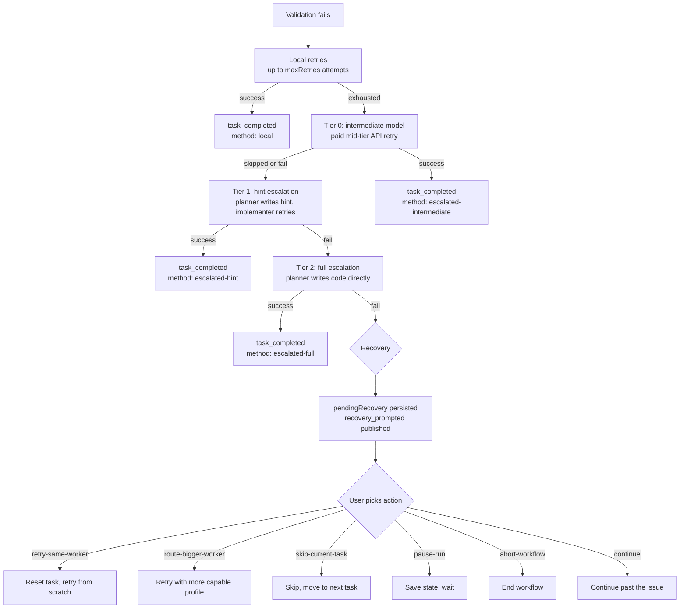

# SPLITBRIEF — Approval gates, escalation, and recovery

How SPLITBRIEF keeps the user in control during a workflow run. Four systems work together: document gates pause on spec, plan, and brief review; tiered approval reviews declared file writes; escalation handles validation failures automatically; and recovery gives the user the final say when automation runs out of options. Budget enforcement and drift detection run alongside these systems as continuous checks.

For the workflow state machine, see `docs/WORKFLOW.md`. For the event model, see `docs/ARCHITECTURE.md`.

---

## v4 contract, evidence, and refusal rules

The persisted workflow contract is `stateVersion: 4`. The fenced state head is
the authority: state operations rebase complete state, require an expected
revision, and refuse stale, future, malformed, or unfenced writes. The TUI,
RPC, IPC-attach, and headless callers share the same controller, projection,
and command policy in every mode (`instant`, `quick`, `standard`, and
`speckit`). A read-only observer may inspect a projection but cannot mutate
state, migrate a session locally, or invoke a provider.

The Evidence Spine persists the Brief, quality report, input receipts,
attempt/usage receipts, evidence head, outbox, and revisions before publishing
the projection. Recovery status is one of `checking`, `auto-repairing`,
`blocked`, `storage-blocked`, `retrying`, `unresolved`, `ready`,
`readiness-blocked`, or `rejected`. `CONTRACT READY` is a binary contract
pass. `CONTRACT BLOCKED` and `brief_contract_blocked` are explicit refusal
states. `READINESS BLOCKED` is a separate diagnostic state and cannot be used
as a quality override.

The quality score and issue list are diagnostic evidence, not a second approval
channel. There is one bounded automatic `auto-repair`; after it is consumed,
the user chooses `retry`, `edit`, or `reject`. Retry is an explicit new
operation with a fresh base and expected Brief/report revisions; it carries no
fabricated comment. The command vocabulary also includes `approve`, `comment`,
`import`, and `resolve-unresolved`; `status` is read-only. No observational
retry is permitted.

If a provider may have received a request but no final result is known, the
attempt is `UNRESOLVED`. Inputs and budget/remote usage remain held and
durable. The user must explicitly resolve it by rebinding while acknowledging
duplication risk, or by abandoning it; the system never silently retries an
ambiguous dispatch. These rules preserve evidence even if a transcript or UI
projection is unavailable.

### Recovery policy matrix

| Mode / surface | Automatic repair | Recovery actions |
|---|---|---|
| standard / Speckit initial and their continuations | one bounded repair | retry, edit, reject |
| instant | one shot only for its existing zero-task failure case; otherwise none | retry, edit, reject |
| Quick | none | retry, edit, reject |
| resume / attach | none | restore persisted allowance; make zero calls merely to observe |
| auto-split review | none | retry, edit, reject |
| RPC / IPC / headless / native observation | none | zero calls merely to observe |

| Surface | Observation rule |
|---|---|
| resume / attach | restore persisted allowance; make zero calls merely to observe |
| RPC / IPC / headless / native observation | zero calls merely to observe |

### Tiered compiler admission

The Task Brief compiler enforces tiered capability admission before planning dispatch: the tested version yields a full capability receipt; other detected versions of supported backends are admitted with runtime-drift evidence and a run warning; unsupported backends (`copilot`, `aider`, `shell`, `agent`) produce a typed fail-closed refusal (`task_compiler_capability_unsupported`). Runtime guards (envelopes, terminal contract, dispatch ledger, post-run mutation detection) are the enforcement surface.

### Three-way disposition

Every new, retry, rewind, and resume planning path returns exactly one of
`ready-for-tasks`, `parked`, or `terminal` (`PlanningPhaseResult`,
`src/engine/orchestrator/planning/types.ts`). Readiness is never inferred from
`!cancelled`, `!failed`, task count, score, artifact existence, phase, or
process exit. A parked result retains the recovery epoch and revision, evidence
head, authoritative generation reference if any, allowance state, a durable
cause, and a non-empty valid action set; it is actionable (`retry`, `edit`,
`reject` as permitted) and never masquerades as completed or failed work.
`terminal` covers `cancelled`, `rejected`, and `failed`. Parked and terminal
results make zero implementer or task-loop calls.

### Permit-gated execution

Only a current execution permit authorizes task execution. Approving the
briefs issues the permit through the sole owner commit
(`issueApprovedGenerationPermit`,
`src/engine/orchestrator/planning/briefs-approval-queue.ts`): the head must
still carry the exact approved epoch, authority revision, generation, and
quality digest, and the permit binds execution to that generation. The refusal
reasons are `no-authority`, `not-ready`, `epoch-mismatch`, `revision-mismatch`,
`generation-mismatch`, `digest-mismatch`, and `uncommitted`. A repeated
issuance of the same generation converges idempotently.

At the task boundary `runTasksAndReview` re-reads the owner head and the
persisted Brief artifacts before any implementer call
(`revalidatePersistedExecutionPermit`,
`src/engine/orchestrator/planning/handoff.ts`). A planning result that no
longer matches the persisted epoch, revision, and generation digests parks or
terminates instead of executing; a published but unapproved generation is
explicitly non-executable.

### Recovery budget: provider-dependent cost

Brief recovery admission is budget-policy aware. Without `workflow.maxBudget`,
missing provider pricing alone does not refuse an otherwise eligible bounded
recovery operation: admission creates a provider-dependent reservation
recording the accounting key, runtime and pricing identity, price knownness,
prompt/input and output bounds, dispatch cap, and operation identity
(`reserveProviderDependentRecoveryCall`,
`src/engine/orchestrator/budget/enforce.ts`). USD is absent or unknown, never
`0` — a provider-dependent reservation is not a zero-cost reservation.

With `maxBudget` configured, recovery refuses before provider dispatch unless
the operation reservation and the relevant current paid spend are finite
frozen USD values. Unknown price or spend uses the stable code
`brief_budget_unknown`; a known finite amount beyond the cap uses
`brief_budget_exhausted`. Runtime budget tracking pauses on unknown paid usage
with the coded `tracking_paused` warning instead of treating that usage as
`$0` — continue only after acknowledging unknown spend or configuring pricing.

### Refusal retention

A pre-acceptance refusal is durable and bounded. It persists the operation and
intent identity, refusal code and category, cap context, price and spend
knownness, accounting identity, allowance state, and bounded evidence
references before returning. Retention is versioned with hard bounds
(`RECOVERY_REFUSAL_RETENTION`, `src/core/schemas/brief-recovery.ts`): 64
records and 64 KiB of receipts per current epoch, a 1 KiB receipt bound, a
4 KiB diagnostic bound, 256 KiB of refusal evidence, and 16 closed-epoch
summaries of 512 bytes each. Retained identities replay exactly — the same
intent hash returns the same refusal without a second state or evidence
advance — and the current projection plus the active operation and
automatic-repair intents can never be evicted.

A refusal leaves `automaticRepair.eligible` true and `consumed` false with zero
provider dispatches, so a blocked contract never consumes the repair allowance.
Refusal reprojects consistently after restart: blocked, with the same durable
reason and allowed actions, never budget-available and never inferred
exhausted from unknown pricing. Repeated identical quality failures stop at
the no-progress threshold of 20 settled attempts; settled attempts are
retained to 256 and the recovery outbox to 256 entries. If safe retention is
impossible, the operation fails storage-safe before dispatch rather than
growing without bound or losing idempotency.

---

## Promotion and conflict semantics

`gateAndPromoteChangedFiles()` (`src/engine/orchestrator/approval/gate-and-promote.ts`) computes the changed set once per task by diffing the implementer's working directory against its start snapshot, puts it through the tiered approval gate, and promotes the approved set into the user's real project directory.

**A changed set discovered outside isolation is gated but never promoted.** When the isolation directory reports no changes but the real project has changes since the task-start snapshot, the changed set is re-read from the project and flagged `fromIsolation = false`. Those changes are the user's own edits — the implementer never touched the project — so they still pass through the approval gate (they are reported and can be reviewed), but promotion is skipped: `promoteStagedChanges()` never reads the isolation directory for files it does not contain. Promotion happens only for a changed set discovered inside isolation.

**Denial leaves the user's edits alone.** On the gate-denied path, the task-start snapshot restore (`restoreDirtyFilesFromSnapshot`) runs only when the task acquired no isolated workspace (`workspace === undefined`) — the `extracted-code` write mode, where SPLITBRIEF wrote the files into the real project itself, so the changed files are the run's own writes and rolling them back is the intended "denied task rollback". When isolation exists and the changed set was discovered outside it, the restore is skipped: reverting to the task-start snapshot would revert the user's own uncommitted edits. What the implementer produced inside isolation is discarded by the workspace's own `cleanup`, and what that costs depends on the strategy. A `staged-copy` workspace is a temporary directory acquired per task, so cleanup deletes it whole. A `worktree` workspace is shared by every task in the run, so cleanup reverts only the files changed since *that acquisition's* snapshot, and only those the project never received: the denied task's writes go, work an earlier task promoted stays — the tasks after it build on top of it. Under either strategy nothing the denied task produced survives, and `dispose()` finds no unpromoted work to retain over it.

**Promotion is hash-guarded and all-or-nothing.** Before any write, `promoteStagedChanges()` re-reads each target from the project and compares it against the content captured before approval. If any file moved underneath SPLITBRIEF during approval, the whole promotion is refused and the task reports an `approval-promotion-conflict` recovery instead of overwriting the concurrent edit.

---

## Document approval gates

After the planner writes a spec or plan, the workflow pauses for human review. The approval loop lives in `src/engine/orchestrator/approval/loop.ts`.

Before a spec or plan can feed a later phase or be shown at its review gate, it must be non-empty Markdown with a heading. Empty or heading-free output fails admission and is not used as an approved artifact.

The rule covers initial and replacement spec and plan artifacts. Admission runs before `spec.md` or `plan.md` is written and before its `artifact_written` event is published. An invalid replacement leaves the previous artifact unchanged, publishes no replacement artifact card, and cannot feed the next phase or approval gate.

Three review gates:

**Spec approval** — After the planner writes the spec. `onApprovalNeeded('spec', filePath)` fires. The user gets three choices: approve (workflow continues to planning), comment (the planner regenerates the spec using the feedback), or reject (the workflow ends). If the user comments, the planner calls `regenerate()` with the feedback, publishes a `spec_regenerated` event, and loops back to approval. This can repeat as many times as the user wants.

**Plan approval** — Same mechanics as spec approval, applied to the plan. Active by default only in speckit mode. `onApprovalNeeded('plan', filePath)` fires, with the same approve/comment/reject loop.

**Briefs review** — Standard and speckit evaluate Task Brief quality before entering the `reviewing-briefs` phase. A first error-level failure gets one bounded tasks-only regeneration. Passing original or repaired tasks enter review; a second failed report ends the run before briefs approval or implementation. Any error-level issue follows this path, including issues in a non-empty task set. The user reviews `tasks.md` on disk before any code is written. This gate is separate from `workflow.approve`. Before approval, the brief readiness gate (`runBriefReadinessGate()`, `src/engine/orchestrator/planning/brief-readiness-gate.ts`) warns on briefs that overflow the selected worker's context window. It resolves context from the same model cache and detected context length the task-loop router uses at dispatch time, so the gate and the router agree on what fits. A readiness warning requires re-evaluation or a user edit; a repeated approval does not make `CONTRACT BLOCKED` ready (see the brief readiness gate section below). A briefs review interrupted by a crash is resumable: `resumeBriefsApproval()` (`src/engine/orchestrator/planning/resume-briefs.ts`) re-opens the same prompt over the persisted `tasks.md`, and approving on resume advances the run to implementing exactly as a first-time approval would.

`workflow.approve` controls only the spec and plan document gates:

| Level | What it gates |
|---|---|
| `none` | No spec or plan gates |
| `spec` | Spec only |
| `plan` | Plan only |
| `all` | Spec and plan |
| `default` | Whatever the mode dictates |

Each mode has a default. `instant` and `quick` default to `none`. `standard` defaults to `spec`. `speckit` defaults to `all`. Override with `--approve` on the CLI or `workflow.approve` in config. Standard and speckit still run briefs review even when `--approve none` skips spec and plan.

All three approval gates resume into their own prompt. A session interrupted at `reviewing-spec`, `reviewing-plan`, or `reviewing-briefs` is resumable: `resumeArtifactApproval()` (`src/engine/orchestrator/planning/resume-artifact-approval.ts`) re-opens the spec or plan gate over the persisted `spec.md` / `plan.md`, honouring a `revise` through the planner exactly as on the original turn, and re-derives the effective `workflow.approve` level from the current config — a user who changed it between runs gets the current level. The briefs gate resumes through `resumeBriefsApproval()` as described above.

Approving on resume continues from the persisted artifacts; it never restarts the planning turn. An approved `spec.md` regenerates `plan.md` and `tasks.md` from that spec and moves on to the plan gate; an approved `plan.md` moves on to the briefs gate. A `revise` at either gate rewrites the artifact through the planner, and a revised plan regenerates the Task Briefs it invalidated before the briefs gate opens. The approved artifact is never overwritten by a fresh planner call, and no gate is shown twice.

Approving the briefs issues the execution permit through the sole owner commit only while the persisted head still carries the exact approved epoch, authority revision, generation, and quality digest. A newer epoch or any owner commit in between rewinds or refuses the permit, so a resume approval never grants execution against a generation the persisted head no longer holds (see [Permit-gated execution](#permit-gated-execution)).

---

## Tiered approval

Document approval gates the planning output. Tiered approval gates the declared file writes the implementer reports during execution. The gate runs over the files the implementer changed; each is classified by risk and checked against a three-tier system.

The classifier lives in `src/engine/orchestrator/approval/action-classifier.ts`. It inspects the declared file path and the task's scope to assign an action class and a tier. It classifies declared file writes only — it does not parse or gate shell commands.

**Action classes the classifier produces:**

| Class | What triggers it | Default tier |
|---|---|---|
| `read` | Action descriptions beginning with `read`/`cat`/`ls`/`find`/`grep`, or anything with no write verb | `auto` |
| `write_in_scope` | Writing to a file named in the task brief or matching `scope.inBounds` / `approval.allowedPaths` | `auto` |
| `write_out_of_scope` | Writing to a file not covered by the task's scope | `sticky` |
| `destructive` | Writing to a control-plane path (`.git`, `.splitbrief`) | `confirm` |
| `package_change` | Writing to a package manifest or lockfile (`package.json`, `pnpm-lock.yaml`, …) | `confirm` |

Classification extracts the target file path from the action description, then checks scope membership. A write to a control-plane path is `destructive`; a write to a package manifest is `package_change`; a write to a file in the task's `scope.inBounds`, `scope.approvedOutOfBounds`, or `approval.allowedPaths` is `write_in_scope`; any other write is `write_out_of_scope`. Anything that is not a write defaults to `read`.

The `validation` and `network` classes remain part of the action-class enum and the default tier map (so `approval.tiers` can still reference them), but the file-write classifier never derives them from a description — they are not produced by gating declared writes.

**Three tiers:**

`auto` — Allow silently, no prompt. The implementer proceeds without interruption. Most in-scope work and reads fall here.

`sticky` — Check `.splitbrief/approvals.json` for a matching grant. If a grant exists with the right pattern and action class, allow silently. If not, prompt the user through `onTieredApproval`. The user can grant once (this action only), for the session (this run), or always (persisted to `approvals.json`). `gateAction()` in `src/engine/orchestrator/approval/tiered-approval.ts` classifies the action and dispatches sticky-tier handling in `sticky.ts`, which reads the grants store, tries to match against `always` grants first, then `session` grants scoped to the current session ID.

`confirm` — Always prompt the user, regardless of prior grants. The response must carry the literal phrase `I confirm` and a non-empty reason; `gateConfirmTier()` (`src/engine/orchestrator/approval/confirm.ts`) rejects anything else as `invalid_confirm_phrase`. That contract is what RPC clients and custom `onTieredApproval` callbacks satisfy themselves. The TUI satisfies it on the user's behalf: the prompt offers a keyed choice, and the friction lives in which key it is. A `destructive` action — a control-plane write — confirms on Enter only, and answers a stray `y` with `enter confirms this write` instead of approving; every other confirm-tier class confirms on `y`. `r` opens an optional reason field; confirming without one records `confirmed at the prompt (no reason given)` so the evidence trail never reads as though a human justified the write. Keystrokes buffered before the prompt appeared are discarded for `PROMPT_TYPEAHEAD_GRACE_MS` (`src/lib/terminal/typeahead-grace.ts`). Approval events (`approval_prompted`, `approval_granted`, `approval_rejected`) are published from `events.ts`; shared gate input/output types live in `types.ts`.

Override the default tier map per action class in config via `approval.tiers`. Disable tiered approval entirely with `approval.enabled: false`. `/approval list` shows active sticky grants. `/approval clear` removes them. `/yolo` toggles file-write tiered approval prompts off or back on for the rest of the session.

---

## Cost and budget gates

Budget enforcement runs in `src/engine/orchestrator/budget/`. Two phases: prediction before tasks start, and tracking during execution.

**Pre-task prediction.** `cost-prediction.ts` estimates the total cost based on task count, planner and implementer pricing, and three escalation-rate scenarios: low (0% escalation), expected (15%), and high (40%). This produces a `CostPrediction` with `lowCost`, `expectedCost`, and `highCost`. If the expected cost exceeds the configured budget, `onCostApprovalNeeded(prediction)` fires and the user can approve continuing despite the estimate or abort.

**Runtime tracking.** `budget.ts` tracks actual spend at task boundaries. It calculates the current cost from accumulated token usage and checks it against the configured `workflow.maxBudget` and `workflow.budgetPauseThreshold`, which defaults to `0.85`:

- At 80% of budget: `budget_warning` event. Informational only.
- At the pause threshold: `budget_paused` event. The workflow stops and enters recovery with reason `budget-paused`. The user can continue (if still below the hard cap), pause, or abort.
- At 100% of budget: `budget_exceeded` event. The workflow stops with reason `budget-exceeded`. Only `pause-run` and `abort-workflow` are available — no continue.

The `enforceBudget()` function guarantees threshold events fire in order: if cost jumps from 70% to 90% in a single task, `budget_warning` publishes first, then `budget_paused`.

---

## Brief quality gate

Before any code is written, `src/engine/spec/brief-quality.ts` scores each Task Brief on completeness. `evaluateBriefQuality(tasks)` runs the checks below. An empty task list is itself an error (`empty_task_list`).

**Error-level checks** (any one blocks the gate):

- `missing_validation` -- Task has zero tests.
- `vague_validation` -- Every test matches a vague pattern: `works`, `works correctly`, `works as expected`, `validate`, `make sure it works`, `should work`, `it works`, `correct`, `pass`, `tests pass`, and case variants.
- `missing_implementation_steps` -- Task has zero implementation steps.
- `multi_file_task` -- Task description or steps direct writes to two or more distinct concrete file paths (write-verb governed mentions; referenced paths such as pattern exemplars or import sources do not count).
- `missing_code_context` -- Task is a `modify` action but has no `currentCode`, `signature`, or `pattern`.
- `missing_escalation` -- Task text contains a risk keyword but defines no escalation rules. Risk keywords: `auth`, `security`, `secret`, `token`, `payment`, `database`, `migration`, `config`, `git`, `hook`, `permission`, `public api`.
- `missing_scope` -- Task has no scope, or scope has neither `inBounds` nor `outOfBounds`.
- `missing_evidence` -- Task has no evidence entries.

**Warning-level checks:**

- `missing_type_definitions` -- Task has no `typeDefs`.

**Scoring.** `score = 1 - errorCount * 0.2 - warningCount * 0.05`, clamped to [0, 1]. The gate passes only when `errorCount === 0` -- warnings lower the score but don't block.

The report is written to the session folder as `brief-quality.json`. If it passes, `brief_quality_passed` publishes and the workflow continues with `CONTRACT READY`. If it fails, `brief_quality_failed` publishes, `brief_contract_blocked` is recorded, and the workflow refuses the transition. The score is diagnostic and never supplies a quality override.

For `standard` and `speckit`, an initial error-level report triggers one bounded tasks-only regeneration before briefs review. If the repaired tasks pass, they enter review. If the second report still has any error-level issue, planning fails closed without briefs approval, `reviewing-briefs`, or implementation. This applies to every error-level issue, not only `empty_task_list`.

An unrepaired error-level report is a terminal planning failure. It returns a failed planning result, records the workflow as failed, and does not enter briefs approval or implementation. User cancellation or an abort is a separate outcome: it returns cancellation without the failed result and does not publish a planning error.

In an already-valid briefs review, a user edit or revision that fails quality is reported and the user is prompted again. The invalid edit is never overwritten.

## Brief readiness gate

Alongside the quality gate, the brief readiness gate (`runBriefReadinessGateAndReport()`, `src/engine/orchestrator/planning/brief-readiness-gate.ts`) runs over the Task Briefs at briefs approval and again after brief edits. It resolves routing metadata through the same model cache and detected context length the task-loop router uses at dispatch time, and blocks briefs whose block kinds are `overflow` (the task overflows the selected worker's context window), `no-capable-worker` (no profile can run the task), or `stale-conflict` (stale or conflicting routing context). Each block names the task, the kind, and the next best action.

The report is written to the session folder as `brief-readiness.json`. If it passes, `brief_readiness_passed` publishes and the workflow continues. If it fails, `brief_readiness_blocked` publishes carrying every blocked task id and every distinct block kind.

The block is advisory evidence, not permission to bypass the contract. A `READINESS BLOCKED` report must be re-evaluated after a user edit or a routing/configuration change; a repeated approval does not grant a quality override. Editing or revising `tasks.md` changes the briefs fingerprint, so a decision is never granted against stale briefs. The review loop also terminates: a failure that repeats unchanged for `MAX_UNPRODUCTIVE_BRIEF_REVIEW_ATTEMPTS` (20) consecutive attempts ends the review with a `brief_review_no_progress` error and rejects the briefs instead of re-prompting forever. That cap covers the readiness, edit, and unreadable-`tasks.md` paths. Quality failures caused by edits in an already-valid review are reported and re-prompted; the invalid edits are never overwritten. Initial quality failures take the pre-review fail-closed path described above.

---

## Escalation

When the implementer writes code and validation fails, the escalation system tries progressively more capable approaches before involving the user. The orchestrator calls these tiers in sequence. If any tier succeeds, the task is done.

**Pre-existing failures do not enter the ladder.** Acceptance is judged against the run's validation baseline: a stage that was already red before the first task ran, and whose failure evidence names none of the task's changed files, is exempt. An exempt stage never produces a retry prompt, so retry and escalation no longer fire for pre-existing failures — a task that introduces no new failure is accepted even when the tree was already red. The review packet keeps the raw `passed`/`total` validation figures for the task and names the exempt stages alongside them, so a shipped-over-red-stage task reads as what it is instead of a partial failure.

**Local retries** (`src/engine/orchestrator/escalation/local-retries.ts`). Before any tier, the implementer retries with the error message appended to its context. No additional API calls beyond the implementer itself. Runs up to `workflow.maxRetries` times (default 3). Each attempt publishes a `retry` event. Local retries are not a numbered tier.

**An aborted attempt is not an attempt.** An implementer call that reports an abort — the workflow signal is aborted, or the outcome carries the runner layer's abort text (`Aborted`) — ends the retry loop immediately: no further retry rows are published to `session.jsonl`, the attempt counter stays at the value it had before the aborted attempt, and the run stops at that boundary instead of escalating. A cancelled run therefore never burns retries or paid escalation tiers on calls the user already cancelled.

**Tier 0: intermediate model** (`INTERMEDIATE_TIER` in `src/engine/orchestrator/escalation/tier.ts`; implementation in `intermediate.ts`). A paid mid-tier API model (`escalation.intermediateProvider` / `intermediateModel`) retries the task. This tier runs only when an intermediate provider is configured and `escalation.enabled` is not `false`; otherwise it is skipped. Publishes `escalate` with tier 0.

**Tier 1: hint escalation** (`HINT_TIER` in `src/engine/orchestrator/escalation/tier.ts`; implementation in `hint.ts`). The planner analyzes the error and produces a short hint. The hint is appended to the error context (truncated to 4000 chars), and the implementer retries once more with the enriched error. Publishes `escalate` with tier 1.

**Tier 2: full escalation** (`FULL_TIER` in `src/engine/orchestrator/escalation/tier.ts`; implementation in `full.ts`). The full task context — brief, all prior attempts, all errors — goes to the planner. The planner writes the code itself instead of hinting. Publishes `escalate` with tier 2.

If tier 2 fails, the task publishes `task_full_fail` and enters recovery.

**Review-packet warnings list.** The final review packet (`review-packet.json`) collects every operational `warning` event into its escalation warnings list (`escalations.warnings`, built by `src/engine/orchestrator/evidence/review-packet/sections.ts`). Warnings published with `safety: { category, code, transcriptSafe: true }` keep their message even when transcript persistence is disabled. The most common one is an implementer that ran and wrote nothing: the pipeline publishes exactly one warning with `category: 'implementer'` and `code: 'implementer_wrote_nothing'`, naming the runner and the task. The task itself still fails with the `no-staged-change` outcome — retry, escalation, and recovery behaviour are unchanged; the warning only makes the outcome legible in the transcript, `session.jsonl`, and the review packet. A second coded warning uses `category: 'cost'` and `code: 'implementer_usage_not_reported'`: it fires when a task completed but the runner's protocol carried no usage, so a run whose runner reported nothing is distinguishable from a run that did no work. It is published once per affected task, names the runner and the task, and does not change the task's outcome or the recorded zero token counts.

Every retry step (`src/engine/orchestrator/escalation/step.ts`) follows the same sequence: refresh the task's code from disk, run the retry in a staged project (a temporary copy), gate the changed files through tiered approval, promote the staged changes back, then validate and commit. If any approval gate denies the changes, the staged project is cleaned up and the retry counts as failed.

---

## Recovery

Recovery takes over when escalation is exhausted or when a workflow-level failure occurs that automation cannot resolve. The system lives in `src/engine/orchestrator/recovery/`.

When a recovery-worthy event happens, the orchestrator builds a `RecoveryIssue` (schemas: `src/core/schemas/recovery/`) describing the failure, the available actions, and a recommended action. The issue is set as `pendingRecovery` in `state.json` via `SET_PENDING_RECOVERY`, and `recovery_prompted` publishes on the EventBus. There is no `onRecoveryNeeded` callback: the TUI and RPC clients react to the persisted `pendingRecovery` (driving `applyRecoveryAction` in `src/engine/orchestrator/recovery/actions.ts`), while a headless run emits a `recovery_required` JSON line and exits non-zero (`src/cli/headless.ts`).

**An unresolved recovery is never silent.** Re-entering the task loop over a state that still carries `pendingRecovery` publishes a transcript-safe `warning` with `code: 'recovery_pending_unresolved'` naming the reason, the recovery status, and the available actions before stopping (`src/engine/orchestrator/task/loop.ts`). The issue is not cleared and not re-entered — only a real recovery action resolves it. Headless `--json` runs fail with exit code 1 for every recovery status: `awaiting-user`, `paused`, and `applying` alike. A machine consumer can tell the three apart because the `recovery_required` record carries the `status` field.

**The unavailable-implementer issue carries the runner's own reason.** When the availability gate fails, the `implementation-error` issue's details carry the runner's own explanation — the optional `Implementer.unavailabilityReason()` member, e.g. "the endpoint is unreachable" — falling back to generic installation / credentials / reachability guidance only when the runner cannot state one.

**A signed-out runner halts the run instead of escalating.** Subscription CLIs report a dead login as an ordinary turn failure (codex: `codex-turn-failed` with "Your access token could not be refreshed…"; Claude Code: an `is_error` result like "Invalid API key · Please run /login"). The implementer pipeline classifies those diagnostics as the `unauthenticated` outcome (`src/engine/runners/auth-failure.ts`, applied in `src/engine/implementers/pipeline/call-result.ts`), and the orchestrator halts — on the first attempt (`src/engine/orchestrator/task/step.ts`) or between ladder steps (`src/engine/orchestrator/escalation/handle.ts`) — with a `runner-unauthenticated` recovery whose message names the exact re-login command (`codex logout` + `codex login`, or `claude /login`) and whose details keep the tool's own words verbatim. Without the halt, every task would silently escalate to the planner at planner prices. SPLITBRIEF does not launch the login itself: both flows are interactive browser OAuth, which cannot run in headless/RPC sessions or over SSH — log in from a separate terminal, then choose `retry-same-worker`; the retry rebuilds the runner sandbox and picks up the fresh credential. A planner-side auth failure already stops the run at the planning call; `handlePlanningFailure` (`src/engine/orchestrator/planning/failure.ts`) appends the planner tool's own diagnosis and the same login command to the published error.

**A usage-limited runner halts the run the same way — and never gets login advice.** Subscription CLIs report an exhausted quota as an ordinary turn failure too (codex: "You've hit your usage limit. … or try again at Aug 8th, 2026 3:27 PM."; Claude Code: an `is_error` result like "You've hit your session limit · resets 3:45pm" or "Credit balance is too low"), and API providers return HTTP 429 bodies. The pipeline classifies those diagnostics as the `usage-limit` outcome (`src/engine/runners/usage-limit.ts`, applied in `src/engine/implementers/pipeline/call-result.ts` for CLI results and in `src/engine/implementers/pipeline/run.ts` for thrown provider errors), and the orchestrator halts at the same points as the signed-out case with a `runner-usage-limit` recovery. The message names the reset moment whenever the tool's diagnostic carried one — codex "try again at Aug 8th, 2026 3:27 PM." or the bare-clock variant "try again at 3:27 PM.", Claude Code "resets 3:45pm" / "resets Mon 12:00am", Groq "try again in 7.66s", or an HTTP `Retry-After` header (threaded into the diagnostic as `(retry-after: Ns)` by `src/engine/streaming/stream-errors.ts` and the Anthropic stream) — surfaced in recovery copy as a locale-formatted time like `Aug 8, 2026, 3:27 PM` when parsed — and the details keep the tool's words verbatim. Logging out and back in cannot restore quota, so the recovery never suggests it: the real options are waiting for the reset (`pause-run`, then `retry-same-worker`), switching to a different implementer profile (`route-bigger-worker`, offered when config has one), skipping the task, or aborting. A planner-side limit stops the run at the planning call with the same reset-aware guidance instead of a login command.

**Unreadable changed files are recorded, not thrown.** The task loop's changed-files baseline records every entry it cannot safely read — a symlink, a directory, an unreadable file — as the `'unreadable'` sentinel instead of failing the run (`UNREADABLE_FINGERPRINT`, `src/engine/orchestrator/changed-files-baseline.ts`; the old `changed-file-fingerprint-read` error kind is gone). Unreadable entries are excluded from user-edit detection, never treated as missing, and never opened; their project-relative paths are named once in a run-start warning, never as an absolute host path. Comparison stays correct in both directions: an entry unreadable at both ends is unchanged, and a file replaced by a symlink mid-run is reported as changed.

**Recovery reasons and their available actions:**

| Reason | When | Available actions | Recommended |
|---|---|---|---|
| `implementation-error` | Implementer crashed, or its endpoint is unreachable at the availability gate | `retry-same-worker`*, `route-bigger-worker`*, `skip-current-task`, `pause-run`, `abort-workflow` | `retry-same-worker` |
| `validation-failed` | Tests fail mid-escalation | `retry-same-worker`*, `route-bigger-worker`*, `skip-current-task`, `pause-run`, `abort-workflow` | `retry-same-worker` |
| `retry-exhausted` | All escalation tiers failed | `route-bigger-worker`*, `retry-same-worker`*, `skip-current-task`, `pause-run`, `abort-workflow` | `route-bigger-worker` |
| `runner-unauthenticated` | A runner's stored login stopped working mid-run (e.g. codex refresh token burned, Claude Code signed out) | `retry-same-worker`, `skip-current-task`, `pause-run`, `abort-workflow` | `retry-same-worker` |
| `runner-usage-limit` | A runner ran out of quota mid-run (codex/Claude Code usage limit, provider 429, credit exhaustion); message names the reset time when known | `retry-same-worker`, `route-bigger-worker`*, `skip-current-task`, `pause-run`, `abort-workflow` | `route-bigger-worker`, else `pause-run` |
| `context-overflow` | Task too large for any profile | `route-bigger-worker`*, `pause-run`, `abort-workflow` | `route-bigger-worker` |
| `user-edit-conflict` | External file edits conflict | `continue`*, `skip-current-task`, `pause-run`, `abort-workflow` | depends on `safeToContinue` |
| `approval-promotion-conflict` | Approved changes can't promote | `skip-current-task`, `pause-run`, `abort-workflow` | `pause-run` |
| `budget-paused` | Cost hit configured pause threshold (default 85%) | `continue`*, `skip-current-task`*, `pause-run`, `abort-workflow` | `pause-run` |
| `budget-exceeded` | Cost hit 100% of budget | `pause-run`, `abort-workflow` | `pause-run` |
| `dependency-blocked` | Upstream task failed/skipped | `skip-current-task`, `pause-run`, `abort-workflow` | `pause-run` |

\* Conditional. `retry-same-worker` requires retry budget remaining. `route-bigger-worker` requires a bigger profile in config. `continue` on `budget-paused` requires cost still below the hard cap. `continue` on `user-edit-conflict` requires `safeToContinue`. `skip-current-task` on `budget-paused` requires a next task.

**Validation-failure handling (`src/engine/orchestrator/task/step.ts`).** When validation fails, the orchestrator first short-circuits on an aborted run (returning without raising recovery), then diffs the current changed files against the task-attributed set. If a foreign edit — one outside the task's promoted files that matches the current task or one of its dependencies — is present in the failing universe, it raises a `user-edit-conflict` recovery (`detectValidationFailureUserEdit`) instead of charging the implementer with the retry ladder. Only after both checks does it enter the retry ladder.

**The pre-task user-edit gate raises a conflict only from a scan that produced a file list.** `checkUserEditConflicts()` (`src/engine/orchestrator/user-edit/detection.ts`) fingerprints the changed files before each task. When the scan itself cannot run, SPLITBRIEF publishes a warning and lets the task proceed — a failed scan degrades to a warning, never to a fabricated conflict with an empty file list, and the run does not stop over an inspection failure. The task's own file stays protected regardless: the extracted-code baseline race check and hash-guarded promotion both remain in force.

**Restore-on-exhaustion.** If the retry ladder exhausts and prompts a `retry-exhausted` recovery for a task that was not diverted out of the ladder, the task's attributed changed files are restored to their pre-task state from `taskStartSnapshot` (via `restoreDirtyFilesFromSnapshot`), so a later task's validation never sees the failing task's leftover edits. A `warning` event discloses which files were restored.

**What each action does in `src/engine/orchestrator/recovery/actions.ts`:**

`retry-same-worker` — Resets the current task (`RESET_TASK`), resolves the recovery issue, and the implementation loop picks it up again from scratch.

`route-bigger-worker` — Same as retry, but the recovery issue carries a `routeBiggerProfile` fact. The orchestrator uses this profile name to create a more capable implementer for the retry. Blocked if the profile doesn't exist in config.

`planner-split-rebase` — Legacy/manual only. New recovery issues do not offer it. If a saved state still contains it, selecting it blocks with `planner-proposal-required`; execution requires a separate flow where the planner proposes new Task Briefs and the user approves/edits/rejects them before the workflow resumes.

`skip-current-task` — Records skip evidence in the evidence ledger, transitions `SKIP_TASK`, resolves recovery, publishes `task_skipped`. The workflow advances to the next task.

`continue` — Only allowed for `budget-paused` (when below hard cap) and `user-edit-conflict` (when safe). Resolves recovery and the workflow resumes where it left off. Blocked for `budget-exceeded`.

`pause-run` — Transitions `PAUSE_PENDING_RECOVERY`. State is saved to disk. The user can `splitbrief resume` later.

`abort-workflow` — Transitions `CANCEL`, resolves recovery. The workflow ends.

**State machine for `pendingRecovery`:**

The recovery state tracks the issue lifecycle:
1. `SET_PENDING_RECOVERY` — Issue attached to state, status `awaiting-user`.
2. `MARK_RECOVERY_APPLYING` — User picked an action, status `applying`.
3. `RESOLVE_PENDING_RECOVERY` — Action applied, issue cleared from state.
4. `PAUSE_PENDING_RECOVERY` — User chose pause, status `paused`.
5. `CLEAR_PENDING_RECOVERY` — Issue removed without resolution (e.g., workflow cancelled externally).

---

## Drift detection

Before final review, `src/engine/orchestrator/final-review.ts` calls `analyzeBriefDrift()` from `src/engine/orchestrator/drift/analyze.ts` against the current diff, tasks, and evidence ledger.

Drift analyzes the full untruncated diff; only the planner-facing review copy is bounded to 100,000 characters.

Primary task files remain required outputs; `task.file`, `scope.inBounds`, and `scope.approvedOutOfBounds` are accepted change patterns.

`analyzeBriefDrift()` takes the task list, the list of changed files, and the diff text. It checks for:

- **Out-of-scope files** — A file was changed but no Task Brief targets it. Severity depends on whether any task declares explicit `outOfBounds` patterns: `error` if explicit bounds exist, `warning` otherwise.
- **Out-of-bounds pattern matches** — An `outOfBounds` pattern from any task scope appears in a changed file path or in the diff text. Always `error`.
- **Missing expected files** — A task reached `done` or `escalated` but its target file was not changed. `warning`.
- **Failed task with diff** — A task failed but left changes in its target file. `error`.
- **Orphan diff** — Changed files exist but every task is failed or skipped. `error`.
- **Missing evidence** — A completed task expected evidence (from the evidence ledger) but none was observed. `warning`.

Score formula: start at 1.0, subtract 0.25 per error, 0.08 per warning, clamped to [0, 1]. The report passes if error count is zero.

The report is written to the session folder as `drift-report.json` and published as a `drift_report` event. The planner sees the drift report in the final review phase, but drift findings don't block the workflow by default.

**Cross-task drift chains** (`src/engine/orchestrator/drift/chain.ts`). Single-task drift can be incidental. Repeated out-of-bounds changes across consecutive tasks suggest a systematic problem. `computePerTaskOutOfBounds` treats a changed file as out-of-bounds only when it is none of the task's own target file, a `dependsOn` task file, an `inBounds` glob match, or an `approvedOutOfBounds` match — the same in-scope contract the approval gate's `isInScope` enforces. The chain tracker accumulates these per-task out-of-bounds files and computes a chain score:

- Length term: `min(chainLength, 5) / 5 * 0.3`
- Overlap term: `(overlapCount / unionSize) * 0.5` (how much consecutive tasks touch the same out-of-bounds files)
- New-files term: `min(uniqueFiles, 10) / 10 * 0.2`

If a task has zero out-of-bounds files, the chain resets. If the current task's out-of-bounds files overlap with the previous entry's, the chain extends. No overlap starts a new chain.

When the chain score meets or exceeds the configured threshold, `drift_chain_detected` publishes with the chain length, score, and the most frequently touched out-of-bounds file. It is telemetry-only: the OTel and tree-recorder sinks consume it, but the conversation UI does not render a row for it. Chain state is persisted to the session folder as `drift-chains.json` (`src/engine/orchestrator/drift/chain-state.ts`).

**Structured final review.** The review seat's text (written to `review.md`) is parsed by `parseFinalReview()` (`src/engine/parsers/final-review.ts`) into a verdict (`pass` / `pass_with_notes` / `fail`), per-criterion pass/fail marks, and findings categorised Critical / Warning / Note. A review that does not carry the demanded structure yields a null verdict and empty lists — the verdict is unknown, never guessed. The parsed verdict and finding counts are persisted into the review packet's final-review section and rolled up into `summary.json` (`reviewPacket.finalReviewVerdict`, `reviewPacket.finalReviewFindingCounts`), so the eval harness can read the verdict off the summary a run returns.
