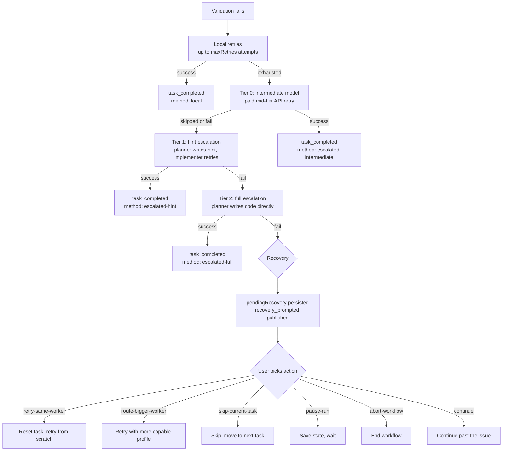

# diptych — Approval gates, escalation, and recovery

How diptych keeps the user in control during a workflow run. Three systems work together: document gates pause on spec, plan, and brief review; tiered approval reviews declared file writes; escalation handles validation failures automatically; and recovery gives the user the final say when automation runs out of options. Budget enforcement and drift detection run alongside these systems as continuous checks.

For the workflow state machine, see `docs/WORKFLOW.md`. For the event model, see `docs/ARCHITECTURE.md`.

---

## Document approval gates

After the planner writes a spec or plan, the workflow pauses for human review. The approval loop lives in `src/engine/orchestrator/approval/loop.ts`.

Three review gates:

**Spec approval** — After the planner writes the spec. `onApprovalNeeded('spec', filePath)` fires. The user gets three choices: approve (workflow continues to planning), comment (the planner regenerates the spec using the feedback), or reject (the workflow ends). If the user comments, the planner calls `regenerate()` with the feedback, publishes a `spec_regenerated` event, and loops back to approval. This can repeat as many times as the user wants.

**Plan approval** — Same mechanics as spec approval, applied to the plan. Active by default only in speckit mode. `onApprovalNeeded('plan', filePath)` fires, with the same approve/comment/reject loop.

**Briefs review** — After Task Briefs pass the quality gate (see below), standard and speckit enter the `reviewing-briefs` phase. The user reviews `tasks.md` on disk before any code is written. This gate is separate from `workflow.approve`.

`workflow.approve` controls only the spec and plan document gates:

| Level | What it gates |
|---|---|
| `none` | No spec or plan gates |
| `spec` | Spec only |
| `plan` | Plan only |
| `all` | Spec and plan |
| `default` | Whatever the mode dictates |

Each mode has a default. `instant` and `quick` default to `none`. `standard` defaults to `spec`. `speckit` defaults to `all`. Override with `--approve` on the CLI or `workflow.approve` in config. Standard and speckit still run briefs review even when `--approve none` skips spec and plan.

---

## Tiered approval

Document approval gates the planning output. Tiered approval gates the declared file writes the implementer reports during execution. The gate runs over the files the implementer changed; each is classified by risk and checked against a three-tier system.

The classifier lives in `src/engine/orchestrator/approval/action-classifier.ts`. It inspects the declared file path and the task's scope to assign an action class and a tier. It classifies declared file writes only — it does not parse or gate shell commands.

**Action classes the classifier produces:**

| Class | What triggers it | Default tier |
|---|---|---|
| `read` | Action descriptions beginning with `read`/`cat`/`ls`/`find`/`grep`, or anything with no write verb | `auto` |
| `write_in_scope` | Writing to a file named in the task brief or matching `scope.inBounds` / `approval.allowedPaths` | `auto` |
| `write_out_of_scope` | Writing to a file not covered by the task's scope | `sticky` |
| `destructive` | Writing to a control-plane path (`.git`, `.diptych`) | `confirm` |
| `package_change` | Writing to a package manifest or lockfile (`package.json`, `pnpm-lock.yaml`, …) | `confirm` |

Classification extracts the target file path from the action description, then checks scope membership. A write to a control-plane path is `destructive`; a write to a package manifest is `package_change`; a write to a file in the task's `scope.inBounds`, `scope.approvedOutOfBounds`, or `approval.allowedPaths` is `write_in_scope`; any other write is `write_out_of_scope`. Anything that is not a write defaults to `read`.

The `validation` and `network` classes remain part of the action-class enum and the default tier map (so `approval.tiers` can still reference them), but the file-write classifier never derives them from a description — they are not produced by gating declared writes.

**Three tiers:**

`auto` — Allow silently, no prompt. The implementer proceeds without interruption. Most in-scope work and reads fall here.

`sticky` — Check `.diptych/approvals.json` for a matching grant. If a grant exists with the right pattern and action class, allow silently. If not, prompt the user through `onTieredApproval`. The user can grant once (this action only), for the session (this run), or always (persisted to `approvals.json`). `gateAction()` in `src/engine/orchestrator/approval/tiered-approval.ts` classifies the action and dispatches sticky-tier handling in `sticky.ts`, which reads the grants store, tries to match against `always` grants first, then `session` grants scoped to the current session ID.

`confirm` — Always prompt the user, regardless of prior grants. The user must type the literal phrase "I confirm" and provide a reason (`src/engine/orchestrator/approval/confirm.ts`). This is deliberately high-friction for control-plane writes, package-manifest writes, and any produced file-write class you configure as `confirm`. Approval events (`approval_prompted`, `approval_granted`, `approval_rejected`) are published from `events.ts`; shared gate input/output types live in `types.ts`.

Override the default tier map per action class in config via `approval.tiers`. Disable tiered approval entirely with `approval.enabled: false`. `/approval list` shows active sticky grants. `/approval clear` removes them. `/yolo` toggles file-write tiered approval prompts off or back on for the rest of the session.

---

## Cost and budget gates

Budget enforcement runs in `src/engine/orchestrator/budget/`. Two phases: prediction before tasks start, and tracking during execution.

**Pre-task prediction.** `cost-prediction.ts` estimates the total cost based on task count, planner and implementer pricing, and three escalation-rate scenarios: low (0% escalation), expected (15%), and high (40%). This produces a `CostPrediction` with `lowCost`, `expectedCost`, and `highCost`. If the expected cost exceeds the configured budget, `onCostApprovalNeeded(prediction)` fires and the user can approve continuing despite the estimate or abort.

**Runtime tracking.** `budget.ts` tracks actual spend at task boundaries. It calculates the current cost from accumulated token usage and checks it against the configured `workflow.maxBudget` and `workflow.budgetPauseThreshold`, which defaults to `0.85`:

- At 80% of budget: `budget_warning` event. Informational only.
- At the pause threshold: `budget_paused` event. The workflow stops and enters recovery with reason `budget-paused`. The user can continue (if still below the hard cap), pause, or abort.
- At 100% of budget: `budget_exceeded` event. The workflow stops with reason `budget-exceeded`. Only `pause-run` and `abort-workflow` are available — no continue.

The `enforceBudget()` function guarantees threshold events fire in order: if cost jumps from 70% to 90% in a single task, `budget_warning` publishes first, then `budget_paused`.

---

## Brief quality gate

Before any code is written, `src/engine/spec/brief-quality.ts` scores each Task Brief on completeness. `evaluateBriefQuality(tasks)` runs the checks below. An empty task list is itself an error (`empty_task_list`).

**Error-level checks** (any one blocks the gate):

- `missing_validation` -- Task has zero tests.
- `vague_validation` -- Every test matches a vague pattern: `works`, `works correctly`, `works as expected`, `validate`, `make sure it works`, `should work`, `it works`, `correct`, `pass`, `tests pass`, and case variants.
- `missing_implementation_steps` -- Task has zero implementation steps.
- `multi_file_task` -- Task description or steps mention concrete paths in two or more distinct files.
- `missing_code_context` -- Task is a `modify` action but has no `currentCode`, `signature`, or `pattern`.
- `missing_escalation` -- Task text contains a risk keyword but defines no escalation rules. Risk keywords: `auth`, `security`, `secret`, `token`, `payment`, `database`, `migration`, `config`, `git`, `hook`, `permission`, `public api`.
- `missing_scope` -- Task has no scope, or scope has neither `inBounds` nor `outOfBounds`.
- `missing_evidence` -- Task has no evidence entries.

**Warning-level checks:**

- `missing_type_definitions` -- Task has no `typeDefs`.

**Scoring.** `score = 1 - errorCount * 0.2 - warningCount * 0.05`, clamped to [0, 1]. The gate passes only when `errorCount === 0` -- warnings lower the score but don't block.

The report is written to the session folder as `brief-quality.json`. If it passes, `brief_quality_passed` publishes and the workflow continues. If it fails, `brief_quality_failed` publishes and the workflow blocks.

---

## Escalation

When the implementer writes code and validation fails, the escalation system tries progressively more capable approaches before involving the user. The orchestrator calls these tiers in sequence. If any tier succeeds, the task is done.

**Local retries** (`src/engine/orchestrator/escalation/local-retries.ts`). Before any tier, the implementer retries with the error message appended to its context. No additional API calls beyond the implementer itself. Runs up to `workflow.maxRetries` times (default 3). Each attempt publishes a `retry` event. Local retries are not a numbered tier.

**Tier 0: intermediate model** (`INTERMEDIATE_TIER` in `src/engine/orchestrator/escalation/tier.ts`; implementation in `intermediate.ts`). A paid mid-tier API model (`escalation.intermediateProvider` / `intermediateModel`) retries the task. This tier runs only when an intermediate provider is configured and `escalation.enabled` is not `false`; otherwise it is skipped. Publishes `escalate` with tier 0.

**Tier 1: hint escalation** (`HINT_TIER` in `src/engine/orchestrator/escalation/tier.ts`; implementation in `hint.ts`). The planner analyzes the error and produces a short hint. The hint is appended to the error context (truncated to 4000 chars), and the implementer retries once more with the enriched error. Publishes `escalate` with tier 1.

**Tier 2: full escalation** (`FULL_TIER` in `src/engine/orchestrator/escalation/tier.ts`; implementation in `full.ts`). The full task context — brief, all prior attempts, all errors — goes to the planner. The planner writes the code itself instead of hinting. Publishes `escalate` with tier 2.

If tier 2 fails, the task publishes `task_full_fail` and enters recovery.

Every retry step (`src/engine/orchestrator/escalation/step.ts`) follows the same sequence: refresh the task's code from disk, run the retry in a staged project (a temporary copy), gate the changed files through tiered approval, promote the staged changes back, then validate and commit. If any approval gate denies the changes, the staged project is cleaned up and the retry counts as failed.

---

## Recovery

Recovery takes over when escalation is exhausted or when a workflow-level failure occurs that automation cannot resolve. The system lives in `src/engine/orchestrator/recovery/`.

When a recovery-worthy event happens, the orchestrator builds a `RecoveryIssue` (schemas: `src/core/schemas/recovery/`) describing the failure, the available actions, and a recommended action. The issue is set as `pendingRecovery` in `state.json` via `SET_PENDING_RECOVERY`, and `recovery_prompted` publishes on the EventBus. There is no `onRecoveryNeeded` callback: the TUI and RPC clients react to the persisted `pendingRecovery` (driving `applyRecoveryAction` in `src/engine/orchestrator/recovery/actions.ts`), while a headless run emits a `recovery_required` JSON line and exits non-zero (`src/cli/headless.ts`).

**Recovery reasons and their available actions:**

| Reason | When | Available actions | Recommended |
|---|---|---|---|
| `implementation-error` | Implementer crashed | `retry-same-worker`*, `route-bigger-worker`*, `skip-current-task`, `pause-run`, `abort-workflow` | `retry-same-worker` |
| `validation-failed` | Tests fail mid-escalation | `retry-same-worker`*, `route-bigger-worker`*, `skip-current-task`, `pause-run`, `abort-workflow` | `retry-same-worker` |
| `retry-exhausted` | All escalation tiers failed | `route-bigger-worker`*, `retry-same-worker`*, `skip-current-task`, `pause-run`, `abort-workflow` | `route-bigger-worker` |
| `context-overflow` | Task too large for any profile | `route-bigger-worker`*, `pause-run`, `abort-workflow` | `route-bigger-worker` |
| `user-edit-conflict` | External file edits conflict | `continue`*, `skip-current-task`, `pause-run`, `abort-workflow` | depends on `safeToContinue` |
| `approval-promotion-conflict` | Approved changes can't promote | `skip-current-task`, `pause-run`, `abort-workflow` | `pause-run` |
| `budget-paused` | Cost hit configured pause threshold (default 85%) | `continue`*, `skip-current-task`*, `pause-run`, `abort-workflow` | `pause-run` |
| `budget-exceeded` | Cost hit 100% of budget | `pause-run`, `abort-workflow` | `pause-run` |
| `dependency-blocked` | Upstream task failed/skipped | `skip-current-task`, `pause-run`, `abort-workflow` | `pause-run` |

\* Conditional. `retry-same-worker` requires retry budget remaining. `route-bigger-worker` requires a bigger profile in config. `continue` on `budget-paused` requires cost still below the hard cap. `continue` on `user-edit-conflict` requires `safeToContinue`. `skip-current-task` on `budget-paused` requires a next task.

**Validation-failure handling (`src/engine/orchestrator/task/step.ts`).** When validation fails, the orchestrator first short-circuits on an aborted run (returning without raising recovery), then diffs the current changed files against the task-attributed set. If a foreign edit — one outside the task's promoted files that matches the current task or one of its dependencies — is present in the failing universe, it raises a `user-edit-conflict` recovery (`detectValidationFailureUserEdit`) instead of charging the implementer with the retry ladder. Only after both checks does it enter the retry ladder.

**Restore-on-exhaustion.** If the retry ladder exhausts and prompts a `retry-exhausted` recovery for a task that was not diverted out of the ladder, the task's attributed changed files are restored to their pre-task state from `taskStartSnapshot` (via `restoreDirtyFilesFromSnapshot`), so a later task's validation never sees the failing task's leftover edits. A `warning` event discloses which files were restored.

**What each action does in `src/engine/orchestrator/recovery/actions.ts`:**

`retry-same-worker` — Resets the current task (`RESET_TASK`), resolves the recovery issue, and the implementation loop picks it up again from scratch.

`route-bigger-worker` — Same as retry, but the recovery issue carries a `routeBiggerProfile` fact. The orchestrator uses this profile name to create a more capable implementer for the retry. Blocked if the profile doesn't exist in config.

`planner-split-rebase` — Legacy/manual only. New recovery issues do not offer it. If a saved state still contains it, selecting it blocks with `planner-proposal-required`; execution requires a separate flow where the planner proposes new Task Briefs and the user approves/edits/rejects them before the workflow resumes.

`skip-current-task` — Records skip evidence in the evidence ledger, transitions `SKIP_TASK`, resolves recovery, publishes `task_skipped`. The workflow advances to the next task.

`continue` — Only allowed for `budget-paused` (when below hard cap) and `user-edit-conflict` (when safe). Resolves recovery and the workflow resumes where it left off. Blocked for `budget-exceeded`.

`pause-run` — Transitions `PAUSE_PENDING_RECOVERY`. State is saved to disk. The user can `diptych resume` later.

`abort-workflow` — Transitions `CANCEL`, resolves recovery. The workflow ends.

**State machine for `pendingRecovery`:**

The recovery state tracks the issue lifecycle:
1. `SET_PENDING_RECOVERY` — Issue attached to state, status `awaiting-user`.
2. `MARK_RECOVERY_APPLYING` — User picked an action, status `applying`.
3. `RESOLVE_PENDING_RECOVERY` — Action applied, issue cleared from state.
4. `PAUSE_PENDING_RECOVERY` — User chose pause, status `paused`.
5. `CLEAR_PENDING_RECOVERY` — Issue removed without resolution (e.g., workflow cancelled externally).

---

## Drift detection

Before final review, `src/engine/orchestrator/final-review.ts` calls `analyzeBriefDrift()` from `src/engine/orchestrator/drift/analyze.ts` against the current diff, tasks, and evidence ledger.

`analyzeBriefDrift()` takes the task list, the list of changed files, and the diff text. It checks for:

- **Out-of-scope files** — A file was changed but no Task Brief targets it. Severity depends on whether any task declares explicit `outOfBounds` patterns: `error` if explicit bounds exist, `warning` otherwise.
- **Out-of-bounds pattern matches** — An `outOfBounds` pattern from any task scope appears in a changed file path or in the diff text. Always `error`.
- **Missing expected files** — A task reached `done` or `escalated` but its target file was not changed. `warning`.
- **Failed task with diff** — A task failed but left changes in its target file. `error`.
- **Orphan diff** — Changed files exist but every task is failed or skipped. `error`.
- **Missing evidence** — A completed task expected evidence (from the evidence ledger) but none was observed. `warning`.

Score formula: start at 1.0, subtract 0.25 per error, 0.08 per warning, clamped to [0, 1]. The report passes if error count is zero.

The report is written to the session folder as `drift-report.json` and published as a `drift_report` event. The planner sees the drift report in the final review phase, but drift findings don't block the workflow by default.

**Cross-task drift chains** (`src/engine/orchestrator/drift/chain.ts`). Single-task drift can be incidental. Repeated out-of-bounds changes across consecutive tasks suggest a systematic problem. `computePerTaskOutOfBounds` treats a changed file as out-of-bounds only when it is none of the task's own target file, a `dependsOn` task file, an `inBounds` glob match, or an `approvedOutOfBounds` match — the same in-scope contract the approval gate's `isInScope` enforces. The chain tracker accumulates these per-task out-of-bounds files and computes a chain score:

- Length term: `min(chainLength, 5) / 5 * 0.3`
- Overlap term: `(overlapCount / unionSize) * 0.5` (how much consecutive tasks touch the same out-of-bounds files)
- New-files term: `min(uniqueFiles, 10) / 10 * 0.2`

If a task has zero out-of-bounds files, the chain resets. If the current task's out-of-bounds files overlap with the previous entry's, the chain extends. No overlap starts a new chain.

When the chain score meets or exceeds the configured threshold, `drift_chain_detected` publishes with the chain length, score, and the most frequently touched out-of-bounds file. It is telemetry-only: the OTel and tree-recorder sinks consume it, but the conversation UI does not render a row for it. Chain state is persisted to the session folder as `drift-chains.json` (`src/engine/orchestrator/drift/chain-state.ts`).
