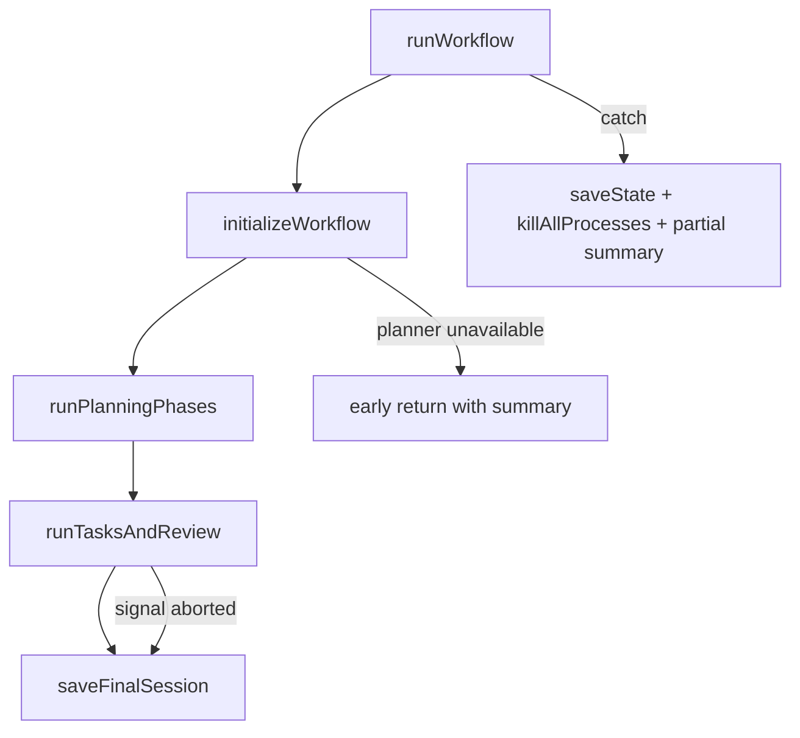
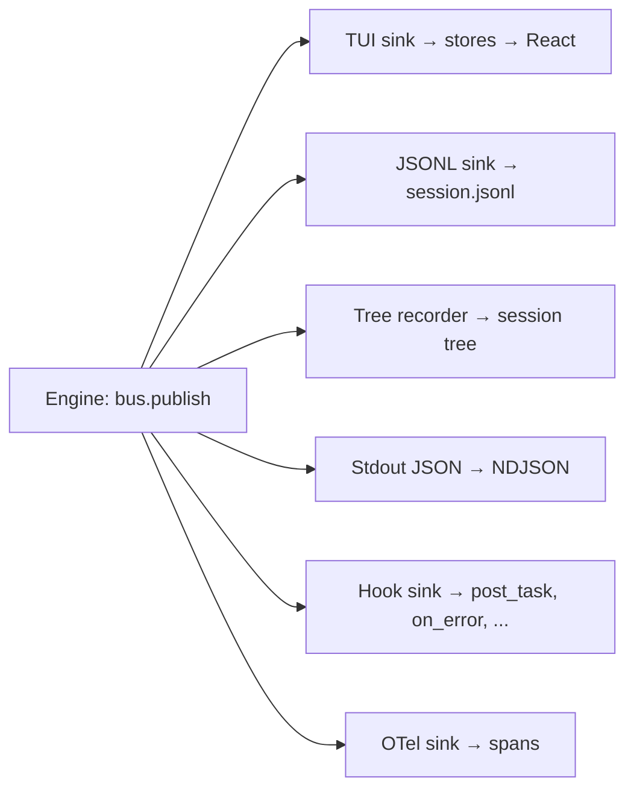

# SPLITBRIEF — Engine internals

How the orchestrator runs, how events flow, and how the engine talks to the UI without knowing the UI exists.

---

## The orchestrator

Entry point: `runWorkflow()` in `src/engine/orchestrator/run/workflow.ts`. It builds a `WorkflowContext`, runs the planner, runs the implementer on each task, reviews the result, and writes a summary. The top-level sequence:

1. `initializeWorkflow()` (`run/init.ts`) — creates the EventBus, subscribes all sinks, spawns the planner and implementer, bootstraps initial state or loads saved state for resume.
2. `runPlanningPhases()` (`run/phases.ts`) — delegates to mode-specific planning (instant, quick, standard, speckit). Each mode determines how many planner calls happen and which approval gates fire.
3. `runTasksAndReview()` — predicts cost, gates on budget if needed, runs the task loop (implementer writes code, validation runs), then calls the planner for a final review.
4. `saveFinalSession()` (`session-lifecycle/finalize.ts`) — persists the summary, updates stats, clears the active-session lock.

If any step throws, the catch block saves state to disk, kills all subprocesses, publishes an error event, and returns a partial summary. The workflow always produces a summary, even on failure.



### Orchestrator subdirectories

The orchestrator is split by concern under `src/engine/orchestrator/`:

- **`planning/`** — Mode-specific planner flows. `instant.ts` does one call producing tasks directly; `quick.ts` does one call for briefs; `full.ts` does research/spec/plan/tasks; `speckit.ts` adds clarification and constitution phases. `regen.ts` and `rewind.ts` handle regeneration from feedback and rewinding to earlier phases.
- **`task/`** — The task loop. `loop.ts` iterates tasks, `step.ts` runs a single task (call implementer, validate, retry), `commit.ts` handles per-task git commits, `pre-task.ts` runs pre-task setup.
- **`escalation/`** — Tiered escalation when the implementer fails. Local retries (`local-retries.ts`) come first, then `tier.ts` dispatches the tiers (`intermediate.ts` / `INTERMEDIATE_TIER` retries with a paid mid-tier API model from `escalation.intermediateProvider`, `hint.ts` / `HINT_TIER` has the planner write a hint that the implementer applies, `full.ts` / `FULL_TIER` hands the task to the planner to write the code itself).
- **`recovery/`** — User-facing recovery flow after all escalation tiers fail. Presents the user with choices: retry same worker, route to a bigger worker, skip, pause, or abort.
- **`approval/`** — Tiered approval system for declared file writes. Classifies changed paths by risk (in-scope, out-of-scope, control-plane, package change) and gates those writes at auto/sticky/confirm tiers.
- **`budget/`** — Cost prediction and budget enforcement. `cost-prediction.ts` estimates prompt-input cost before tasks start; `check.ts` holds pure threshold math; `knownness.ts` resolves usage-price knownness for runtime spend; `enforce.ts` publishes budget events, drives recovery, and runs post-task enforcement via `checkBudgetAfterTask`.
- **`drift/`** — Brief drift detection. Checks whether implementer output drifted from the Task Brief and reports a score. `chain.ts` tracks chains of drifting tasks.
- **`evidence/`** — Collects evidence of task completion for the final review. The `review-packet/` subfolder assembles all evidence into a structured packet for the planner.
- **`user-edit/`** — Detects when the user edits files outside of SPLITBRIEF during a running workflow. `conflicts.ts` handles merge conflicts between user edits and implementer output.
- **`explain/`** — Post-hoc explanation of workflow decisions. Formats artifacts, routing choices, and section breakdowns for the `splitbrief explain` CLI command.

---

## WorkflowContext

Every orchestrator function receives a `WorkflowContext` (`src/engine/orchestrator/types.ts`). It carries everything the workflow needs:

```
projectDir, sessionId     — where we are, which session
config                     — full resolved Config
callbacks                  — OrchestratorCallbacks (see "Events vs callbacks")
bus                        — the EventBus
planner, implementer       — the active runner instances
context                    — ProjectContext (name, dir, runtime, testCommand)
signal                     — optional AbortSignal for cancellation
metadata                   — SpecMetadata for written artifacts
sinks                      — WorkflowSinks (abort handler, queue handler)
validator                  — validation pipeline
resumeHolder               — prior messages for stateless resume
modelCache                 — pricing/cost lookups
drainPendingAttachments    — pulls attachments from store
```

This is the "god object" of the orchestrator. It's created once in `initializeWorkflow()` and threaded through every function call. Functions that need a subset of it use `Pick<WorkflowContext, ...>` or narrower types like `PlannerCallbacksContext`.

---

## EventBus

`src/engine/events/bus.ts`. Created by `createEventBus()`.

```ts
function createEventBus(): EventBus {
  // Two methods: publish(event) and subscribe(sink)
}
```

**Synchronous fan-out.** `publish()` calls every registered sink inline, in registration order. No async, no microtask scheduling. This guarantees that when `publish()` returns, all sinks have processed the event.

**Crash isolation.** Each sink call is wrapped in try/catch. If one sink throws (disk full, render error, hostile hook), the other sinks still run. The error is swallowed intentionally — sinks that care about their own failures can publish a warning event before throwing.

**External ownership.** The bus is usually created inside `initializeWorkflow()`, but can be passed in as `opts.eventBus` for the detached IPC server/client path, where a single bus is shared across process boundaries.

### EngineEvent

`EngineEventSchema` in `src/engine/events/schema.ts` (the `EngineEvent` alias is `z.infer`d in `src/engine/events/types.ts`). It is dispatched by the mandatory `type` field (snake_case) and carries `ts` (epoch millis). Workflow events also carry `phase` when they occur inside a workflow phase; global events such as snapshot restore conflicts and approval-mode changes are phase-less. Event type names use snake_case to match the on-disk JSONL convention — no translation layer between memory and persistence.

Events cover the full workflow lifecycle. A few examples:

- `workflow_started` / `workflow_complete` — session boundaries
- `task_started` / `task_completed` / `task_full_fail` — task lifecycle with timing, method, retries
- `planner_text` — streaming planner output chunks. Planner document chunks set
  `content: 'markdown'`; plain logs omit it or use `content: 'plain'`.
- `runner_call_*` — normalized planner/implementer/backend call lifecycle, text deltas, usage, raw tool-use, safe activity, session IDs, artifacts, warnings, errors, and completion
- `cost_update` — cumulative token usage after each planner or implementer call

The full union has many variants, but the pattern is consistent: every event is a flat object with snake_case type, timestamp, optional phase, and domain-specific fields.

### Runner call pipeline

Raw acquisition happens before the runner-call contract. The shared subprocess helpers in `src/lib/process/spawn/` (`lifecycle.ts`, `run-command.ts`, `progress.ts`, `line-stream.ts`) drain child stdout/stderr while retaining bounded snapshots: stdout/result text defaults to 1 MiB with prefix+tail retention, stderr defaults to a 256 KiB tail, and stdout line buffers default to 1 MiB. Snapshots carry `bytesSeen`, `bytesStored`, `omittedBytes`, `truncated`, policy, and budget. Runner stderr streaming uses an 8 KiB line buffer; an oversized stderr line is skipped and becomes a bounded `stderr_line_overflow` warning. Process errors use only sanitized bounded snapshots.

Backend calls are normalized through `src/engine/calls/*`. CLI tools, shell commands, API streams, Claude Code, and Agent SDK adapters emit `RunnerCallEvent` values. `createRunnerCallRecorder()` validates every emitted value with `RunnerCallEventSchema`; invalid upstream data becomes a bounded `call_unknown_upstream` diagnostic with a safe preview instead of a malformed event. Final snapshots/results validate with `RunnerCallResultSchema`. Streaming parsers and provider adapters validate their own upstream message/block shapes before recording; unrecognized provider chunks also route through unknown-upstream diagnostics. The collector turns the ordered stream into a `RunnerCallResult` with:

- call identity: `callId`, role, backend kind, runner/model metadata
- lifecycle status: `completed`, `failed`, `truncated`, `aborted`, `timeout`, `refused`, `unsupported_tool`, or `incomplete`
- text with semantic channel (`assistant`, `result`, `system`, or raw compatibility text), usage, native session ID, tool-use, artifacts, warnings, error, and `partial`

Runner-call usage preserves optional `reasoningTokens`. Legacy `TokenDelta` projections use the named `preserve_reasoning_metadata` policy: they carry reasoning tokens as metadata rather than folding them into `outputTokens`, because some providers already include reasoning in completion totals. `InvokeResult` is now a compatibility projection only. `toInvokeResult()` accepts completed calls; non-completed calls stay typed so planner/implementer policy can preserve partial output or fail closed. Public consumers receive bounded/redacted projections, not raw backend payloads.

Planner and implementer paths publish those call events through `publishRunnerCallEvent()` in `src/engine/orchestrator/events.ts`. The helper attaches workflow phase, optional task id, and a monotonic sequence before publishing projected `runner_call_*` `EngineEvent` values on the EventBus. Raw tool/text/artifact projections preserve internal detail when transcript persistence allows it. Safe `runner_call_activity` projections carry bounded redacted labels keyed by stable activity ids, so UI and attached clients do not inspect raw tool payloads to render activity. The engine does not import UI code or stores; the TUI sink projects these events into workflow stores.

Terminal runner events always carry frozen timing and outcome fields: `startedAt`, `endedAt`, `durationMs`, `partial`, `error`, `usage`, `nativeSessionId`, runner name/model/attempt, role, backend kind, phase, and optional task id. `runner_call_completed` can only have `status: 'completed'` with `error: null`; `runner_call_error` can only use failure statuses.

Model answer text is transcript/output content. It is never repurposed as status chrome or tool/action activity. Structured assistant/model protocol chunks are recorded as assistant/result text channels, while operational progress must be explicitly classified into safe `runner_call_activity` before the UI can render it as activity.

Warnings are explicit, not a side effect of benign stderr. `call_stderr_delta` is raw diagnostic material and is dropped from the public `runner_call_*` projection by default. Warning-like stderr and stderr from failed calls are promoted to bounded `call_warning` records with `source: 'stderr'`; successful subprocesses can still write benign stderr without creating a warning row. Actionable warnings enter through `call_warning` or unknown-upstream conversion and carry `code`, `severity`, `source`, `surface`, optional parser/upstream/channel metadata, `fingerprint`, `message`, and optional `rawRef`. Fingerprints normalize volatile timestamps, session ids, attempts, pids, durations, temp paths, and project-local absolute paths. Primary UI surfaces are `status`, `activity`, and `transcript`; `hidden` and `debug` stay out of the main transcript/status. `operationsStore` groups warnings by fingerprint/code/source/surface and keeps count, first/last timestamps, latest message, and max severity. Native-session resume attempts buffer callback output; if the old backend session is expired and a fresh attempt succeeds, the failed attempt is not flushed as primary runner activity.

---

## Sinks

Several sinks can subscribe to the bus. Two are unconditional (JSONL, tree recorder); the rest are gated by config or runtime mode. All are registered in `initializeWorkflow()` (`run/init.ts`):

**TUI sink** (`src/features/workflow/tui-sink.ts`) — calls `addEvent()` from `src/stores/workflow/actions/event.ts`. This is the bridge between engine and UI. It lives in `src/features/`, not `src/engine/`, because the engine layer must not import from React or stores. The sink is passed in as `opts.tuiSink` — the engine never constructs it.

**JSONL sink** (`src/engine/events/sinks/jsonl.ts`) — appends protected events to `.splitbrief/sessions/<id>/session.jsonl`. When transcript persistence is disabled, transcript-like events are dropped or stripped before write. This is the audit log and the source for session replay.

**Tree recorder sink** (`src/engine/events/sinks/tree-recorder.ts`) — maintains a branching session tree on disk. Records plan steps, agent invocations, recovery decisions, and cost checkpoints. Recovery actions that change the execution path (retry, route to bigger worker, planner split) create branches instead of appending linearly. Every raw event first passes `protectEngineEventForConsumer(context: 'tree')`; tree payloads and entry envelopes then pass consumer payload protection and schema validation before disk write. Runner invocations store control fields such as call id, role, backend kind, runner/model, phase, status, timing, usage, partial, error code, and warning counts/codes, not raw runner text/tool/artifact output.

**Stdout JSON sink** (`src/engine/events/sinks/stdout-json.ts`) — writes public NDJSON records to stdout. Live events are protected with the same transcript policy as external consumers before they are wrapped as `{ "type": "event", "data": <EngineEvent> }`; readiness, recovery, final-review, warning, and error records use their own top-level `type`. Only subscribed in `--json` headless mode.

**Hook sink** (`src/engine/hooks/sink.ts`) — maps events to workflow hook triggers and dispatches matching hooks fire-and-forget. Only five event types trigger hooks: `task_completed` maps to `post_task`, `validate` (when done) maps to `post_validation`, `git_commit` maps to `post_commit`, `workflow_complete` maps to `on_complete`, `error` maps to `on_error`. All other events are ignored.

**OTel sink** (`src/engine/events/sinks/otel.ts`) — maps events to OpenTelemetry spans. Creates nested spans for workflow, phases, and tasks. Point events (cost, validation, warnings) become span attributes or events. Opt-in via `config.otel.enabled`.



---

## Events vs callbacks

Two separate communication mechanisms serve different purposes.

**EventBus** — Broadcast, fire-and-forget. No return value. For state changes that anyone can observe. The engine publishes, sinks consume. Nobody waits for a sink to "respond."

**Callbacks** — Await-able request/response pairs on `WorkflowContext.callbacks` (`OrchestratorCallbacks` in `src/engine/orchestrator/types.ts`). For moments where the workflow must stop and wait for the user:

- `onApprovalNeeded(type, filePath)` — spec, plan, or briefs review
- `onUserEditConflict(conflict)` — a user edit collides with in-flight work
- `onQuestionAsked(question, num, total)` — planner asks a clarification question
- `onCostApprovalNeeded(prediction)` — predicted spend needs sign-off
- `onContinuationNeeded(partialResponse)` — planner call was interrupted, should we continue?
- `onTieredApproval(request)` — a declared implementer file write needs tiered approval
- `onTaskReviewNeeded(request)` — task needs human review
- `onComplete(summary)` — workflow finished

Budget pressure is **not** a gating callback. The engine never calls a budget callback; spend thresholds and unknown paid-pricing cases publish `budget_warning` / `budget_paused` / `budget_exceeded` events on the bus, and the actual pause/stop is driven through the recovery channel (`recovery_needed`), not a dedicated budget prompt.

In **interactive mode**, the TUI fulfills callbacks by switching input mode (e.g., showing an approval prompt) and resolving the promise when the user acts. In **headless mode**, workflow review gates are auto-approved, questions answer empty, recovery exits non-zero, and file-write tiered approvals fail closed unless approval config already allows the write. In **IPC mode** (detached server/client), the server publishes a status event and blocks until the client sends a command back.

The split exists because events and callbacks solve different problems. Events push state outward (anyone can listen). Callbacks pull decisions inward (the workflow needs an answer before it can proceed). Merging them would mean either every event blocks until consumed, or every callback becomes lossy.

---

## Transcript protection

`protectEngineEventForConsumer()` is applied before events leave the engine through the session log, tree recorder, IPC/TUI, stdout JSON, or RPC. With `persistTranscript: true`, events still pass through public payload size/shape protection. With `persistTranscript: false`, full transcript-like event types are omitted: `planner_text`, `user_message`, clarification text events, `implementer_generate_done`, and runner text/tool/artifact payload events. Safe `runner_call_activity`, usage, lifecycle, and terminal status remain visible after redaction. Runner activity raw expansion is disabled by forcing `rawAvailable:false` and omitting `expandId`; raw markers are only affordances, never inline raw text. `workflow_started.feature`, IPC `session_meta.feature`, queued-message text, RPC status state, task titles/reasons, task-review prose, approval/revision comments, retry errors, cost-prediction task prose, native session ids, and other prompt-bearing metadata are stripped or replaced so lifecycle remains observable without exposing user text.

Runner-call warning and error events remain structurally visible, but their message text is replaced with `[transcript omitted]` because backend diagnostics can contain prompt or transcript fragments. Ordinary operational `warning` and `error` events keep their bounded message text, so queue-full, queue-not-ready, IPC, replay, and protection diagnostics remain actionable in transcript-off mode.

All protected consumers share `src/core/consumer-policy.ts`: terminal controls are stripped from strings, secrets are redacted with the shared redaction rules, strings and full payloads are byte-bounded per consumer, unsupported/circular values are replaced, and the normalized payload is validated again. If protection makes an event invalid or too large, the consumer receives a bounded protection warning or drops the payload rather than writing unsafe data. Hooks and OpenTelemetry have separate boundaries: hook command stdin and interpolated fields use consumer-payload protection, while builtin and module hooks receive engine events; OTel applies transcript projection before span handling and per-string protection before exporting attributes. When transcript persistence is disabled, `splitbrief.feature` is omitted or replaced with a placeholder rather than exporting the feature prompt. Summary JSON, summary UI, HTML export, `ps`, active-session metadata, and generated branch/session names use the same transcript policy for feature text.

---

## How events reach the UI

The full path from engine to pixel:

1. Engine calls `bus.publish({ type: 'task_completed', ... })`
2. TUI sink calls `addEvent(event)` from `src/stores/workflow/actions/event.ts`
3. `addEvent` dispatches to workflow sub-stores synchronously:
   - `eventsStore` — appends the TUI-safe event-log projection
   - `tasksStore` — updates task progress (status, counts)
   - `tokensStore` — updates cost and token usage
   - `lifecycleStore` — updates phase, queue depth, terminal workflow timing
   - `operationsStore` — updates active/last runner operation lifecycle for compact status
4. React components using `store.use(s => s.tasks)` re-render when their selector output changes

**Ordering invariant:** safe retained event log, then tasks, then tokens, then lifecycle, then operations. Strictly synchronous — no await, no setTimeout, no microtask scheduling between them. `addEvent()` computes the safe event-log projection first, then passes the original raw event to the operational stores in the same call. React 19 + Ink batch synchronous store updates, so subscribers observe one consistent commit with all workflow stores updated together.

`cost_update` events take a fast path: they skip the event log and task store and only update tokens. This avoids growing the event log with high-frequency cost ticks.

`workflow_cancelled` is canonical. UI cancel aborts the run with a recognizable reason, and `runWorkflow()` publishes `workflow_cancelled` for UI aborts as well as OS-signal shutdown. Approval-gate `user_cancelled` follows the same event path. The store projection freezes lifecycle/operation duration immediately and accepts late terminal runner/cost events idempotently.

---

## State persistence

Two complementary paths:

**`saveState()`** (`src/core/state/persistence.ts`) — writes `state.json` on every phase transition via `transitionAndSave()`. This is the resume source of truth. `splitbrief resume` reads this file to know what phase, which tasks, and what progress. It's overwritten, not appended.

A persisted changed-files baseline has three provenance states: absent uses legacy commit-subject discovery, `head: null` records a known unborn start, and a SHA records the exact run-start commit.

`runStartChangedFiles` is immutable run-start provenance, while rolling fingerprints retain absorbed `"missing"` tombstones.

**`jsonlSink`** — appends protected events to `session.jsonl` via `src/core/sessions/log-writer.ts`. This is the audit log and transcript source when transcript persistence is enabled. Stateless backends (those that don't support session resume natively) rebuild planner context from the JSONL log on resume.

Transcript-off projection for MCP and CLI status (`consoleWorkflowFeature`, `projectWorkflowStateForTranscriptPolicy`) lives in `src/core/transcript-policy.ts`. Session directory confinement for state and log writes is shared via `assertSessionDirConfined` in `src/core/sessions/confinement.ts`.

The two serve different consumers: `state.json` is for the state machine (small, structured, overwritten), `session.jsonl` is for history (append-only, protected events, including streaming planner text only when transcript persistence is enabled).

### Session JSONL format

`session.jsonl` contains three record types interleaved chronologically. Every record is a JSON object with a `kind` discriminant and a `ts` timestamp.

**Event records** (`kind: 'event'`). Written by `jsonlSink` after event protection. Fields: `kind`, `ts`, `type` (the `EngineEvent` type name), optional `phase`, optional `taskId`, and a `data` object with event-specific fields. Known event payloads are validated before replay. The replay system (`src/engine/ipc/replay.ts`) reads only these records when an IPC client attaches mid-session and reports skipped blank, non-event, malformed, unknown, and oversized records in replay diagnostics.

**Message records** (`kind: 'message'`). Written by the transcript buffer (`src/engine/streaming/transcript-buffer.ts`) during planner and implementer streaming output. Fields: `kind`, `ts`, `role` (`'user'` or `'assistant'`), `text`, optional `phase`, and optional `interrupted`. The buffer accumulates streaming chunks and flushes at 16 KB or when the phase ends. If the call is aborted (Ctrl-C during a planner call), `flushInterrupted()` writes the partial text with `interrupted: true`. Context rebuild on resume reads these records to reconstruct the conversation history for stateless backends.

**Summary records** (`kind: 'summary'`). Written by the compaction system (see SUBSYSTEMS.md section 11). Contains `text`, `summarizedUpTo` timestamp, optional `tokenEstimate`, and optional `structured` fields. On resume, only messages after the latest summary's `summarizedUpTo` are loaded.

All three live in the same file because consumers need chronological ordering. Context rebuild reads message records and, when compaction exists, uses the latest summary record as a synthetic message before loading later messages. A separate file per record type would require merge-sorting at read time. Session-log writes and readers share bounded record-size limits; malformed or oversized lines are skipped with diagnostics rather than being silently treated as valid history.

---

## Abort handling

Ctrl-C fires a SIGINT. The signal handler (registered in `withSignalHandlers`, `src/engine/orchestrator/signals.ts`) runs `shutdownWorkflow()`:

1. `killAllProcesses()` — terminates all tracked subprocess (planner, implementer).
2. Saves `state.json` from whatever `trackedState` is at the moment of interruption.
3. If an implementer task was in progress, discards the partial file change (git checkout for tracked files, delete for new files).

The `withShutdownHandlers` wrapper in `session-lifecycle/shutdown.ts` returns the cancellation state so the run loop knows to stop and return a partial summary. For UI-originated aborts, `runWorkflow()` publishes a `workflow_cancelled` event with the abort reason; the TUI sink then freezes active operations through the store projection.

**Continuation loop.** When a planner call is interrupted (not the whole workflow, just the current call), `withContinuationLoop()` in `src/engine/orchestrator/continuation.ts` handles it. It aborts the in-flight call via a per-call `AbortController`, transitions the state to `awaitingContinue: true`, calls `onContinuationNeeded` to ask the user whether to continue, then rebuilds the prompt with the partial response and loops. The transcript buffer flushes with `interrupted: true` so the JSONL log marks the partial response.

This means a single Ctrl-C during a planner call doesn't kill the workflow — it pauses the current call and asks the user what to do. Ctrl-C at the process level (outside of an active planner call, or if no continuation callback is set) runs the shutdown path.

---

## Message queue

`src/engine/orchestrator/queue/submit.ts` (live-queue entry), with drain/clear/prompt in sibling `queue/` modules. While the planner is running, the user can type messages. These are queued, not dropped.

`enqueueUserMessage()` adds a `QueuedMessage` to `state.messageQueue` (capped at 50 messages). Each message is persisted as a message record only when transcript persistence is enabled; a `message_queued` event is always published. The event carries a sanitized bounded preview for local UI/replay consumers, and protection strips that preview for transcript-off session logs and IPC consumers.

Queue submission is planner-only. The shared enqueue boundary rejects messages outside live planner phases and rejects when the cap is full; callers receive an explicit rejection result and the engine publishes a bounded warning. Local TUI shows anchored feedback instead of pretending success, and RPC returns an error rather than an ACK.

At safe points — end of the current planner call — the orchestrator calls `drainQueue()`, which marks pending-undelivered messages as drained and publishes `queue_drained`. The drained messages get formatted into the next planner prompt as `[user also says during <phase>]` blocks.

**Native injection.** For backends that support `injectUserTurn` (e.g., Claude Code's conversation API), messages bypass the queue entirely. `dispatchNativeInjection()` in `src/engine/orchestrator/queue/native-injection.ts` calls `planner.injectUserTurn()` to push the message as a real user turn into the active conversation. If injection succeeds, the message is marked `deliveredViaNative` in state. If it fails, the message stays in the queue for the next drain — no message is ever lost.

---

## Summary shape

Source: `src/core/schemas/summary.ts`. Written to `summary.json` at workflow end by `saveFinalSession()`.

```typescript
type Summary = {
  feature: string
  totalTasks: number
  completedByLocal: number
  escalatedToPlanner: number
  skipped: number
  failed: number
  totalTime: number                       // ms
  tokenUsage: TokenUsage
  estimatedCostSavings: string
  escalationRate: number

  // Runner identity
  plannerTool?: string
  plannerModel?: string
  implementerTool?: string
  implementerModel?: string
  mode?: WorkflowMode

  // Per-task breakdown
  taskBreakdown?: TaskTokenUsage[]
  phaseTimings?: Record<string, number>   // phase name → ms

  // Cost analysis
  costBreakdown?: {
    hypotheticalCost: number              // what it would cost if planner did everything
    actualPlannerCost: number
    actualImplementerCost: number
    totalActualCost: number
    savingsAmount: number
    savingsPercentage: number
    localCompletionRate: number
    providerCosts?: Record<string, { inputTokens: number; outputTokens: number; cost: number }>
  }

  // Quality signals
  briefQuality?: { score: number; passed: boolean; errorCount: number; warningCount: number }
  driftSummary?: { passed: boolean; score: number; errorCount: number; warningCount: number }
  costPrediction?: CostPrediction          // deterministic prompt-input estimate, not total spend
  evidenceSummary?: { path: string; totalTasks: number; tasksWithValidationEvidence: number; ... }
  reviewPacket?: ReviewPacketSummary
  checkpointSummary?: CheckpointSummaryRollup
}
```

The summary is the final artifact. It carries enough data to render the summary screen and compute cumulative project stats without re-reading the JSONL log.

---

## Key event shapes

From `src/engine/events/schema.ts` (`EngineEventSchema`). Every event carries `ts: number` (epoch ms); workflow-phase events also carry `phase: Phase`.

```ts
// Task lifecycle
{ type: 'task_started'; taskId: TaskId; title: string; index: number; total: number;
  file: string; action: 'create' | 'modify'; tool?: string; model?: string;
  implementerProfile?: string; contextFit?: TaskContextFit;
  estimatedTokens?: number; untruncatedEstimatedTokens?: number;
  contextLength?: number; currentCodeTruncated?: boolean;
  currentCodeContextMode?: CurrentCodeContextMode;
  costPosture?: string; routingReason?: string }

{ type: 'task_completed'; taskId: TaskId; title: string;
  method: TaskCompletionMethod; retries: number; duration: number;
  tool?: string; model?: string; implementerProfile?: string }

// Validation
{ type: 'validate'; taskId: TaskId; status: 'running' | 'done';
  passed: boolean; stages: ValidationStages; error?: string; duration?: number }
// where ValidationStages = { typecheck: boolean; lint: boolean; test: boolean }

// Recovery
{ type: 'recovery_prompted'; issueId: string; reason: RecoveryReason;
  taskId?: TaskId; files: string[]; affectedTaskIds: TaskId[];
  availableActions: RecoveryAction[]; recommendedAction: RecoveryAction }

// Tiered approval
{ type: 'approval_prompted'; tier: ApprovalTier;
  actionClass: ActionClass; taskId?: TaskId }

// Cost
{ type: 'cost_update'; tokenUsage: TokenUsage }
// where TokenUsage = {
//   plannerInput: number; plannerOutput: number;
//   implementerInput: number; implementerOutput: number;
//   escalationInput: number; escalationOutput: number;
//   plannerCacheRead?: number; plannerCacheCreate?: number;
//   implementerCacheRead?: number; implementerCacheCreate?: number;
// }

// Planner heartbeat (emitted while the planner is running)
{ type: 'planner_heartbeat'; elapsedMs: number;
  accumulatedTokens: number; phaseHint?: string }

// Workflow config (emitted once at startup)
{ type: 'workflow_config'; mode: WorkflowMode;
  plannerTool: string; plannerModel?: string;
  implementerTool: string; implementerModel?: string }
```

`routingReason` on `task_started` is intended for user-facing task-start rows. Fuller context-fit and per-task routing metadata is also retained for cost drilldown and `splitbrief explain`; the engine emits it as plain event data and does not import UI code.
