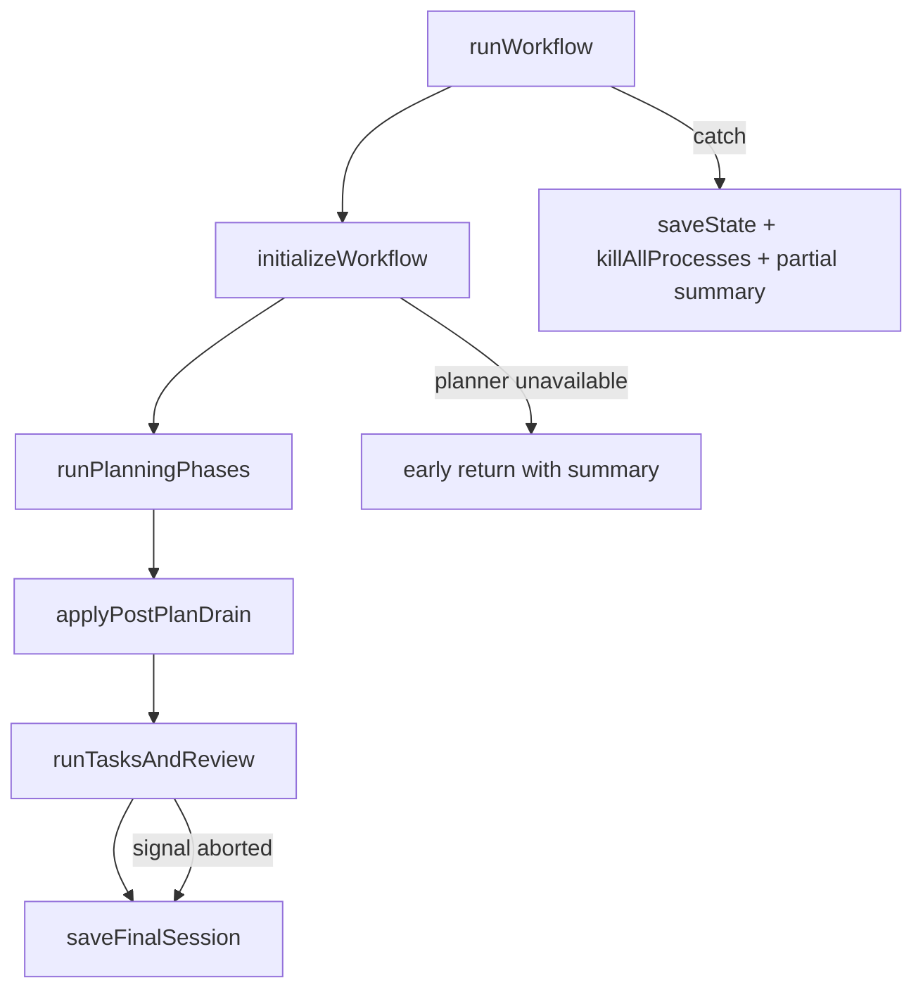
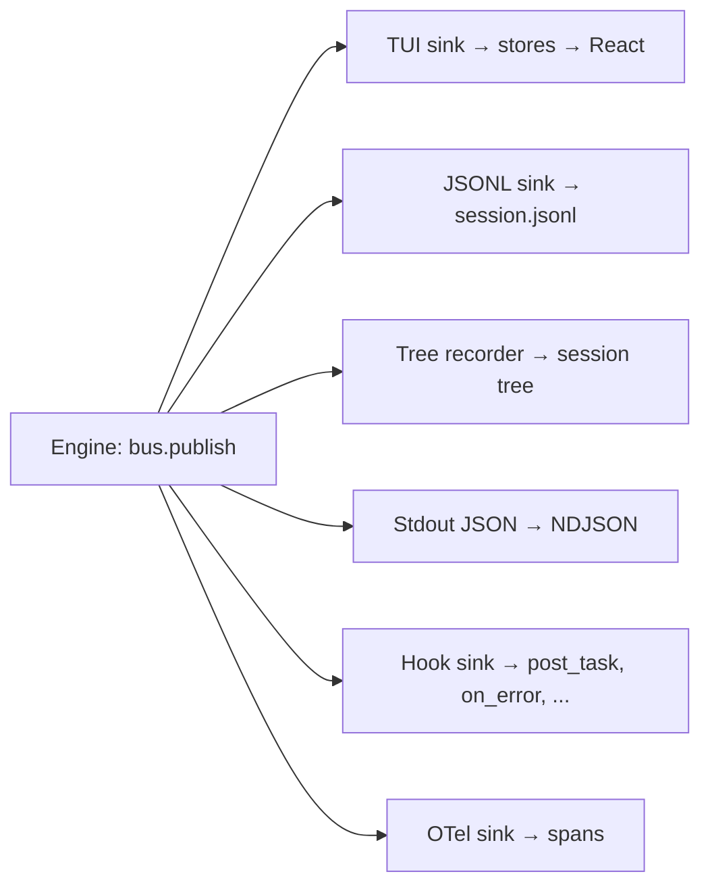

# diptych — Engine internals

How the orchestrator runs, how events flow, and how the engine talks to the UI without knowing the UI exists.

---

## The orchestrator

Entry point: `runWorkflow()` in `src/engine/orchestrator/run/workflow.ts`. It builds a `WorkflowContext`, runs the planner, runs the implementer on each task, reviews the result, and writes a summary. The top-level sequence:

1. `initializeWorkflow()` (`run/init.ts`) — creates the EventBus, subscribes all sinks, spawns the planner and implementer, bootstraps initial state or loads saved state for resume.
2. `runPlanningPhases()` (`run/phases.ts`) — delegates to mode-specific planning (instant, quick, standard, speckit). Each mode determines how many planner calls happen and which approval gates fire.
3. `applyPostPlanDrain()` — drains queued user messages that arrived while the planner was working. These get folded into the next planner prompt.
4. `runTasksAndReview()` — predicts cost, gates on budget if needed, runs the task loop (implementer writes code, validation runs), then calls the planner for a final review.
5. `saveFinalSession()` (`session-lifecycle.ts`) — persists the summary, updates stats, clears the active-session lock.

If any step throws, the catch block saves state to disk, kills all subprocesses, publishes an error event, and returns a partial summary. The workflow always produces a summary, even on failure.



### Orchestrator subdirectories

The orchestrator is split by concern under `src/engine/orchestrator/`:

- **`planning/`** — Mode-specific planner flows. `instant.ts` does one call producing tasks directly; `quick.ts` does one call for briefs; `full.ts` does research/spec/plan/tasks; `speckit.ts` adds clarification and constitution phases. `regen.ts` and `rewind.ts` handle regeneration from feedback and rewinding to earlier phases.
- **`task/`** — The task loop. `loop.ts` iterates tasks, `step.ts` runs a single task (call implementer, validate, retry), `commit.ts` handles per-task git commits, `pre-task.ts` runs pre-task setup.
- **`escalation/`** — Tiered escalation when the implementer fails. `tier.ts` defines the tiers (`INTERMEDIATE_TIER` tries a local code-fix, `HINT_TIER` sends error context to an intermediate model, `FULL_TIER` sends everything to the most capable model).
- **`recovery/`** — User-facing recovery flow after all escalation tiers fail. Presents the user with choices: retry, skip, split the task, abort.
- **`approval/`** — Tiered approval system for individual file operations. Classifies actions by risk (in-scope, out-of-scope, destructive, network, package change) and gates them at auto/sticky/confirm tiers.
- **`budget/`** — Cost prediction and budget enforcement. `cost-prediction.ts` estimates total cost before tasks start; `check.ts` monitors spend during execution.
- **`drift/`** — Brief drift detection. Checks whether implementer output drifted from the Task Brief and reports a score. `chain.ts` tracks chains of drifting tasks.
- **`evidence/`** — Collects evidence of task completion for the final review. The `review-packet/` subfolder assembles all evidence into a structured packet for the planner.
- **`user-edit/`** — Detects when the user edits files outside of diptych during a running workflow. `conflicts.ts` handles merge conflicts between user edits and implementer output.
- **`explain/`** — Post-hoc explanation of workflow decisions. Formats artifacts, routing choices, and section breakdowns for the `diptych explain` CLI command.

---

## WorkflowContext

Every orchestrator function receives a `WorkflowContext` (`src/engine/orchestrator/types.ts`). It carries everything the workflow needs:

```
projectDir, sessionId     — where we are, which session
config                     — full resolved Config
callbacks                  — OrchestratorCallbacks (see "Events vs callbacks")
bus                        — the EventBus
planner, implementer       — the active runner instances
context                    — ProjectContext (name, dir, runtime, testCommand)
signal                     — optional AbortSignal for cancellation
metadata                   — SpecMetadata for written artifacts
sinks                      — WorkflowSinks (abort handler, queue handler)
validator                  — validation pipeline
resumeHolder               — prior messages for stateless resume
modelCache                 — pricing/cost lookups
drainPendingAttachments    — pulls attachments from store
```

This is the "god object" of the orchestrator. It's created once in `initializeWorkflow()` and threaded through every function call. Functions that need a subset of it use `Pick<WorkflowContext, ...>` or narrower types like `PlannerCallbacksContext`.

---

## EventBus

`src/engine/events/bus.ts`. Created by `createEventBus()`.

```ts
function createEventBus(): EventBus {
  // Two methods: publish(event) and subscribe(sink)
}
```

**Synchronous fan-out.** `publish()` calls every registered sink inline, in registration order. No async, no microtask scheduling. This guarantees that when `publish()` returns, all sinks have processed the event.

**Crash isolation.** Each sink call is wrapped in try/catch. If one sink throws (disk full, render error, hostile hook), the other sinks still run. The error is swallowed intentionally — sinks that care about their own failures can publish a warning event before throwing.

**External ownership.** The bus is usually created inside `initializeWorkflow()`, but can be passed in as `opts.eventBus` for the detached IPC server/client path, where a single bus is shared across process boundaries.

### EngineEvent

`src/engine/events/types.ts`. A discriminated union with a mandatory `type` field (snake_case) and `ts` (epoch millis). Workflow events also carry `phase` when they occur inside a workflow phase; global events such as snapshot restore conflicts and approval-mode changes are phase-less. Event type names use snake_case to match the on-disk JSONL convention — no translation layer between memory and persistence.

Events cover the full workflow lifecycle. A few examples:

- `workflow_started` / `workflow_complete` — session boundaries
- `task_started` / `task_completed` / `task_full_fail` — task lifecycle with timing, method, retries
- `planner_text` — streaming planner output chunks
- `cost_update` — cumulative token usage after each planner or implementer call

The full union has many variants, but the pattern is consistent: every event is a flat object with snake_case type, timestamp, optional phase, and domain-specific fields.

---

## Sinks

Up to six sinks can subscribe to the bus. Two are unconditional (JSONL, tree recorder); four are gated by config or runtime mode. All are registered in `initializeWorkflow()` (`run/init.ts`):

**TUI sink** (`src/features/workflow/tui-sink.ts`) — calls `addEvent()` from `src/stores/workflow/actions.ts`. This is the bridge between engine and UI. It lives in `src/features/`, not `src/engine/`, because the engine layer must not import from React or stores. The sink is passed in as `opts.tuiSink` — the engine never constructs it.

**JSONL sink** (`src/engine/events/sinks/jsonl.ts`) — appends every event to `.diptych/sessions/<id>/session.jsonl`. Filters out `planner_text` events when transcript persistence is disabled. This is the audit log and the source for session replay.

**Tree recorder sink** (`src/engine/events/sinks/tree-recorder.ts`) — maintains a branching session tree on disk. Records plan steps, agent invocations, recovery decisions, and cost checkpoints. Recovery actions that change the execution path (retry, route to bigger worker, planner split) create branches instead of appending linearly.

**Stdout JSON sink** (`src/engine/events/sinks/stdout-json.ts`) — writes NDJSON to stdout, one line per event. Only subscribed in `--json` headless mode.

**Hook sink** (`src/engine/hooks/sink.ts`) — maps events to workflow hook triggers and dispatches matching hooks fire-and-forget. Only five event types trigger hooks: `task_completed` maps to `post_task`, `validate` (when done) maps to `post_validation`, `git_commit` maps to `post_commit`, `workflow_complete` maps to `on_complete`, `error` maps to `on_error`. All other events are ignored.

**OTel sink** (`src/engine/events/sinks/otel.ts`) — maps events to OpenTelemetry spans. Creates nested spans for workflow, phases, and tasks. Point events (cost, validation, warnings) become span attributes or events. Opt-in via `config.otel.enabled`.



---

## Events vs callbacks

Two separate communication mechanisms serve different purposes.

**EventBus** — Broadcast, fire-and-forget. No return value. For state changes that anyone can observe. The engine publishes, sinks consume. Nobody waits for a sink to "respond."

**Callbacks** — Await-able request/response pairs on `WorkflowContext.callbacks` (`OrchestratorCallbacks` in `src/engine/orchestrator/types.ts`). For moments where the workflow must stop and wait for the user:

- `onApprovalNeeded(type, filePath)` — spec, plan, or briefs review
- `onQuestionAsked(question, num, total)` — planner asks a clarification question
- `onContinuationNeeded(partialResponse)` — planner call was interrupted, should we continue?
- `onBudgetPaused(currentCost, maxBudget)` — spend hit a threshold
- `onTieredApproval(request)` — implementer wants to do something risky
- `onTaskReviewNeeded(request)` — task needs human review
- `onComplete(summary)` — workflow finished

In **interactive mode**, the TUI fulfills callbacks by switching input mode (e.g., showing an approval prompt) and resolving the promise when the user acts. In **headless mode**, workflow review gates are auto-approved, questions answer empty, recovery exits non-zero, and tiered approvals fail closed unless approval config already allows the action. In **IPC mode** (detached server/client), the server publishes a status event and blocks until the client sends a command back.

The split exists because events and callbacks solve different problems. Events push state outward (anyone can listen). Callbacks pull decisions inward (the workflow needs an answer before it can proceed). Merging them would mean either every event blocks until consumed, or every callback becomes lossy.

---

## How events reach the UI

The full path from engine to pixel:

1. Engine calls `bus.publish({ type: 'task_completed', ... })`
2. TUI sink calls `addEvent(event)` from `src/stores/workflow/actions.ts`
3. `addEvent` dispatches to four sub-stores synchronously:
   - `eventsStore` — appends to the event log
   - `tasksStore` — updates task progress (status, counts)
   - `tokensStore` — updates cost and token usage
   - `lifecycleStore` — updates phase and queue depth
4. React components using `store.use(s => s.tasks)` re-render when their selector output changes

**Ordering invariant:** events, then tasks, then tokens, then lifecycle. Strictly synchronous — no await, no setTimeout, no microtask scheduling between them. React 19 + Ink batch synchronous store updates, so subscribers observe one consistent commit with all four stores updated together.

`cost_update` events take a fast path: they skip the event log and task store and only update tokens. This avoids growing the event log with high-frequency cost ticks.

---

## State persistence

Two complementary paths:

**`saveState()`** — writes `state.json` on every phase transition via `transitionAndSave()`. This is the resume source of truth. `diptych resume` reads this file to know what phase, which tasks, and what progress. It's overwritten, not appended.

**`jsonlSink`** — appends every event to `session.jsonl`. This is the audit log and transcript source. Stateless backends (those that don't support session resume natively) rebuild planner context from the JSONL log on resume.

The two serve different consumers: `state.json` is for the state machine (small, structured, overwritten), `session.jsonl` is for history (append-only, everything, including streaming planner text when transcript persistence is enabled).

### Session JSONL format

`session.jsonl` contains three record types interleaved chronologically. Every record is a JSON object with a `kind` discriminant and a `ts` timestamp.

**Event records** (`kind: 'event'`). Written by `jsonlSink` on every `bus.publish()`. Fields: `kind`, `ts`, `type` (the `EngineEvent` type name), optional `phase`, optional `taskId`, and a `data` object with event-specific fields. The replay system (`src/engine/ipc/replay.ts`) reads only these records when an IPC client attaches mid-session.

**Message records** (`kind: 'message'`). Written by the transcript buffer (`src/engine/streaming/transcript-buffer.ts`) during planner and implementer streaming output. Fields: `kind`, `ts`, `role` (`'user'` or `'assistant'`), `text`, optional `phase`, and optional `interrupted`. The buffer accumulates streaming chunks and flushes at 16 KB or when the phase ends. If the call is aborted (Ctrl-C during a planner call), `flushInterrupted()` writes the partial text with `interrupted: true`. Context rebuild on resume reads these records to reconstruct the conversation history for stateless backends.

**Summary records** (`kind: 'summary'`). Written by the compaction system (see SUBSYSTEMS.md section 11). Contains `text`, `summarizedUpTo` timestamp, optional `tokenEstimate`, and optional `structured` fields. On resume, only messages after the latest summary's `summarizedUpTo` are loaded.

All three live in the same file because consumers need chronological ordering. Context rebuild reads message records and, when compaction exists, uses the latest summary record as a synthetic message before loading later messages. A separate file per record type would require merge-sorting at read time.

---

## Abort handling

Ctrl-C fires a SIGINT. The signal handler (registered in `withSignalHandlers`, `src/engine/orchestrator/signals.ts`) runs `shutdownWorkflow()`:

1. `killAllProcesses()` — terminates all tracked subprocess (planner, implementer).
2. Saves `state.json` from whatever `trackedState` is at the moment of interruption.
3. If an implementer task was in progress, discards the partial file change (git checkout for tracked files, delete for new files).

The `withShutdownHandlers` wrapper in `session-lifecycle.ts` sets the `cancelled` flag so the run loop knows to stop and return a partial summary.

**Continuation loop.** When a planner call is interrupted (not the whole workflow, just the current call), `withContinuationLoop()` in `src/engine/orchestrator/continuation.ts` handles it. It aborts the in-flight call via a per-call `AbortController`, transitions the state to `awaitingContinue: true`, calls `onContinuationNeeded` to ask the user whether to continue, then rebuilds the prompt with the partial response and loops. The transcript buffer flushes with `interrupted: true` so the JSONL log marks the partial response.

This means a single Ctrl-C during a planner call doesn't kill the workflow — it pauses the current call and asks the user what to do. Ctrl-C at the process level (outside of an active planner call, or if no continuation callback is set) runs the shutdown path.

---

## Message queue

`src/engine/orchestrator/queue.ts`. While the planner is running, the user can type messages. These are queued, not dropped.

`enqueueUserMessage()` adds a `QueuedMessage` to `state.messageQueue` (capped at 50 messages). Each message is persisted to the JSONL log immediately and a `message_queued` event is published.

At safe points — end of the current planner call — the orchestrator calls `drainQueue()`, which marks all pending messages as drained and publishes `queue_drained`. The drained messages get formatted into the next planner prompt as `[user also says during <phase>]` blocks.

**Native injection.** For backends that support `injectUserTurn` (e.g., Claude Code's conversation API), messages bypass the queue entirely. `dispatchNativeInjection()` in `src/engine/orchestrator/native-injection.ts` calls `planner.injectUserTurn()` to push the message as a real user turn into the active conversation. If injection succeeds, the message is marked `deliveredViaNative` in state. If it fails, the message stays in the queue for the next drain — no message is ever lost.

---

## Summary shape

Source: `src/core/schemas/summary.ts`. Written to `summary.json` at workflow end by `saveFinalSession()`.

```typescript
type Summary = {
  feature: string
  totalTasks: number
  completedByLocal: number
  escalatedToPlanner: number
  skipped: number
  failed: number
  totalTime: number                       // ms
  tokenUsage: TokenUsage
  estimatedCostSavings: string
  escalationRate: number

  // Runner identity
  plannerTool?: string
  plannerModel?: string
  implementerTool?: string
  implementerModel?: string
  mode?: WorkflowMode

  // Per-task breakdown
  taskBreakdown?: TaskTokenUsage[]
  phaseTimings?: Record<string, number>   // phase name → ms

  // Cost analysis
  costBreakdown?: {
    hypotheticalCost: number              // what it would cost if planner did everything
    actualPlannerCost: number
    actualImplementerCost: number
    totalActualCost: number
    savingsAmount: number
    savingsPercentage: number
    localCompletionRate: number
    providerCosts?: Record<string, { inputTokens: number; outputTokens: number; cost: number }>
  }

  // Quality signals
  briefQuality?: { score: number; passed: boolean; errorCount: number; warningCount: number }
  driftSummary?: { passed: boolean; score: number; errorCount: number; warningCount: number }
  costPrediction?: CostPrediction
  evidenceSummary?: { path: string; totalTasks: number; tasksWithValidationEvidence: number; ... }
  reviewPacket?: ReviewPacketSummary
  checkpointSummary?: CheckpointSummaryRollup
}
```

The summary is the final artifact. It carries enough data to render the summary screen and compute cumulative project stats without re-reading the JSONL log.

---

## Key event shapes

From `src/engine/events/types.ts`. Every event carries `ts: number` (epoch ms); workflow-phase events also carry `phase: Phase`.

```ts
// Task lifecycle
{ type: 'task_started'; taskId: TaskId; title: string; index: number; total: number;
  file: string; action: 'create' | 'modify'; tool?: string; model?: string;
  implementerProfile?: string; contextFit?: TaskContextFit;
  estimatedTokens?: number; untruncatedEstimatedTokens?: number;
  contextLength?: number; currentCodeTruncated?: boolean;
  currentCodeContextMode?: CurrentCodeContextMode;
  costPosture?: string; routingReason?: string }

{ type: 'task_completed'; taskId: TaskId; title: string;
  method: TaskCompletionMethod; retries: number; duration: number;
  tool?: string; model?: string; implementerProfile?: string }

// Validation
{ type: 'validate'; taskId: TaskId; status: 'running' | 'done';
  passed: boolean; stages: ValidationStages; error?: string; duration?: number }
// where ValidationStages = { typecheck: boolean; lint: boolean; test: boolean }

// Recovery
{ type: 'recovery_prompted'; issueId: string; reason: RecoveryReason;
  taskId?: TaskId; files: string[]; affectedTaskIds: TaskId[];
  availableActions: RecoveryAction[]; recommendedAction: RecoveryAction }

// Tiered approval
{ type: 'approval_prompted'; tier: ApprovalTier;
  actionClass: ActionClass; taskId?: TaskId }

// Cost
{ type: 'cost_update'; tokenUsage: TokenUsage }
// where TokenUsage = {
//   plannerInput: number; plannerOutput: number;
//   implementerInput: number; implementerOutput: number;
//   escalationInput: number; escalationOutput: number;
//   plannerCacheRead?: number; plannerCacheCreate?: number;
//   implementerCacheRead?: number; implementerCacheCreate?: number;
// }

// Planner heartbeat (emitted while the planner is running)
{ type: 'planner_heartbeat'; elapsedMs: number;
  accumulatedTokens: number; phaseHint?: string }

// Workflow config (emitted once at startup)
{ type: 'workflow_config'; mode: WorkflowMode;
  plannerTool: string; plannerModel?: string;
  implementerTool: string; implementerModel?: string }
```
