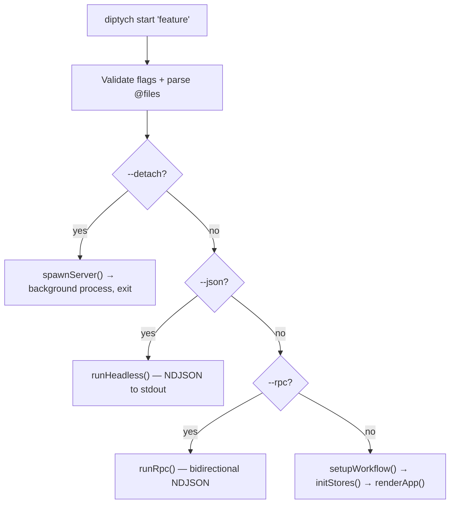
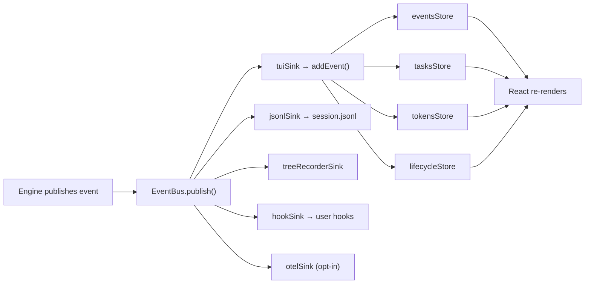

# diptych — How it works

This is the data flow from CLI entry to workflow completion. You've read the [mental model](./MENTAL-MODEL.md) and know what diptych does. This page shows you where it happens — file paths, function names, the actual call chain. Read this when you want to trace through the code.

---

## CLI entry

The user types `diptych start "add email validation"`. Execution begins in `src/cli.ts`, which creates a Commander program and registers subcommands. `start` is registered by `registerStartCommand()` in `src/cli/commands/start/register.ts` and is the default command — bare `diptych "feature"` hits the same path.

The handler validates flag combinations first — `--json` and `--rpc` are mutually exclusive, `--detach` requires a feature argument. If the user provided `@file` arguments, `parseAtFiles()` (`src/cli/parse-at-files.ts`) reads them, inlines text files into `<user-context>`, and queues image files in the attachments store. Then the handler branches into one of four paths:

**`--detach`** spawns a background server via `spawnServer()` (`src/engine/ipc/spawn-server.ts`), prints the session ID and PID, then exits. The user attaches later with `diptych attach`.

**`--json`** runs the workflow headless via `runHeadless()` (`src/cli/headless.ts`). Events stream as NDJSON to stdout. Workflow review gates are auto-approved; file-write tiered sticky/confirm approvals fail closed unless their tiers allow the write.

**`--rpc`** runs via `runRpc()` (`src/cli/rpc/run/host.ts`). Bidirectional NDJSON — the caller sends gate responses, diptych sends events back. Gates are interactive.

**Interactive** (the default) is the path most users take. It calls `setupWorkflow()` (`src/cli/setup.ts`) to resolve the project directory, check for a git repo, and create a default config if none exists. If no config exists and no CLI overrides were provided, it returns `needsSetup: true` and the router opens the setup screen instead of the workflow.

After setup, the handler calls `initStores()` and then `renderApp()`.

---

## Store bootstrap

`initStores()` in `src/cli/init-stores.ts` prepares the shared state layer. It runs three phases in order:

**`initUIChrome()`** subscribes the terminal-size store to resize events so layout reflows when the window changes.

**`loadProjectState()`** loads configuration from `.diptych/config.yaml` via `configStore.load()`, loads session history via `sessionsStore.load()`, and installs history persistence. If the user specified `--mode full`, it warns that `full` is a deprecated alias for `speckit`. Config must load before sessions — session display depends on config state.

**`ensureHooksTrusted()`** (`src/cli/hook-trust-prompt.ts`) checks whether the project's configured hooks have been approved. If not, it prompts the user before continuing. This runs after config is loaded (hooks come from config) but before discovery (discovery shouldn't run under untrusted hooks).

**`loadDiscovery()`** runs last because it's async and independent of config/session state. It does three things in parallel: discovers planner skills via `discoverSkills()` (`src/engine/skill-discovery.ts`), detects provider capabilities via `detectCapabilities()` (`src/engine/providers/capabilities.ts`), and detects available CLI tools and models via `loadDetectionIntoStores()`. Skill sources depend on the planner: `.claude/skills/`, `.diptych/skills/`, global tool skill dirs, `AGENTS.md`, or `CONVENTIONS.md`.

---

## TUI rendering

`renderApp()` in `src/cli/render/app.ts` mounts the Ink app. It tries fullscreen mode via `withFullScreen()` from `fullscreen-ink` — if that fails (unsupported terminal, broken escape codes), it falls back to inline rendering. Mouse input is wired through a filtered stdin that strips mouse escape sequences before they reach Ink's input handler.

**`src/app/root.tsx`** is the root component. It reads `routerStore` for the current screen and `overlayStore` for any active overlay, wires runtime commands via `useRuntimeCommands()` (`src/app/command-context.ts`), binds app-wide keys via `useAppKeys()` (`src/app/keys.ts`), and renders `<AppProvider>` (`app/provider.tsx`, today only `<ThemeProvider>`) wrapping `<Router/>` (`app/router.tsx`), which composes the page files and returns `<Layout screen={…} overlay={…}/>`.

Screen selection is a switch on `routerStore`'s `screen` field:

- **home** — `<HomeScreen/>` — the landing screen when no feature was provided
- **workflow** — `<WorkflowScreen/>` — the main screen during a run
- **summary** — `<SummaryScreen/>` — post-completion results
- **setup** — `<SetupScreen/>` — first-run configuration wizard

`<WorkflowScreen/>` is where the engine starts. Its `useWorkflowRunner()` hook (`src/features/workflow/hooks/use-runner.ts`) triggers `runWorkflow()` from the engine. The hook creates an `AbortController`, wires up cancel/rewind handlers, creates a TUI event sink, and calls `runWorkflow()` with callbacks that bridge engine gate requests to the UI's input mode system.

The callbacks are how the engine asks for human decisions without importing React. `onApprovalNeeded` switches to review mode and resolves when the user responds. `onCostApprovalNeeded` opens the cost approval prompt. `onTaskReviewNeeded` switches to question mode. The engine `await`s these promises — it's blocked until the user answers.

---

## Workflow initialization

`runWorkflow()` (`src/engine/orchestrator/run/workflow.ts`) is the top-level engine entry. It generates a session ID, builds a summary base with planner/implementer metadata, wraps the entire run in `withShutdownHandlers()` (SIGINT/SIGTERM handler that saves state on interrupt), and delegates to `initializeWorkflow()` (`src/engine/orchestrator/run/init.ts`).

`initializeWorkflow()` does the following, in order:

**Creates the EventBus** — `createEventBus()` in `src/engine/events/bus.ts`. The bus is a synchronous fan-out dispatcher: `publish(event)` iterates all subscribed sinks and calls each one. A throw in one sink is caught and swallowed — a crashing sink cannot tear down the engine mid-task.

**Subscribes sinks** to the bus:
- The TUI sink (`opts.tuiSink`) if provided — this is `createTuiSink()` from `src/features/workflow/tui-sink.ts`, which forwards events to `addEvent()` in the workflow store. The engine doesn't import it — it receives it as an opaque `EventSink` via the options, which is how the engine/UI boundary stays clean.
- The JSONL sink (`createJsonlSink()`) appends every event to `session.jsonl`.
- The tree recorder sink (`createTreeRecorderSink()`) tracks the event tree structure.
- The stdout-JSON sink (headless only) writes NDJSON to stdout.
- The hook sink (`createHookSink()`) dispatches user-configured hooks on matching events.
- The OTel sink (opt-in) emits OpenTelemetry spans.

**Creates the planner** via `createPlanner()` in `src/engine/runners/factory.ts`. The factory switches on `config.planner.kind` and lazy-loads the appropriate backend module. Backend modules are loaded with dynamic `import()` behind a memoizing `lazy()` wrapper — the module is only loaded when first needed, and subsequent calls return the same promise.

**Creates the implementer** via `createImplementer()` using the same factory pattern.

**Handles resume** — if `savedState` exists and there's no pending recovery, it auto-compacts the JSONL log and rebuilds context for stateless backends (those that don't support session persistence natively).

**Publishes `workflow_started`** (or `workflow_resumed` for a resume) and saves the initial state to disk.

After initialization, `runWorkflow()` installs a queue handler (for messages the user types while the planner is working) and proceeds to planning.

---

## Planning phases

`runPlanningPhases()` (`src/engine/orchestrator/run/phases.ts`) delegates to `runPlanningPhase()` (`src/engine/orchestrator/planning/run.ts`), which resolves the workflow mode and dispatches to the mode-specific handler:

**instant** — `runInstantPlanning()` (`src/engine/orchestrator/planning/instant.ts`). One planner call. Produces tasks directly — no spec, no plan, no approval gates.

**quick** — `runQuickPlanning()` (`src/engine/orchestrator/planning/quick.ts`). One planner call. Tasks only, no supporting documents.

**standard** — `runFullPlanning()` (`src/engine/orchestrator/planning/full.ts`). Four planner calls: research, spec, plan, tasks. The spec goes through an approval loop — the user can approve, comment (triggers regeneration), or reject. After tasks are generated, they pass through the brief quality gate, then `runBriefsApprovalLoop()` enters `reviewing-briefs` before implementation.

**speckit** — `runSpeckitPlanning()` (`src/engine/orchestrator/planning/speckit.ts`). Adds clarification questions, a constitution check, and post-plan analysis on top of the standard flow.

Before any mode-specific handler runs, `runPlanningPhase()` builds a repo map via `buildRepoMap()` (`src/engine/codebase/repomap.ts`) — a PageRank-weighted summary of the codebase focused on files relevant to the feature. This gives the planner structural context without sending the entire codebase.

During planning, the planner streams text. `planner_heartbeat` events (`src/engine/orchestrator/planning/heartbeat.ts`) fire every 2 seconds after a 5-second threshold, reporting accumulated tokens and a phase hint. These are proof-of-life signals during long waits — the TUI shows them as a spinning indicator.

Planning artifacts (`research.md`, `spec.md`, `plan.md`, `tasks.md`, plus speckit artifacts when produced) are written to the session folder at the end of each planning phase via `writeSpecFile()` in `src/core/paths-io.ts`.

---

## Task loop

After planning, `runTasksAndReview()` (`src/engine/orchestrator/run/phases.ts`) runs a cost prediction, optionally gates on cost, and enters the task loop via `runTaskLoop()` (`src/engine/orchestrator/task/loop.ts`).

The loop iterates tasks in order (tasks are already topologically sorted by `dependsOn` during planning). For each task:

**Dependency check** — if any task in this task's `dependsOn` list has failed or been skipped, the task enters recovery. The user is prompted to decide what to do.

**User edit detection** — `checkUserEditConflicts()` checks whether the user modified files outside diptych while the workflow was running. If there's a conflict with the current task's target file, recovery is triggered.

**Implementer profile routing** — `routeTaskToImplementerProfile()` (`src/engine/orchestrator/context-routing/route.ts`) estimates the task's token requirements and selects the best implementer profile. If no profile can handle the task (context overflow), the task enters recovery.

**Execution** — `runSingleTask()` (`src/engine/orchestrator/task/step.ts`) runs the task:

1. Transitions state to `START_TASK` and refreshes the file's current code from disk
2. Runs the tiered file-write approval gate, classifying declared changed paths by scope/risk (in-scope, out-of-scope, control-plane, package change) and gating those writes at the configured tier
3. Runs pre-task hooks if configured
4. Calls `runImplementation()` — the implementer receives the task brief and produces code
5. Applies changed files — for `api` and `shell` backends, code is extracted from the response; for `cli`, `agent`, and `agent-sdk` backends, changes are detected via git diff
6. Runs validation: typecheck, then lint, then test (`src/engine/orchestrator/validation/run.ts`). The pipeline stops on the first failure.
7. On pass: commits (if per-task commit strategy is configured), transitions to `VALIDATION_PASS`, records evidence, runs drift chain analysis
8. On fail: retries with the error message (up to the configured retry count), then escalates through tiers if retries are exhausted

Budget enforcement happens at task boundaries — `enforceBudget()` checks accumulated cost after each task and can pause or stop the loop if the budget threshold or maximum is reached.

---

## Event flow

When the engine publishes an event through the bus, every subscribed sink receives it synchronously. The TUI path is the one that drives the terminal display:

**`addEvent()`** in `src/stores/workflow/actions/event.ts` is the bridge between engine events and React state. It updates four stores in a fixed order: events, tasks, tokens, lifecycle. This ordering is strictly synchronous — no `await`, no `setTimeout`, no microtask scheduling. React 19 with Ink batches synchronous store updates so subscribers observe one consistent commit with all four stores updated.

One optimization: `cost_update` events take a fast path that only touches the tokens store, skipping the events/tasks/lifecycle writes.

If the lifecycle store's `cancelled` flag is set, `addEvent()` returns immediately — no stores are updated. This prevents late-arriving events from a cancelled workflow from polluting the display.

React components subscribe to individual store slices via `store.use(selector)`. A component that only reads `tasksStore.use(s => s.currentTask)` won't re-render when the token count changes. The store system makes selector-based subscriptions automatic — no `useMemo` or `useCallback` needed.

---

## Persistence

Every workflow run produces files on disk under `.diptych/sessions/<id>/`:

**`state.json`** — the source of truth for resume. Overwritten on every phase transition via `transitionAndSave()` (`src/engine/orchestrator/state-ops.ts`), which calls `saveState()` (`src/core/state/persistence.ts`). Contains the current phase, task list with statuses, token usage, message queue, and any pending recovery state.

**`session.jsonl`** — the full event log, append-only. The JSONL sink writes every `EngineEvent` as it's published (`src/core/sessions/log-writer.ts`). This is the audit trail and the source for context rebuild when resuming with a stateless backend.

**`research.md`, `spec.md`, `plan.md`, `tasks.md`** — planning artifacts, written once at the end of each planning phase when the selected mode produces them. The user reviews applicable artifacts during approval gates.

**`summary.json`** — final cost, timing, task outcomes. Written once at workflow end by `saveFinalSession()` (`src/engine/orchestrator/session-lifecycle/finalize.ts`), which also updates cumulative stats and clears the `.diptych/active` lock file.

**`snapshots/`** — content-addressed working-tree snapshots for undo, created at configurable points (pre-task, post-task, pre-final-review).

**On interrupt** (SIGINT/SIGTERM), `withSignalHandlers()` (`src/engine/orchestrator/signals.ts`) runs `shutdownWorkflow()` (`src/engine/orchestrator/session-lifecycle/shutdown.ts`): it kills all child processes, saves the current state to `state.json`, and discards any in-progress file change. The `.diptych/active` marker is preserved when there's pending recovery or a rewind in progress, cleared otherwise. Continue later with `diptych continue <session-id>` when the saved state is resumable.

---

## Final review and shutdown

When all tasks complete, `runTasksAndReview()` calls `runFinalReviewPhase()` (`src/engine/orchestrator/final-review.ts`).

The function transitions state to `ALL_DONE`, optionally takes a pre-final-review snapshot, then asks the planner to review the full git diff against the spec. It computes brief drift — comparing what each task brief asked for against what actually changed — and includes that analysis in the review prompt. The planner's response is written to `review.md` in the session folder.

Evidence recording happens throughout: the evidence ledger tracks approvals, rejections, validation outcomes, and the final review status. After the review, a review packet is written — a structured summary of all evidence for the session.

The function transitions to `REVIEW_DONE`, publishes `workflow_complete`, builds the final summary, and calls `callbacks.onComplete(summary)`. Back in `runWorkflow()`, `saveFinalSession()` writes `summary.json`, updates cumulative project stats, and clears `.diptych/active`.

In the TUI, `onComplete` causes the router to navigate to the summary screen, where the user sees cost breakdown, task outcomes, and the planner's review.

---

## Resume

`diptych resume` (`src/cli/commands/resume.ts`) picks up an interrupted workflow.

The CLI reads `.diptych/active` to find the session ID, loads `state.json` via `loadState()` (`src/core/state/persistence.ts`), and runs three guards:

1. **Version check** -- `stateVersion` must equal `CURRENT_STATE_VERSION` (currently 3). Older versions refuse with an error.
2. **Phase check** -- `isResumable(state)` (`src/core/phases.ts`) returns true for the `RESUMABLE_PHASES` set (`planning`, `implementing`, `final-review`) and for any phase with `awaitingContinue: true`. Every other phase -- including the review/gate phases, `analyzing`, `validating-task`, and `escalating` -- is resumable only through that override; terminal phases (`idle`, `complete`) never are.
3. **Recovery check** -- if `pendingRecovery` is set, the orchestrator shows the recovery prompt before dispatching work.

After validation, the CLI routes to headless (`--json`), RPC (`--rpc`), or interactive (TUI) mode, passing the loaded state as `resumeState`.

Inside `initializeWorkflow()` (`src/engine/orchestrator/run/init.ts`), context rebuild follows the capability matrix:

1. **Native session resume** -- if the planner has `supportsSessionResume` and `plannerSessionId` is set, the factory passes the session ID to the backend (Claude Code `--session-id`, Agent SDK `options.resume`). The prior conversation survives.
2. **Auto-compaction + transcript rebuild** -- if `supportsSessionResume` is false, `autoCompactResumeContext()` (`src/engine/orchestrator/resume-context.ts`) checks whether the JSONL log exceeds `compactionThreshold`. If so, it summarizes old messages via `planner.summarize()`. Then `applyRebuiltContext()` rebuilds a messages array from `session.jsonl` and injects it as `resumeHolder.messages` for the next planner call.
3. **Handoff fallback** -- if `persistTranscript` is false and native resume failed, no transcript exists to rebuild from. The orchestrator warns the user and continues with spec/plan/tasks artifacts only.

The orchestrator then publishes `workflow_resumed` and picks up from the saved phase.

### Related commands

**`diptych spec <feature>`** (`src/cli/commands/spec.ts`) -- runs planning phases only (research, spec, plan, tasks) and exits without implementation. Produces the same planning artifacts (`research.md`, `spec.md`, `plan.md`, `tasks.md`, plus speckit artifacts when produced) as a full run.

**`diptych continue [alias]`** (registered in `src/cli/commands/continue/register.ts`) -- continues a session by numeric alias from `diptych ps`, by session ID, or by active/single-running discovery. It attaches when the target is running and resumes saved state otherwise.

---

## What to read next

- **[WORKFLOW.md](./WORKFLOW.md)** — the state machine: every phase, every transition, every edge case
- **[ARCHITECTURE.md](./ARCHITECTURE.md)** — layer boundaries, import rules, design rationale
- **[ENGINE.md](./ENGINE.md)** — EventBus internals, sink contracts, how engine and UI communicate
