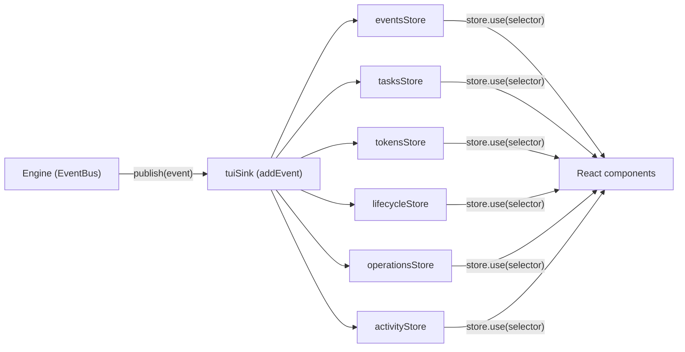

# Stores and UI

How state flows from the engine to the screen. Read this before adding a store, a feature, or an overlay. Prerequisites: [MENTAL-MODEL.md](./MENTAL-MODEL.md) for concepts, [ENGINE.md](./ENGINE.md) for how the EventBus delivers events, [HOW-IT-WORKS.md](./HOW-IT-WORKS.md) for the full flow.

---

## The store factory

`src/stores/create-store.ts` creates a store from an initial value or factory function. Each store exposes five methods:

- `get()` -- synchronous read. Used by non-React UI/CLI glue and store actions.
- `set(updater)` -- replace state or pass a function `(prev) => next`. Skips notification when the new value is reference-equal (`Object.is`) to the old one, so updaters must return new objects to trigger subscribers.
- `subscribe(listener)` -- register a callback, returns an unsubscribe function.
- `use(selector)` -- React hook. Wraps `useSyncExternalStore`. Caches the selected value per render -- if the store state reference and selector function haven't changed, it returns the cached result without re-running the selector.
- `reset()` -- restore to initial state.

Stores are module-scoped singletons. Import the store, call its methods. No providers, no prop drilling.

`storeBase(store)` strips `set` from the public surface, exposing only `use`, `get`, `subscribe`, `reset`. The `set` method is kept in a private `_nameInternal` export so only the store's own actions file can write to it.

**What the codebase does not use:** No React Context for state (only a static `ThemeContext` for colors). No `useMemo`, `useCallback`, `React.memo`, `forwardRef`, `useImperativeHandle`. The store pattern makes them unnecessary.

---

## Engine to UI -- the event path



The engine publishes events through the EventBus. `createTuiSink()` in `src/features/workflow/tui-sink.ts` returns `addEvent` -- a function in `src/stores/workflow/actions.ts` that dispatches each event synchronously to workflow sub-stores in a fixed order: safe event log, tasks, tokens, lifecycle, operations, activity. React 19 + Ink batch these synchronous updates into one commit, so subscribers see a consistent snapshot.

This is the only event path from engine to UI. UI composition boundaries may call engine read/run APIs explicitly — for example `useWorkflowRunner()` starts `runWorkflow()`, and command-context wiring can invoke snapshot or handoff functions — but engine events still flow into render state through stores, not direct component imports.

Store modules may import engine types with `import type` (`EngineEvent`, detection service types), but they must not import engine values. Engine modules do not import store values; they publish events and receive explicit inputs.

`runner_call_*` events are part of that same event stream. `addEvent()` projects the event-log copy before retaining it: raw `runner_call_text_delta`, tool-use, session-id, artifact, warning, error, and completion events are not stored in `eventsStore.events`. The same original event still reaches the operational stores in the same synchronous dispatch. `operationsStore` consumes runner-call lifecycle events as the canonical active-operation lifecycle for the status row: start, terminal status, duration, partial output flag, runner/model metadata, grouped warnings, and usage. Terminal operation fields are frozen once a call is cancelled/completed/failed, so late abort or warning telemetry cannot mutate the visible cancelled row. The engine separately projects safe `runner_call_activity` events from structured tool/action/session/artifact progress; conversation rows render that already-redacted activity surface as compact task/activity children, and wide terminals also render the bounded `ActivitySideRail` from `activityStore`. Raw runner text/tool/session/artifact payload events stay silent in conversation rows, and `tokensStore` does not count runner-call usage directly. `cost_update` remains the canonical user-facing token/cost projection, which avoids double-counting.

Cancellation has the same shape in every path. UI cancel first records a local cancellation intent so the screen stops spinning immediately, then the engine publishes `workflow_cancelled` with a reason such as `user_cancelled`. Both paths terminalize running operations with `endedAt` and `durationMs`; late `runner_call_error(status: aborted)` or final cost events are accepted idempotently.

When the workflow needs a human decision -- approve a spec, answer a question, confirm a cost -- it uses a separate mechanism: the engine awaits a promise, and the UI resolves it when the user acts. These blocking callbacks are distinct from the fire-and-forget event path. The approval stores (`src/stores/approval-prompt/`, `src/stores/cost-approval/`) and the `useInputMode` hook manage this.

---

## Store groups

### Workflow -- `src/stores/workflow/`

Runtime state of the active workflow run.

- **eventsStore** -- the TUI-safe event log. Array of projected `EngineEvent` objects, merged and capped. It keeps structural workflow/task events, safe planner/validation messages, and safe `runner_call_activity` display events. It does not retain raw runner text, tool-use, session-id, artifact, warning, error, or completion payloads. When capped, ordinary activity/log events are evicted before structural task/config events so completed-task summaries and active task grouping remain reconstructable.
- **lifecycleStore** -- current phase (`researching`, `reviewing-spec`, `implementing`, etc.), cancellation flag, message queue depth, and sanitized pending queue previews.
- **tasksStore** -- task map, ordered task list, current/total counts, completion times.
- **tokensStore** -- token usage, cost, pricing context, per-phase breakdowns.
- **operationsStore** -- active/last normalized runner operation. This is the source of truth for `AgentStatusRow`; terminal states carry frozen `endedAt` / `durationMs`, and running states stay compact. Runner warnings are kept only while the call is running and only when their surface is `status`, `activity`, or `transcript`. They are grouped by fingerprint/code/source/surface with count, first/last timestamps, latest message, and max severity.
- **activityStore** -- bounded live runner/tool activity derived from safe structured metadata. Repeated visible activity identity replaces the prior item, so duplicate warning/tool updates do not inflate the side rail. Conversation rows render the same safe `runner_call_activity` events directly from the event stream.
- **planEditorStore** -- rich brief editor state (flags, cursor, runtime mode toggle, section focus/editing state, copy/status messages).
- **conversationScrollStore** -- scroll offset for the conversation view.
- **abortStore** -- armed-abort indicator (`armed`: `none` / `interrupt` / `cancel` / `exit`, 2s auto-clear).
- **streamingOutputStore** -- live implementer output lines.
- **reviewStore** -- which file is under review, the scroll offset, and the rendered Markdown row height.
- **attachmentsStore** -- files attached to the next user message.

### Navigation -- `src/stores/navigation/`

- **routerStore** -- current screen (`home` | `workflow` | `summary` | `setup`) plus screen-specific data (feature name, resume state, summary, summary status). Validates transitions against a fixed map. Session selection routes resumable interrupted sessions to `workflow`; sessions with a persisted summary open `summary` with their terminal status.

### UI -- `src/stores/ui/`

- **overlayStore** -- active overlay type, overlay stack, exclusive flag.
- **feedbackStore** -- user-facing feedback. Informational messages and transient errors auto-clear after 3 seconds; persistent errors remain until replaced or reset.
- **controlsStore** -- sidebar visibility, input mode echo.
- **terminalSizeStore** -- reactive terminal cols/rows, subscribes to resize events.
- **inputHeightStore** -- current composer height in rows.
- **inputHistoryStore** -- command history with disk persistence.
- **commandPaletteMruStore** -- most-recently-used entries for the command palette.

### Project -- `src/stores/project/`

- **configStore** -- loaded `Config` object, project directory, CLI overrides, disk persistence.
- **skillsStore** -- available and selected planner skills.
- **detectionStore** -- detected tool availability (git, npm, language runtimes).
- **sessionsStore** -- past session metadata.

### Discovery -- `src/stores/discovery/`

- **modelCacheStore** -- provider model lists with TTL-based expiry.

### Approval -- `src/stores/approval-prompt/`, `src/stores/cost-approval/`

Promise-based gates. `openApprovalPrompt(request)` returns a promise. The store holds the pending request and its `resolve` function. The UI renders the prompt, the user acts, the component calls `closeApprovalPrompt(response)`, and the promise resolves. The engine continues.

---

## The multi-store hook

`useStores()` from `src/stores/use-stores.ts` subscribes to multiple stores in one call. It returns proxied state objects that track which properties each component actually reads. On the next store update, it compares only the accessed properties -- if none changed, the component skips re-rendering.

```ts
const [router, overlay] = useStores(routerStore, overlayStore);
// Only re-renders when router.screen or overlay.active changes
// (assuming those are the only properties read in JSX)
```

Use `store.use(selector)` when reading one store. Use `useStores()` when reading two or more in the same component.

---

## Screens

`src/app.tsx` reads `routerStore.screen` and renders the matching screen:

| Screen | Component | Location |
|---|---|---|
| `home` | `HomeScreen` | `src/features/home/screen.tsx` |
| `workflow` | `WorkflowScreen` | `src/features/workflow/screen.tsx` |
| `summary` | `SummaryScreen` | `src/features/summary/screen.tsx` |
| `setup` | `SetupScreen` | `src/features/setup/screen.tsx` |

Features are vertical slices. Each `src/features/<name>/` owns its screen (or overlay/picker), local components in `components/`, local hooks in `hooks/`. Features never import from each other. Shared code lives in `src/components/`, `src/hooks/`, `src/utils/`.

---

## WorkflowScreen

The main screen during execution. Key hooks:

- **`useWorkflowRunner()`** -- starts the engine via `runWorkflow()`, passing `tuiSink: createTuiSink()` and managing the run lifecycle via an `AbortController`. The EventBus is created inside the engine (`runWorkflow` init wires the `tuiSink` to it). Returns `startedAt` and `handleResume`.
- **`useInputMode()`** -- manages three input modes: `normal` (typing), `review` (approve/reject), `question` (answering planner). `setReviewMode()` and `setQuestionMode()` return promises -- the engine blocks until the user acts, then the promise resolves.
- **`useWorkflowKeys()`** -- keyboard shortcuts (Ctrl-C abort, Ctrl-D detach, arrow navigation).
- **`useIpcClient()`** -- connects to a running workflow via Unix socket for attach mode.

Key components: `Header`, `ConfigLine`, `AgentStatusRow`, `CostStatusLine`, `ConversationFlow` (row-based event stream), `Sidebar`, `Composer`, `InputFooter`, `ApprovalPrompt`, `CostApprovalPromptConnected`.

`AgentStatusRow` reads `operationsStore.active ?? operationsStore.last` and renders only compact operation state: spinner, role, phase, elapsed/proof-of-life/tokens, terminal status, warning count, and runner/model when width allows. It never renders model answer text, raw stdout, prompts, or long activity strings. `ConversationFlow` batches safe `runner_call_activity` events by model call and builds one canonical activity batch view model whose render-facing fields are `visibleItems`, `hiddenCount`, `headerCount`, `renderableUnits`, `expandableKey`, `severityCounts`, `groups`, and `rawMarkers`, alongside identity/state fields `batchKey`, `expanded`, `headerText`, and `tone`. Header text, hidden-row affordance, scroll math, and activity target discovery all use that model, whose item identity is the normalized visible label/value rather than raw event count. The compact block shows the latest three distinct items, such as `run  npm run typecheck`, `read  src/app.ts`, `search  useWorkflowRunner`, `call  github/list_issues`, `session  captured`, or `artifact  plan.md`; when older distinct items are hidden, the batch shows an explicit `Alt+A /activity` expand affordance for only that targetable batch. `Ctrl+A` remains composer line-start editing rather than activity expansion. At 120+ columns the runtime body splits into transcript plus `ActivitySideRail`, which reads `activityStore` for a bounded live timeline; 80-100 column layouts keep the side rail hidden. Assistant/result text from runner streams is transcript/output content only. `InputFooter` reads `lifecycleStore.queueDepth` and `queuePreviews` so the pending queue remains visible near the composer. Queue previews are one-line, sanitized, bounded summaries, not source transcript.

Raw activity expansion is an explicit boundary. `rawAvailable:true` means a safe display row has an expansion target in the persisted transcript/log; it does not mean raw text can be shown inline or shown without re-sanitizing. The transcript uses a `raw` marker only as an affordance. With `persistTranscript:false`, protected events force `rawAvailable:false` and omit `expandId`, so the UI has no raw expansion target. Default display payloads and expansion payloads canonicalize terminal controls before redaction.

Conversation scrolling is row-based. `planner_text` events with `content: 'markdown'` are parsed with the pure Markdown block/inline/layout utilities before they become conversation rows; unmarked planner/implementer text stays plain log output. Safe `runner_call_activity` events become batched styled activity blocks; raw runner-call text/tool/session/artifact events do not. See [`WORKFLOW-CONVERSATION-SCROLL.md`](./WORKFLOW-CONVERSATION-SCROLL.md) for the row renderer, prompt-row budgeting, terminal resize behavior, and scroll-window invariants.

Brief review has two UI paths. Simple review is read-only until the user types `e` / `edit`, which flips `planEditorStore.runtimeRichMode` for the current session and mounts the rich editor; `E` / `edit-file` keeps the explicit external-editor path. The rich editor owns task-list, section-list, and inline section-edit focus. Copy uses the selected task/section source text and writes a session-local `selection.txt` fallback when an OS clipboard command is unavailable.

---

## Overlays

`overlayStore` manages a stack. Opening an overlay pushes the current one onto the stack. `Esc` pops. When an overlay is active, `Layout` (`src/layout.tsx`) hides the screen and renders the overlay in its place.

Overlay types: `help`, `command-palette`, `skills`, `settings`, `mode-selector`, `planner-picker`, `implementer-picker`, `sessions`, `cost-drilldown`, `plan-editor-help`.

Each type maps to a component in `renderOverlay()` in `src/app.tsx`.

---

## Adding a new store

1. Create `src/stores/<group>/<name>.ts`.
2. Call `createStore(initialState)`.
3. Export the public API via `storeBase(store)` -- this gives consumers `use`, `get`, `subscribe`, `reset`.
4. Export `_nameInternal = { set: store.set }` for the actions file that needs write access.
5. If the store reads disk on startup: add an init call in `src/cli/init-stores.ts`.
6. Reset in tests: `beforeEach(() => store.reset())`.

---

## Key store shapes

State types from the source files. Use `store.use(selector)` in React and `store.get()` only in UI/CLI glue or store actions. Engine code publishes events and receives explicit inputs; it does not import stores.

```ts
// src/stores/workflow/lifecycle.ts
interface LifecycleState {
  phase: Phase;          // 'idle' | 'researching' | 'implementing' | ...
  status: 'idle' | 'running' | 'complete' | 'cancelled';
  cancelled: boolean;
  queueDepth: number;    // pending user messages
  queuePreviews: readonly { id: string; preview: string }[];
  startedAt: number | null;
  endedAt: number | null;
  durationMs: number | null;
  reason: string | null;
}

// src/stores/workflow/operations.ts
type OperationStatus =
  | 'running'
  | 'completed'
  | 'failed'
  | 'cancelled'
  | 'aborted'
  | 'timeout'
  | 'truncated'
  | 'refused'
  | 'unsupported_tool'
  | 'incomplete';

type ActiveOperation = {
  callId: string;
  role: 'planner' | 'implementer' | 'review' | 'summary' | 'compaction' | 'escalation';
  phase: Phase;
  taskId?: string;
  runnerName?: string;
  model?: string;
  attempt?: number;
  status: OperationStatus;
  startedAt: number;
  endedAt: number | null;
  durationMs: number | null;
  reason: string | null;
  usage: unknown | null;
  warnings: readonly OperationWarningGroup[];
  partial: boolean;
};
interface OperationWarningGroup {
  code: string;
  severity: 'debug' | 'info' | 'warning' | 'error';
  source: string;
  surface: 'hidden' | 'status' | 'activity' | 'transcript' | 'debug';
  fingerprint: string;
  count: number;
  firstTs: number;
  lastTs: number;
  latestMessage: string;
}

// src/stores/workflow/activity.ts
interface ActivityState {
  items: readonly ActivityItem[];
}
interface ActivityItem {
  id: string;
  callId: string;
  taskId?: string;
  ts: number;
  phase: Phase;
  role: OperationRole;
  stage: 'started' | 'updated' | 'completed' | 'warning' | 'failed' | 'aborted' | 'timeout' | 'truncated' | 'refused' | 'unsupported_tool' | 'incomplete';
  kind: 'tool' | 'command' | 'file' | 'read' | 'write' | 'edit' | 'search' | 'glob' | 'task' | 'web' | 'mcp' | 'plan' | 'session' | 'artifact' | 'warning' | 'error' | 'text' | 'unknown';
  label: string;       // safe, sanitized, terminal-cell bounded
  target?: string;
  runnerName?: string;
  model?: string;
  redacted: boolean;
  rawAvailable: boolean; // false when transcript persistence or protection forbids raw expansion
  expandId?: string;     // present only for an allowed raw expansion target
  textPartial?: string;
  diagnosticPartial?: string;
  sequence: number;
}

// src/stores/workflow/tasks.ts
interface TasksState {
  currentTask: number;
  totalTasks: number;
  tasks: WorkflowTask[];               // ordered list
  taskMap: Map<string, WorkflowTask>;   // id → task
  taskCompletionTimes: number[];
}
interface WorkflowTask { id: string; title: string; status: TaskStatus }

// src/stores/workflow/tokens.ts
interface TokensState {
  tokenUsage: TokenUsage | null;
  perPhase: Record<string, PhaseTokens>;
  perTask: Record<string, PerTaskTokens>;
  localCount: number;       // tasks completed by primary implementer
  escalatedCount: number;   // tasks completed via escalation
  completedTaskCount: number;
  prediction: CostPrediction | null;       // deterministic prompt-input estimate
  pricingContext: { plannerTool: string; implementerTool: string;
    plannerModel?: string; implementerModel?: string } | null;
}

// src/stores/workflow/review.ts
interface ReviewState {
  filePath: string | null;
  scrollOffset: number;
  renderedLineCount: number;
}

// src/stores/project/config.ts
interface ConfigState {
  config: Config | null;       // full resolved config (disk + CLI overrides)
  diskConfig: Config | null;   // config as persisted on disk, without overrides
  projectDir: string;
  overrides: CLIOverrides;
}

// src/stores/navigation/router.ts
type RouteData =
  | { screen: 'home' }
  | { screen: 'workflow'; feature: string; resumeState?: WorkflowState;
      sessionId?: string; attach?: WorkflowAttach }
  | { screen: 'summary'; summary: Summary; sessionId?: string;
      status: Session['status'] }
  | { screen: 'setup'; onComplete?: 'home' | 'workflow'; feature?: string };
```

---

## Adding a new feature

1. Create `src/features/<name>/screen.tsx` (or `overlay.tsx` / `picker.tsx`).
2. Wire it in `src/app.tsx` -- add to `renderScreen()` or `renderOverlay()`.
3. If it's a new screen: add the route to the `Screen` type and the `transitions` map in `src/stores/navigation/router.ts`.
4. Feature-local components: `src/features/<name>/components/`.
5. Feature-local hooks: `src/features/<name>/hooks/`.
6. When something is used by two or more features, move it to `src/components/` or `src/hooks/`.
