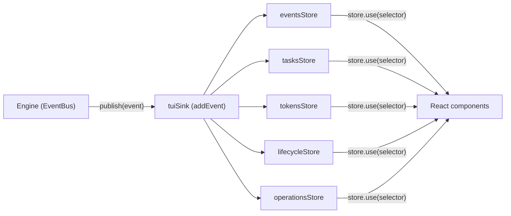

# Stores and UI

How state flows from the engine to the screen. Read this before adding a store, a feature, or an overlay. Prerequisites: [MENTAL-MODEL.md](./MENTAL-MODEL.md) for concepts, [ENGINE.md](./ENGINE.md) for how the EventBus delivers events, [HOW-IT-WORKS.md](./HOW-IT-WORKS.md) for the full flow.

---

## The store factory

`src/stores/create-store.ts` creates a store from an initial value or factory function. Each store exposes five methods:

- `get()` -- synchronous read. Used by non-React UI/CLI glue and store actions.
- `set(updater)` -- replace state or pass a function `(prev) => next`. Skips notification when the new value is reference-equal (`Object.is`) to the old one, so updaters must return new objects to trigger subscribers.
- `subscribe(listener)` -- register a callback, returns an unsubscribe function.
- `use(selector)` -- React hook. Wraps `useSyncExternalStore`. Caches the selected value per render -- if the store state reference and selector function haven't changed, it returns the cached result without re-running the selector.
- `reset()` -- restore to initial state.

Stores are module-scoped singletons. Import the store, call its methods. No providers, no prop drilling.

`storeBase(store)` strips `set` from the public surface, exposing only `use`, `get`, `subscribe`, `reset`. The `set` method is kept in a private `_nameInternal` export so only the store's own actions file can write to it.

**What the codebase does not use:** No React Context for state (only a static `ThemeContext` for colors). No `useMemo`, `useCallback`, `React.memo`, `forwardRef`, `useImperativeHandle`. The store pattern makes them unnecessary.

---

## Engine to UI -- the event path



The engine publishes events through the EventBus. `createTuiSink()` in `src/features/workflow/tui-sink.ts` returns `addEvent` -- `addEvent` in `src/stores/workflow/actions/event.ts`, which dispatches each event synchronously to workflow sub-stores in a fixed order: safe event log, tasks, tokens, lifecycle, and operations. React 19 + Ink batch these synchronous updates into one commit, so subscribers see a consistent snapshot.

This is the only event path from engine to UI. UI composition boundaries may call engine read/run APIs explicitly — for example `useWorkflowRunner()` starts `runWorkflow()`, and command-context wiring can invoke snapshot or handoff functions — but engine events still flow into render state through stores, not direct component imports.

Store modules may import engine types with `import type` (`EngineEvent`, detection service types), but they must not import engine values. Engine modules do not import store values; they publish events and receive explicit inputs.

`runner_call_*` events are part of that same event stream. `addEvent()` projects the event-log copy before retaining it: raw `runner_call_text_delta`, tool-use, session-id, artifact, warning, error, and completion events are not stored in `eventsStore.events`. The same original event still reaches the operational stores in the same synchronous dispatch. `operationsStore` consumes runner-call lifecycle events as the canonical active-operation lifecycle for the status row: start, terminal status, duration, partial output flag, runner/model metadata, grouped warnings, and usage. Terminal operation fields are frozen once a call is cancelled/completed/failed, so late abort or warning telemetry cannot mutate the visible cancelled row. The engine separately projects safe `runner_call_activity` events from structured tool/action/session/artifact progress; conversation rows render that already-redacted activity surface as compact task/activity children. Raw runner text/tool/session/artifact payload events stay silent in conversation rows, and `tokensStore` does not count runner-call usage directly. `cost_update` remains the canonical user-facing token/cost projection, which avoids double-counting.

Cancellation has the same shape in every path. UI cancel first records a local cancellation intent so the screen stops spinning immediately, then the engine publishes `workflow_cancelled` with a reason such as `user_cancelled`. Both paths terminalize running operations with `endedAt` and `durationMs`; late `runner_call_error(status: aborted)` or final cost events are accepted idempotently.

When the workflow needs a human decision -- approve a spec, answer a question, confirm a cost -- it uses a separate mechanism: the engine awaits a promise, and the UI resolves it when the user acts. These blocking callbacks are distinct from the fire-and-forget event path. The approval stores (`src/stores/approval-prompt/`, `src/stores/cost-approval/`) and the `useInputMode` hook manage this.

---

## Store groups

### Workflow -- `src/stores/workflow/`

Runtime state of the active workflow run.

- **eventsStore** -- the TUI-safe event log. Array of projected `EngineEvent` objects, merged and capped. It keeps structural workflow/task events, safe planner/validation messages, and safe `runner_call_activity` display events. It does not retain raw runner text, tool-use, session-id, artifact, warning, error, or completion payloads. When capped, ordinary activity/log events are evicted before structural task/config events so completed-task summaries and active task grouping remain reconstructable. Coalescing rules: a `running` `validate` event replaces the previous `running` `validate` entry (one row per task), and a `running` `validation_baseline` event replaces the previous `running` `validation_baseline` entry the same way (one row per probe stage sequence); a `running` followed by a `done` of either type stays two rows.
- **lifecycleStore** -- current phase (`researching`, `reviewing-spec`, `implementing`, etc.), cancellation flag, and message queue depth.
- **tasksStore** -- task map, ordered task list, current/total counts, completion times.
- **tokensStore** -- token usage, cost, pricing context, per-phase breakdowns.
- **operationsStore** -- active/last normalized runner operation. Terminal states carry frozen `endedAt` / `durationMs`, and running states stay compact. Runner warnings are kept only while the call is running and only when their surface is `status`, `activity`, or `transcript`. They are grouped by fingerprint/code/source/surface with count, first/last timestamps, latest message, and max severity.
- **conversationScrollStore** -- scroll offset for the conversation view.
- **abortStore** -- armed-abort indicator (`armed`: `none` / `interrupt` / `cancel` / `exit`, 2s auto-clear).
- **streamingOutputStore** -- live implementer output lines.
- **reviewStore** -- which file is under review, the scroll offset, and the rendered Markdown row height.
- **attachmentsStore** -- files attached to the next user message.

### Navigation -- `src/stores/navigation/`

- **routerStore** -- current screen (`home` | `workflow` | `summary` | `setup`) plus screen-specific data (feature name, resume state, summary, summary status). Validates transitions against a fixed map. Session selection routes resumable interrupted sessions to `workflow`; sessions with a persisted summary open `summary` with their terminal status.

### UI -- `src/stores/ui/`

- **overlayStore** -- active overlay type, overlay stack, exclusive flag.
- **feedbackStore** -- user-facing feedback. Informational messages and transient errors auto-clear after 3 seconds; persistent errors remain until replaced or reset.
- **controlsStore** -- sidebar visibility, input mode echo.
- **terminalSizeStore** -- reactive terminal cols/rows, subscribes to resize events.
- **inputHeightStore** -- current composer height in rows.
- **inputHistoryStore** -- command history with disk persistence.
- **commandPaletteMruStore** -- most-recently-used entries for the command palette.
- **projectFilesStore** -- refresh invalidation tick for project-file completion; the composer owns the async file read and local suggestion list.

### Project -- `src/stores/project/`

- **configStore** -- loaded `Config` object, project directory, CLI overrides, disk persistence.
- **skillsStore** -- available and selected planner skills.
- **detectionStore** -- detected tool availability (git, npm, language runtimes).
- **sessionsStore** -- past session metadata.

### Discovery -- `src/stores/discovery/`

- **modelCacheStore** -- provider model lists with TTL-based expiry.

### Approval -- `src/stores/approval-prompt/`, `src/stores/cost-approval/`

Promise-based gates. `openApprovalPrompt(request)` returns a promise. The store holds the pending request and its `resolve` function. The UI renders the prompt, the user acts, the component calls `closeApprovalPrompt(response)`, and the promise resolves. The engine continues.

---

## The multi-store hook

`useStores()` from `src/stores/use-stores.ts` subscribes to multiple stores in one call. It returns proxied state objects that track which properties each component actually reads. On the next store update, it compares only the accessed properties -- if none changed, the component skips re-rendering.

```ts
const [router, overlay] = useStores(routerStore, overlayStore);
// Only re-renders when router.screen or overlay.active changes
// (assuming those are the only properties read in JSX)
```

Use `store.use(selector)` when reading one store. Use `useStores()` when reading two or more in the same component.

---

## Screens

`src/app/router.tsx` reads `routerStore.screen` (via `app/root.tsx`) and dispatches the matching FLAT page from `src/app/screens/`:

| Screen | Component | Location |
|---|---|---|
| `home` | `HomeScreen` | `src/app/screens/home.tsx` |
| `workflow` | `WorkflowScreen` | `src/app/screens/workflow.tsx` |
| `summary` | `SummaryScreen` | `src/app/screens/summary.tsx` |
| `setup` | `SetupScreen` | `src/app/screens/setup.tsx` |

Features are vertical slices. Each `src/features/<name>/` owns its screen (or overlay/picker), local components in `components/`, local hooks in `hooks/`. Features never import from each other. Shared code lives in `src/components/`, `src/hooks/`, `src/utils/`.

---

## WorkflowScreen

The main screen during execution. Key hooks:

- **`useWorkflowRunner()`** -- starts the engine via `runWorkflow()`, passing `tuiSink: createTuiSink()` and managing the run lifecycle via an `AbortController`. The EventBus is created inside the engine (`runWorkflow` init wires the `tuiSink` to it). Returns `startedAt` and `handleResume`.
- **`useInputMode()`** -- manages three input modes: `normal` (typing), `review` (approve/reject), `question` (answering planner). `setReviewMode()` and `setQuestionMode()` return promises -- the engine blocks until the user acts, then the promise resolves.
- **`useWorkflowKeys()`** -- workflow-local keyboard shortcuts: Ctrl-D toggles the latest diff locally, plus review/conversation arrow navigation. Ctrl-C abort/exit handling lives in `src/app/keys.ts`; attached-client Ctrl-D detach is handled in `WorkflowScreen`.
- **`useIpcClient()`** -- connects to a running workflow via Unix socket for attach mode.

Key components: `Header` (phase rail), `ConversationFlow` (row-based event stream), `Sidebar`, `Composer`, `InputFooter` (byline), `ApprovalPrompt`, `CostApprovalPromptConnected`, `QuestionPrompt`.

`Sidebar` asks `layout/rect.ts` for its task-title budget (`getSidebarTaskTitleWidth`) instead of deriving one: the budget is the exact interior of the row it renders into — border, padding, and the bar/marker/space prefix accounted for — and shortens further when a status tail claims cells, so a long title always fits on one line.

The sidebar is the run's persistent task list, and it ships on: `controlsStore.sidebarVisible` starts `true`, `getWorkflowSidebarWidth` suppresses it at 120 columns and below, and `/sidebar` toggles it. Every task in the plan stays listed for the whole run, marked `✓` done (dim), `◉` running (foreground, bold, with the `▌` live bar), `○` pending, `▲` escalated, `✗` failed, `–` skipped. None of those glyphs may be tinted with `accent` — cyan is reserved for paths and links.

`tasks_planned` announces the whole plan once, before the task loop, so the list shows pending rows from the start instead of learning each task only when it begins. `updateTaskMap` seeds one `pending` entry per announced task and never downgrades a task that already earned a status, which is what makes the event safe to republish on resume and on detached re-attach. **`tasks_planned.total` is the authoritative plan size**; `task_started.total` remains only for streams that predate the announcement. The two cannot disagree — `runTaskLoop` derives both from the same `state.tasks.length` on the same entry — so the header cannot flicker as the first task starts.

The `N queued` count survives only as `selectTaskListView.unannounced` (`total - tasks.length`), which the plan announcement drives to zero; it renders as `+N more` so it never repeats the `queued` wording the overflow marker uses. Only `escalated`, `failed` and `skipped` carry a status word — a dash against a circle is the whole distinction between skipped and queued, so the states the user has to act on keep their word at every width, while done, running and pending never needed one. `getSidebarStatusColumnCells` reserves the 11-cell status column on **every** row of a list that contains any of those three, filled or not, so all titles truncate in one column instead of ragging against a right-aligned word of varying length; a list with none of them reserves nothing and spends the cells on titles. Label case is settled: Title Case for the `Tasks` header and the `Planner`/`Implementer` role names, lowercase for every state and metric word (`done`, `escalated`, `failed`, `skipped`, `queued`, `above`, `below`, `local`).

When the list is taller than its row budget, `getSidebarTaskWindow` windows it around the running task; the running task is always inside the window. The markers name what is out of view rather than only counting it — `7 done above`, `13 queued below`, falling back to a bare count when the hidden slice is not all one status — because the list follows the run instead of scrolling, so a bare count would be a dead end. When the budget affords only one marker row, `combine` collapses both edges onto it so neither is silently truncated; only a budget with no marker row at all (a single row, which the anchor claims) reports no marker. A combined row that cannot hold both labels in full drops the direction words from both sides at once (`11 done · 12 queued`) rather than a status word from one side, because an asymmetric drop reads as the two edges meaning different things. `getSidebarTaskListRows` derives the budget from the `height` the screen passes down through `WorkflowBody`; without a height the list never windows.

The panel reads on two left edges, not four: the header, the divider and every footer row sit on the marker column, titles and overflow markers sit on the title column, and the `▌` live bar hangs alone in the column left of the markers. The footer gives the planner and the implementer a row each — one shared row spent its whole width on the planner and cut the implementer away at the 34-column floor. The empty state uses the same grid: `No tasks yet` on the title column, the spinner on the marker column with the stage label beside it, and no separate "planner is working" line, since the spinner row already says the planner is running and names the stage.

Completed tasks leave the transcript by design: `groupEventsIntoSections` turns a finished task's event range into a `completed-task` section, and `walkTranscript` skips those sections, so the rows collapse into the sticky summary block above the transcript. That block's header carries the same `tasks N/M` counts, which is the only place the counts appear at or below the 120-column sidebar breakpoint.

`ConversationFlow` batches safe `runner_call_activity` events by model call and builds one canonical activity batch view model whose render-facing fields are `visibleItems`, `hiddenCount`, `headerCount`, `renderableUnits`, `expandableKey`, `severityCounts`, `groups`, and `rawMarkers`, alongside identity/state fields `batchKey`, `expanded`, `headerText`, and `tone`. Header text, hidden-row affordance, scroll math, and activity target discovery all use that model, whose item identity is the normalized visible label/value rather than raw event count. The compact block shows the latest three distinct items, such as `Run  npm run typecheck`, `Read  src/app.ts`, `Search  useWorkflowRunner`, `Call  github/list_issues`, `Sess  captured`, or `Art  plan.md`; when older distinct items are hidden, the batch shows the compact `ctrl+a` affordance for only that targetable batch. `/activity` and `Ctrl+A` both toggle the latest expandable activity batch. Assistant/result text from runner streams is transcript/output content only. `FeedbackRow` reads `lifecycleStore.queueDepth` so the pending queue count remains visible near the composer without echoing queued text outside the conversation.

Raw activity expansion is an explicit boundary. `rawAvailable:true` means a safe display row has an expansion target in the persisted transcript/log; it does not mean raw text can be shown inline or shown without re-sanitizing. The transcript uses a `raw` marker only as an affordance. With `persistTranscript:false`, protected events force `rawAvailable:false` and omit `expandId`, so the UI has no raw expansion target. Default display payloads and expansion payloads canonicalize terminal controls before redaction.

Transcript rows share one column model. Columns 0–1 are the glyph slot (`❯` prompt marker, `◉`/`●` batch dots, `│` callout bar) and content starts at column 2; activity children hang under their batch header with `├`/`└` at column 2 and text at column 4. `rowLeading()` in `conversation-rows/row-markers.ts` owns that leading, and every row builder wraps at `width - rowLeadingCells(kind)`, so full lines do not clip at the right edge. Hovering a row paints the accent `▌` bar directly into cell 0 rather than reserving a column for it. There is no transcript max-width cap: the conversation spans the full content width, and a visible sidebar squeezes it by a clamped 25% share — floored at 34 and capped at 48 columns, gated on widths above the workflow-local 120-column breakpoint — plus a 2-column gap (`layout/rect.ts`).

Activity batches always render a header (`Plan activity  4 updates  [Codex]`), even for a single event, so the header does not flicker in as a batch grows. Ledger labels render as Capitalized display strings via `display/activity-label-display.ts` (`Run`, `Read`, `Edit`, `Search`, `Call`, `List`, …); stage ids and hints stay lowercase (`spec › plan`, `+3 more · ctrl+a`, `git:none`). Shell commands from CLI runners pass through the conservative prettifier in `display/shell-activity-pretty.ts`: `cat` / `sed -n` / `head` / `tail` become `Read`, `rg` / `grep` become `Search`, `ls` becomes `List`, and anything compound (`&&`, `|`, `;`, redirects) stays a raw `Run`.

Live status renders in the byline under the composer, not as a transcript row. `deriveLiveStatus()` in `display/live-activity.ts` decides whether a stage is live; `InputFooter` renders `⠼ Researching… 2:24 · git:none` with spinner, verb, and elapsed in the active stage's role hue and the rest dim. While a prompt is open (question, review, approval, cost) the byline shows `○ waiting for you · <stage> · …` instead. The byline carries only derived status, never model answer text or raw stdout. Spinner frames are braille on every unicode-tier terminal and `|/-\` on the ascii tier (`src/lib/glyphs.ts`).

Scroll banners ride the chrome dividers instead of consuming transcript rows: `N lines above` on the header divider, `N lines below · ↓ N new events` on the footer divider. `flow.tsx` reports the labels through `onScrollAbove` / `onScrollBelow`, and `layout/scroll-window.ts` gives the window the full viewport height. Question-mode prompts (interrupt continuation, clarify questions, task review, edit conflicts) render as a bordered panel above the composer (`components/question-prompt.tsx`, budgeted by `getQuestionPromptRows` in `prompt-rows/question.ts`) with the transcript still visible; only review mode swaps the body.

Conversation scrolling is row-based. `planner_text` events with `content: 'markdown'` are parsed with the pure Markdown block/inline/layout utilities before they become conversation rows; unmarked planner/implementer text stays plain log output. The parser covers text, bold/italic/strikethrough, inline code, links, leading-pipe GFM tables, headings h1–h6, and lowlight-highlighted fenced code; markdown HTML comments (including planner `<!-- Q:… -->` clarification markers) parse but never render. Layout segments carry `href` (link target), `scope` (highlight token), and `depth` (heading level) as data only — `workflow-markers.ts` scans inline workflow tokens, `conversation-segments.ts` maps them to conversation-row tones and paths, and `review-segments.ts` maps them for the review overlay; OSC 8 hyperlink sequences are resolved only at render time in `row-view.tsx` (transcript) and `components/markdown.tsx` (review overlay), never baked into the parsed rows. Safe `runner_call_activity` events become batched styled activity blocks; raw runner-call text/tool/session/artifact events do not. See [`WORKFLOW-CONVERSATION-SCROLL.md`](./WORKFLOW-CONVERSATION-SCROLL.md) for the row renderer, prompt-row budgeting, terminal resize behavior, and scroll-window invariants.

The projection and per-event row blocks are cached by identity, not content. `getConversationRowsProjection` (`conversation-rows/projection-cache.ts`) hits its cache when all six inputs — sections, expanded-diff/activity sets, cols, viewport height, streaming state — are reference-equal to the prior call, so a cache hit costs a handful of `===` checks regardless of transcript size; this replaces the old content-key hashing, which re-serialized every event on every lookup. `conversation-rows/block-cache.ts` memoizes per-event row blocks in a `WeakMap<EngineEvent, …>`, so appending one event reuses every unchanged event's block instead of rebuilding the transcript. Both caches lean on the store layer never mutating events or sections in place (`mergeEvent` and `computeSections` re-allocate on change) and both reset at workflow start. The composer-byline live status derives from `lifecycleStore`'s `phaseFirstSeenTs` map — one timestamp recorded the first time each phase is seen — instead of rescanning the full events array on every spinner tick.

Clarification-question prompts now fire in every workflow mode, not just `speckit`: the same bordered `QuestionPrompt` panel above the composer collects answers in `instant`, `quick`, `standard`, and `speckit` alike, and answers persist under the run's `## Clarifications` section regardless of mode.

Brief review has one text-editing path. `workflow.briefReview: rich` is deprecated and maps to simple review. Pressing `Ctrl+E` or typing `e`, `edit`, `E`, or `edit-file` opens the persisted `.splitbrief/sessions/<id>/tasks.md` in the external editor. Resolution uses explicit `VISUAL` first, then non-terminal `EDITOR`, then detected GUI editors (`cursor`, `code`, `zed`, `subl`, `mate`, `bbedit`) with wait flags, macOS `open -W -t`, terminal `EDITOR`, and finally `vi`. Implicit GUI auto-detection probes only safe absolute `PATH` segments (empty, `.`, and relative segments are skipped) and spawns the resolved absolute executable path; on Windows it also honors `PATHEXT` plus `.cmd`, `.exe`, and `.bat` suffixes. After the editor exits, SPLITBRIEF re-reads `tasks.md`, re-runs brief-quality validation, and keeps the gate open on parse or quality errors. The brief review overlay loads `brief-readiness.json` alongside `brief-quality.json` (defensively: a missing or malformed readiness artifact is treated as absent). The review header folds a `readiness N blocked` slot into its existing width budget while a blocking report is loaded, and appends the override instruction `approve again overrides` in the same header line — the confirm-by-repeat affordance for the readiness override is carried there and only there, because the header is the one surface that holds the loaded report. The composer briefs hint stays fixed at the four review commands. Per-task state words stay first-match-wins: `overflow`, `conflict`, `no worker` (a task no configured profile can run), `failed`, then `stale`. The brief readiness gate renders the same way as the quality gate: `brief_readiness_passed` shows a `brief readiness` card (`passed · N tasks`), and `brief_readiness_blocked` shows an error-toned `brief readiness` card (`blocked · N of M`) in the conversation row stream.

---

### Brief recovery: projection, authority, and ownership

Brief recovery has one authority and many projections. The orchestrator's
`BriefRecoveryController` (the `BriefRecoveryController` contract in
`src/core/schemas/brief-recovery.ts`) owns admission, the fenced state/evidence mutation, the
provider call, budget reservation, operation identity, allowed actions, and the durable receipt.
It returns the versioned `BriefRecoveryProjectionV1` together with a `RecoveryResultV1` or
`QueueResultV1`. The controller is the only place that may turn a retry, edit, reject, approve, or
`resolve-unresolved` command into a mutation or provider call. A quality score is diagnostic data;
it never grants an approve override to a blocked contract.

The production loader is contract-first. `loadBriefReviewData()`
(`src/features/workflow/brief-review-loader.ts`) reads the persisted `tasks.md`,
`brief-quality.json`, `brief-readiness.json`, and `state.json`, projects the
brief recovery from the persisted state, and resolves that projection as the
authority before any legacy file. The primary status is the binary contract
outcome — `CONTRACT READY`, `CONTRACT BLOCKED`, or the corresponding non-ready
recovery state — with the durable cause and the valid action set.
Score and task count are diagnostic only. A persisted contract projection wins
over a contradictory legacy score or count display: with zero Tasks and a
quality score of 0.80 on disk, the blocked contract and its durable cause
render as the primary state, never `0 tasks · quality 0.80`. The loader and
the render perform no UI mutation and no provider call; mutating intents are
forwarded to the owner with the current epoch and receipt.

`src/stores/workflow/review.ts` is the UI projection store, not a recovery authority. It owns the
current review source, owner token, revision, scroll offset, rendered/visible row counts, brief
paths/sources, and load error used to paint the review. Components read it with `store.use()` and
local review actions update only that display state. The store does not own the recovery status,
allowed-action set, receipts, persistence, CAS/fence, budget, or provider client. `BriefReviewView`
renders the bounded recovery projection (including `CHECKING CONTRACT`, `CONTRACT BLOCKED`,
`RETRYING`, `RETRY UNRESOLVED`, `CONTRACT READY`, `READINESS BLOCKED`, and `rejected`) and sends
an action through the controller/owner command boundary; it never edits persisted recovery state
or calls a provider directly.

The owner is the only workflow process allowed to hydrate resumable state through the v4
`loadStateForResume` path and to dispatch a mutating command with its current authority receipt.
An attached or reconnecting client receives the same projection and replays it for display, but is
projection-only: status/attach/reconnect performs zero recovery calls and zero local state writes.
A mutation from an attached client is routed to the live owner, which returns the same versioned
receipt/result. If the owner is dead, takeover happens through the normal fence acquisition before
hydration; a stale owner cannot commit or unlock the epoch.

`splitbrief attach <session-id> --project .` reconnects a live detached TUI to that owner's
projection. A status or reconnect replay is observational; `retry`, edit, reject, and approve are
the only mutation intents, and they are forwarded to the owner with the current epoch and receipt.

The status/action grammar remains visible after restart:

| Projection | Meaning | Valid next move |
| --- | --- | --- |
| `checking` | local contract evidence is being checked | wait; no retry is fabricated |
| `blocked` | quality/provider/storage evidence prevents approval | retry when allowed, edit, or reject |
| `retrying` | one identified retry is in flight | observe the operation; duplicate retry is refused |
| `unresolved` / `UNRESOLVED` | dispatch may have happened, so the operation will not replay | `resolve-unresolved` with explicit rebind or abandon, then edit/reject as allowed |
| `ready` | the current Brief/report pair passed the contract gate | approve or edit |
| `readiness-blocked` | operational readiness is separate from Brief quality | edit or reject; no quality override is implied |
| `rejected` | the Brief epoch is closed by user intent | start a new epoch |

A parked planning result renders the same projection surface with its durable
cause and valid actions. Resume rehydrates it through the owner fence, and the
same projection returns; status, attach, and reconnect replays perform zero
recovery calls and zero local state writes. A park is a decision point, not a
completion or a failure, so it never renders as done work.

The wire command for a retry contains no comment or fabricated revision request. It is an explicit,
idempotent action with the current epoch, evidence base, diagnostic fingerprint, and frozen queued
input IDs:

```json
{
  "version": 1,
  "sessionId": "session-1",
  "epochId": "epoch-1",
  "operationId": "operation-1",
  "base": { "revision": 1, "hash": "brief-hash", "path": "tasks.md" },
  "intentHash": "retry-intent-hash",
  "action": "retry",
  "diagnosticFingerprint": "diagnostic-hash",
  "frozenInputIds": []
}
```

Read-only status and refusal are machine-readable and stable; terminal prose is not an API:

```json
{ "version": 1, "sessionId": "session-1", "epochId": "epoch-1", "action": "status" }
{ "type": "status", "data": { "status": "UNRESOLVED", "operationId": "operation-1" } }
{ "type": "error", "code": "brief_contract_blocked", "status": "blocked", "operationId": null }
```

### Whole-screen geometry and composer ownership

The workflow's fixed rows are owned by `ScreenShell`: one header row, one header divider, the
scrollable body, one footer divider, one feedback row, the variable-height composer, and one input
footer/byline row. `layout/chrome-rows.ts` is the shared row contract used by viewport and pointer
geometry; scroll banners ride the dividers and never consume body rows. The composer is outside the
body rectangle and is always terminal-originated: `x = 0`, `width = cols`. Recovery status,
help text, prompt text, sidebar visibility, and review content width may change the composer height
or its hint, but never its x-coordinate or width.

The sidebar rule is exact: it renders iff `cols > 120`. At 121 columns it has its clamped width and
the two-column gap; the body and the sidebar end on the same bottom row. At 120 and 119 columns the
sidebar and gap both disappear and the body reaches the content
bottom. At 80, 50, and 40 columns the content pane stays full-width; at 40 the rail/review layout
recomposes to one column rather than shrinking the composer or dropping recovery outcome/action
text. The same rectangle equation is used for conversation, document review, and Brief review, so
zero-height and prompt-clamped bodies cannot introduce a second breakpoint or hidden bottom row.

## Overlays

`overlayStore` manages a stack. Opening an overlay pushes the current one onto the stack. `Esc` pops. When an overlay is active, `Layout` (`src/app/layout.tsx`) hides the screen and renders the overlay in its place.

Overlay types: `help`, `command-palette`, `skills`, `settings`, `mode-selector`, `planner-picker`, `implementer-picker`, `reviewer-picker`, `crew`, `sessions`, `editor`, `cost-drilldown` — the `ACTIVE_OVERLAYS` tuple in `src/core/navigation/types.ts`.

Each type maps to a component in `renderOverlay()` in `src/app/router.tsx`. The three picker overlays all render the same component parameterised by role: `<ToolModelPicker role="planner" | "implementer" | "reviewer" />` (`src/app/overlays/runners.tsx`). `role` is `ActiveRunnerRole` (`src/core/runners/cli-tool-catalog.ts`) — the one role union the UI uses; confirming a `reviewer` selection writes the `reviewer` block in project config.

### The Crew page

`crew` is the page `src/app/overlays/crew.tsx`, backed by the feature `src/features/crew/`:

| File | Owns |
|---|---|
| `use-crew.ts` | Reads `configStore` and `detectionStore` and returns `{ seats, presets }` — seats from `deriveCrewSeats()`, presets from `computeCrewPresets()` over the tools detection reports as `ready`. |
| `rows.ts` | The focus model. Rows are identified by key (`preset:<id>`, `seat:<id>`, `continue`), not index, so discovery adding a preset while the page is open never shifts focus, and dropping the focused preset hands focus to the first seat rather than to whatever slid into its index. `CREW_SEAT_PICKER` maps each seat to the picker overlay it opens. |
| `format.ts` | Pure row layout — label, identity (`display name · model`), and the posture tag, with the tag yielding its column before a model id gets truncated past legibility. An unresolved posture earns no tag rather than a guess. |
| `seat-rows.tsx` | Renders the seat spine, the indented `escalate` branch under `BUILD`, and the cross-lab line under `REVIEW`. |
| `preset-row.tsx` | Renders the ready-made crews and applies one — all three seats in a single config save. |

The seat and lab models live in core, not in the feature: `src/core/crew/seats.ts` (`deriveCrewSeats`, the `plan` / `build` / `review` seats), `src/core/crew/presets.ts` (`computeCrewPresets`, which offers only crews whose every tool is installed and authenticated), and `src/core/crew/labs.ts` (`resolveLab` / `crossLabVerdict` — a verdict is rendered only when the labs behind `BUILD` and `REVIEW` are both determined).

The first-run setup screen (`src/app/screens/setup.tsx`) is built on the same feature: its second step is the crew surface with a continue row appended, so first run and `/crew` show the same seats through the same code.

---

## Adding a new store

1. Create `src/stores/<group>/<name>.ts`.
2. Call `createStore(initialState)`.
3. Export the public API via `storeBase(store)` -- this gives consumers `use`, `get`, `subscribe`, `reset`.
4. Export `_nameInternal = { set: store.set }` for the actions file that needs write access.
5. If the store reads disk on startup: add an init call in `src/cli/init-stores.ts`.
6. Reset in tests: `beforeEach(() => store.reset())`.

---

## Key store shapes

State types from the source files. Use `store.use(selector)` in React and `store.get()` only in UI/CLI glue or store actions. Engine code publishes events and receives explicit inputs; it does not import stores.

```ts
// src/stores/workflow/lifecycle.ts
interface LifecycleState {
  phase: Phase;          // 'idle' | 'researching' | 'implementing' | ...
  status: 'idle' | 'running' | 'complete' | 'cancelled';
  cancelled: boolean;
  queueDepth: number;    // pending user messages
  startedAt: number | null;
  endedAt: number | null;
  durationMs: number | null;
  reason: string | null;
}

// src/stores/workflow/operations/state.ts
type OperationStatus =
  | 'running'
  | 'completed'
  | 'failed'
  | 'cancelled'
  | 'aborted'
  | 'timeout'
  | 'truncated'
  | 'refused'
  | 'unsupported_tool'
  | 'incomplete';

type ActiveOperation = {
  callId: string;
  role: 'planner' | 'implementer' | 'review' | 'summary' | 'compaction' | 'escalation';
  phase: Phase;
  taskId?: string;
  runnerName?: string;
  model?: string;
  attempt?: number;
  status: OperationStatus;
  startedAt: number;
  endedAt: number | null;
  durationMs: number | null;
  reason: string | null;
  usage: unknown | null;
  warnings: readonly OperationWarningGroup[];
  partial: boolean;
};
interface OperationWarningGroup {
  code: string;
  severity: 'debug' | 'info' | 'warning' | 'error';
  source: string;
  surface: 'hidden' | 'status' | 'activity' | 'transcript' | 'debug';
  fingerprint: string;
  count: number;
  firstTs: number;
  lastTs: number;
  latestMessage: string;
}

// src/stores/workflow/tasks.ts
interface TasksState {
  currentTask: number;
  totalTasks: number;
  tasks: WorkflowTask[];               // ordered list
  taskMap: Map<string, WorkflowTask>;   // id → task
  taskCompletionTimes: number[];
}
interface WorkflowTask { id: string; title: string; status: TaskStatus }

// src/stores/workflow/tokens.ts
interface TokensState {
  tokenUsage: TokenUsage | null;
  perPhase: Record<string, PhaseTokens>;
  perTask: Record<string, PerTaskTokens>;
  localCount: number;       // tasks completed by primary implementer
  escalatedCount: number;   // tasks completed via escalation
  completedTaskCount: number;
  prediction: CostPrediction | null;       // deterministic prompt-input estimate
  pricingContext: { plannerTool: string; implementerTool: string;
    plannerModel?: string; implementerModel?: string } | null;
}

// src/stores/workflow/review.ts
interface ReviewState {
  filePath: string | null;
  scrollOffset: number;
  renderedLineCount: number;
}

// src/stores/project/config.ts
interface ConfigState {
  config: Config | null;       // full resolved config (disk + CLI overrides)
  diskConfig: Config | null;   // config as persisted on disk, without overrides
  projectDir: string;
  overrides: CLIOverrides;
}

// src/stores/navigation/router.ts
type RouteData =
  | { screen: 'home' }
  | { screen: 'workflow'; feature: string; resumeState?: WorkflowState;
      sessionId?: string; attach?: WorkflowAttach }
  | { screen: 'summary'; summary: Summary; sessionId?: string;
      status: Session['status'] }
  | { screen: 'setup'; onComplete?: 'home' | 'workflow'; feature?: string };
```

---

## Adding a new feature

1. Create the feature's components and hooks under `src/features/<name>/`. A pure-entry surface with no internals skips this — the page in step 2 is the whole surface.
2. Add a FLAT page in `src/app/screens` | `src/app/overlays`, then wire it into `renderScreen()` / `renderOverlay()` in `src/app/router.tsx`.
3. If it's a new screen: add the route to the `Screen` type and the `transitions` map in `src/stores/navigation/router.ts`.
4. Feature-local components: `src/features/<name>/components/`.
5. Feature-local hooks: `src/features/<name>/hooks/`.
6. When something is used by two or more features, move it to `src/components/` or `src/hooks/`.
