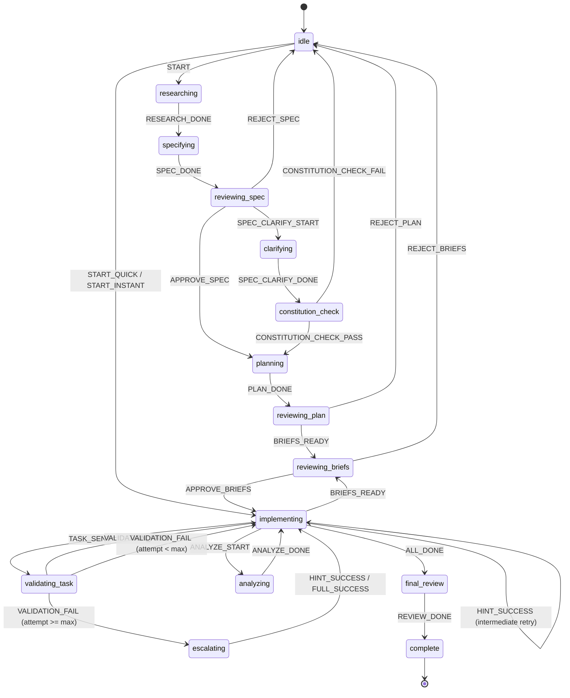

# SPLITBRIEF — Workflow

The state machine reference. Every phase, every transition, what triggers each one, what code runs.

Source of truth: `src/core/state/machine.ts` (reducer), `src/core/phases.ts` (phase taxonomy), `src/core/schemas/enums.ts` (Phase / WorkflowMode enums). Orchestrator entry: `src/engine/orchestrator/run/workflow.ts` → `src/engine/orchestrator/run/phases.ts`.

For terminology (planner, implementer, runner kinds, sessions, queue, awaiting-continue), read `docs/CONCEPTS.md` first.

---

## 1. The state machine

Primary state is the `phase` field — one of 15 values from the `Phase` enum. Two boolean-like sub-states overlay any phase:

- **`awaitingContinue`** — the current call was aborted mid-stream (single Ctrl-C). The workflow stays in its current phase, holding for the user to continue or cancel.
- **`rewindPending`** — a `/revise-spec` or `/revise-plan` command was issued. Contains `{ target: 'spec' | 'plan', comment?: string }`. The planning runner reads it on restart and takes the rewind fast-path. Cleared via `CLEAR_REWIND_PENDING` before the approval gate.

A third overlay, **`pendingRecovery`**, carries a `RecoveryIssue` when the task loop hits an unrecoverable error. The phase stays where the stop occurred; the recovery overlay gates further progress until the user picks an action.

### 1.1 Phase diagram



The diagram shows phase-level transitions only. `awaitingContinue`, `rewindPending`, and `pendingRecovery` are sub-states that overlay any phase — they don't appear as nodes.

### 1.2 Complete transition table

Verified against the `transition()` reducer in `src/core/state/machine.ts` and the `phaseActions` map.

| From | Action | To | Side effects |
|------|--------|----|-------------|
| `idle` | `START` | `researching` | — |
| `idle` | `START_QUICK` | `implementing` | Sets `tasks`, resets `currentTaskIndex` and `attempt` to 0 |
| `idle` | `START_INSTANT` | `implementing` | Sets `tasks`, resets `currentTaskIndex` and `attempt` to 0 |
| `researching` | `RESEARCH_DONE` | `specifying` | — |
| `specifying` | `SPEC_DONE` | `reviewing-spec` | — |
| `reviewing-spec` | `APPROVE_SPEC` | `planning` | — |
| `reviewing-spec` | `REJECT_SPEC` | `idle` | Workflow ends |
| `reviewing-spec` | `SPEC_CLARIFY_START` | `clarifying` | Speckit only |
| `clarifying` | `SPEC_CLARIFY_DONE` | `constitution-check` | — |
| `constitution-check` | `CONSTITUTION_CHECK_PASS` | `planning` | — |
| `constitution-check` | `CONSTITUTION_CHECK_FAIL` | `idle` | Clears `awaitingContinue`; carries `reason` |
| `planning` | `PLAN_DONE` | `reviewing-plan` | Attaches `tasks` to state |
| `reviewing-plan` | `BRIEFS_READY` | `reviewing-briefs` | Sets `tasks`, resets `currentTaskIndex` and `attempt` to 0 |
| `reviewing-plan` | `REJECT_PLAN` | `idle` | Workflow ends |
| `implementing` | `BRIEFS_READY` | `reviewing-briefs` | Sets `tasks`, resets `currentTaskIndex` and `attempt` to 0 |
| `reviewing-briefs` | `APPROVE_BRIEFS` | `implementing` | Resets `currentTaskIndex` and `attempt` to 0 |
| `reviewing-briefs` | `REJECT_BRIEFS` | `idle` | Workflow ends before any implementer write |
| `implementing` | `ANALYZE_START` | `analyzing` | Speckit post-planning audit |
| `analyzing` | `ANALYZE_DONE` | `implementing` | — |
| `implementing` | `START_TASK` | `implementing` | Sets task to `in_progress`, resets `attempt` to 0 |
| `implementing` | `TASK_SENT` | `validating-task` | — |
| `validating-task` | `VALIDATION_PASS` | `implementing` | Marks task `done`, advances `currentTaskIndex`, resets `attempt` |
| `validating-task` | `VALIDATION_FAIL` (attempt < maxRetries) | `implementing` | Increments `attempt` |
| `validating-task` | `VALIDATION_FAIL` (attempt >= maxRetries) | `escalating` | — |
| `validating-task` | `ESCALATE` | `escalating` | — |
| `implementing` | `HINT_SUCCESS` | `implementing` | Marks task `escalated`, advances index. Used by successful intermediate-model retry while still in the implementing phase. |
| `escalating` | `HINT_SUCCESS` | `implementing` | Marks task `escalated`, advances index |
| `escalating` | `HINT_FAIL` | `escalating` | Falls through to full escalation |
| `escalating` | `FULL_SUCCESS` | `implementing` | Marks task `escalated`, advances index |
| `implementing` / `validating-task` / `escalating` | `SKIP_TASK` | *(same)* | Marks task `skipped`, advances `currentTaskIndex` |
| `implementing` / `validating-task` / `escalating` | `RESET_TASK` | `implementing` | Sets task to `pending`, rewinds `currentTaskIndex` to that task's index, resets `attempt`. Tasks after it keep their status. |
| `implementing` | `ALL_DONE` | `final-review` | — |
| `final-review` | `REVIEW_DONE` | `complete` | — |

`maxRetries` defaults to 3 (configurable via `workflow.maxRetries`).

**Cross-phase actions from `phaseActions` not shown above:** `RESEARCH_DONE` is also allowed from `idle` and `planning`. `START_QUICK` and `START_INSTANT` are allowed from `idle` and `researching`. `SPEC_CLARIFY_START` is allowed from `idle`, `researching`, `reviewing-spec`, and `planning`. `PLAN_DONE` is also allowed from `reviewing-plan`. `BRIEFS_READY` is allowed from `reviewing-plan` and `reviewing-briefs`. `ANALYZE_START` is allowed from `reviewing-plan`. These permit the orchestrator to skip or re-enter phases depending on mode and backend capability without the reducer rejecting the action.

### 1.3 Anytime actions

These fire from any phase. They modify sub-state without changing `phase`.

| Action | Effect |
|--------|--------|
| `CANCEL` | Sets `phase: 'idle'`, clears `awaitingContinue`. Used by explicit cancellation paths, not by the TUI double Ctrl-C exit. |
| `ABORT_TURN` | Sets `awaitingContinue: true`. Reducer accepts it in any phase; the TUI dispatches it only for `isLivePhase()` phases. |
| `CONTINUE_TURN` | Sets `awaitingContinue: false`. User pressed Enter. |
| `SET_PLANNER_SESSION_ID` | Stores backend session handle for resume. |
| `ENQUEUE_USER_MSG` | Appends message to `messageQueue`. |
| `MARK_INJECTING_NATIVE` | Marks a queued message as currently being delivered to the live native session. |
| `MARK_DELIVERED_NATIVE` | Marks a queued message as delivered to the live native session and no longer pending. |
| `MARK_NATIVE_DELIVERY_FAILED` | Moves an injecting message back to pending delivery. |
| `DRAIN_QUEUE` | Timestamps pending-undelivered messages with `drainedAt`. |
| `CLEAR_QUEUE` | Removes pending or injecting undelivered messages from the queue. Delivered and already-drained messages remain as history. |
| `SET_PENDING_RECOVERY` | Sets `pendingRecovery` to the provided `RecoveryIssue`. |
| `MARK_RECOVERY_APPLYING` | Records selected recovery action and timestamp on `pendingRecovery`. |
| `PAUSE_PENDING_RECOVERY` | Sets `pendingRecovery.status` to `'paused'`. |
| `RESOLVE_PENDING_RECOVERY` | Removes `pendingRecovery` after the selected recovery path is handled. |
| `REWIND_TO_SPEC` | Sets `phase: 'specifying'`, clears `tasks`, resets `currentTaskIndex` and `attempt` to 0, clears `awaitingContinue`, sets `rewindPending: { target: 'spec', comment? }`. |
| `REWIND_TO_PLAN` | Sets `phase: 'planning'`, clears `tasks`, resets `currentTaskIndex` and `attempt` to 0, clears `awaitingContinue`, sets `rewindPending: { target: 'plan', comment? }`. |
| `CLEAR_REWIND_PENDING` | Removes `rewindPending`. |

Two task-scoped actions also apply in `implementing` and `escalating`: `UPDATE_TASK_CODE` stores partial implementer output on a task, `CLEAR_TASK_CODE` removes it.

---

## 2. Phase taxonomy

From `src/core/phases.ts`. Each phase has four properties derived from the source sets.

| Phase | Role | Cancellable | Resumable | Live |
|-------|------|:-----------:|:---------:|:----:|
| `idle` | — | no | no | no |
| `researching` | planner | yes | no | yes |
| `specifying` | planner | yes | no | yes |
| `reviewing-spec` | planner | no | no | no |
| `clarifying` | planner | no | no | no |
| `constitution-check` | planner | no | no | no |
| `planning` | planner | yes | yes | yes |
| `reviewing-plan` | planner | no | no | no |
| `reviewing-briefs` | planner | no | no | no |
| `analyzing` | planner | no | no | no |
| `implementing` | implementer | yes | yes | yes |
| `validating-task` | implementer | no | no | no |
| `escalating` | implementer | yes | no | yes |
| `final-review` | planner | yes | yes | yes |
| `complete` | — | no | no | no |

**Role** — `phaseRole()`: implementer for `implementing`, `validating-task`, `escalating`; planner for everything else (cost accounting adds `final-review` to the implementer bucket via `phaseCostRole()`).

**Cancellable** — single Ctrl-C aborts the active model call. This matches `isLivePhase()` in `src/core/phases.ts`.

**Resumable** — `splitbrief resume` can pick up here. `RESUMABLE_PHASES` in `src/core/phases.ts` is exactly `planning`, `implementing`, `final-review`. Every other phase is resumable only through the `awaitingContinue` override below; terminal phases (`idle`, `complete`) never are.

**Live** — streaming output is happening. Phases where the planner or implementer is actively generating: `researching`, `specifying`, `planning`, `implementing`, `escalating`, `final-review`.

**Planner markdown headers** — `planner_text` events with `content: 'markdown'` prepend a phase label before the rendered markdown body. During `researching`, the label is the literal `RESEARCH` (codebase research output, not the later Task Brief). `specifying` uses `SPEC`, `planning` uses `PLAN`, and `escalating` uses `ESCALATION`. Task Brief markdown is produced later in `planning` and at the `reviewing-briefs` gate, not during the research phase.

**Override:** `awaitingContinue: true` makes any phase resumable regardless of the table above. The user explicitly aborted and is expected to return.

---

## 3. Mode dispatch

Mode selection: `src/engine/orchestrator/planning/run.ts` → `resolveMode()`. Mode determines how many planner calls run and which approval gates activate.

| Mode | Planner calls | Phases visited | Default approval | Artifacts |
|------|:------------:|----------------|:----------------:|-----------|
| `instant` | 1 | idle → implementing | `none` | tasks.md |
| `quick` | 1 | idle → implementing | `none` | tasks.md |
| `standard` | 4 | idle → researching → specifying → reviewing-spec → planning → reviewing-plan → reviewing-briefs → implementing | `spec` | research, spec.md, plan.md, tasks.md |
| `speckit` | 6-7 | idle → researching → specifying → reviewing-spec → clarifying → constitution-check → planning → reviewing-plan → reviewing-briefs → analyzing → implementing | `all` | research, spec.md, clarifications.md, constitution-check.json, plan.md, tasks.md, analyze.json |

`full` is a legacy alias for `speckit` at the CLI/config boundary.

### Approval gates

Controlled by `workflow.approve`: `none` | `spec` | `plan` | `all` | `default`. Each mode has a default; `default` follows that mode default. Override via `--approve <level>` on the CLI.

- `none` — skip spec/plan document gates. instant/quick default. Briefs review still runs in modes that produce reviewable briefs.
- `spec` — gate on supporting spec. standard default.
- `plan` — gate on plan only.
- `all` — gate on spec and plan. speckit default.

The brief quality gate (`src/engine/spec/brief-quality.ts`) runs for all four modes after the Task Brief is produced and before `implementing`. It writes `brief-quality.json` and publishes `brief_quality_passed` or `brief_quality_failed`. Error-level issues block the transition.

Briefs review is separate from `workflow.approve`: `standard` and `speckit` enter `reviewing-briefs` after the quality gate so the user can review `tasks.md` before implementation.

### Mode advisor

`adviseMode()` in `src/engine/orchestrator/planning/mode-advisor.ts` is a deterministic keyword/pattern classifier. No LLM call. It classifies the feature prompt into a risk tier (`trivial` → instant, `small` → quick, `normal` → standard, `high` → speckit) and produces a `ModeAdviceKind`: `none`, `downgrade`, `upgrade`, or `missing-context`.

Upgrade and downgrade advice fire only when `confidence >= 0.65`. Missing-context fires below that threshold when the prompt is obviously vague.

The advisor never auto-switches the mode. It publishes a `mode_advice` event and the footer displays the suggestion. On downgrade it also publishes `mode_downgrade_advised` for backward compatibility.

### Clarification questions

All four modes extract planner `<!-- Q:{...} -->` markers and show the interactive `QuestionPrompt` panel above the composer (`collectAndPersistClarifications` in `src/engine/orchestrator/clarifications.ts`); the marker itself never appears in the transcript, in any mode. The five-question cap holds everywhere.

`standard` and `speckit` collect clarifications mid-plan, after the phase's planner call, and regenerate the affected planning artifacts with the answers before moving on — existing behavior, unchanged by this feature.

`quick` and `instant` ask after their single planner call completes, once tasks are already drafted: each answer is persisted under `## Clarifications` in `spec.md` and queued as a `QueuedMessage` (`origin: 'clarification'`) for the next planner invocation, with a native-inject attempt against the live planner session where the runner supports it. There is no automatic re-plan — `quick` and `instant` stay one planner call each; the answers ride along as queued context rather than triggering a second call.

Skipping, cancelling, or superseding a question lets the workflow proceed; no mode blocks on an answer that never comes.

---

## 4. Abort / continue / queue

Four user actions during a live phase:

| Action | Trigger | Effect |
|--------|---------|--------|
| Queue message | Type + Enter | During live planner phases, appends to `messageQueue`. Current call continues. Planners with `injectUserTurn()` also receive the message immediately. Still-pending delivery entries drain at the next safe-point. |
| Abort turn | Ctrl-C (single) | `AbortController.abort()`. Current call terminates. Partial response preserved in `session.jsonl` with `interrupted: true`. Dispatches `ABORT_TURN` → `awaitingContinue: true`. |
| Exit workflow | Ctrl-C twice within 2s | Exits after state is saved. The TUI unmounts; the saved state may be resumable later with `splitbrief continue <session-id>`. |
| Continue | Enter (from awaiting-continue) | Dispatches `CONTINUE_TURN` → `awaitingContinue: false`. Next planner call includes queued messages and partial context. |

**Queue scope.** Planner-only across local TUI, attached clients, and RPC. Mid-task interjection at the implementer, validation, or escalation level is rejected instead of being queued or injected into the planner, because small local models lose coherence when their task prompt is perturbed mid-call.

**Abort scope.** Live model-call phases only: `researching`, `specifying`, `planning`, `implementing`, `escalating`, and `final-review`. Validation is resumable from saved state, but it is not a live input phase.

**Queue lifecycle.** `ENQUEUE_USER_MSG` appends. Native delivery moves through `MARK_INJECTING_NATIVE` to `MARK_DELIVERED_NATIVE`, or back to pending with `MARK_NATIVE_DELIVERY_FAILED`. `DRAIN_QUEUE` timestamps pending-undelivered messages. `CLEAR_QUEUE` removes pending or injecting undelivered messages. On the next safe-point the orchestrator reads pending-undelivered queue entries, folds contents into the next prompt as `[user also says: ...]`, and drains.

Queue submissions return accepted/rejected results. Rejections include planner-unavailable phases and the 50-message cap; both publish a bounded warning. Local UI shows feedback near the composer, while RPC reports an error/non-ACK. `/queue show` reports pending-undelivered messages. `/queue clear` clears pending or injecting undelivered messages from the live workflow queue when a live clear handler is available; attached/RPC clients route through that handler instead of clearing only local state, and otherwise report unavailable.

**Esc Esc interrupts (two-press ladder).** On the workflow screen, the first Esc arms an intent — `interrupt` while a live phase runs, or `cancel` while a question prompt is open or the workflow is already interrupted (`abortStore.arm(...)` in `src/app/keys.ts`); a second Esc fires it. The armed intent auto-clears after 2 seconds. The first Esc Esc is a hard interrupt: the in-flight call aborts, the runner's process group is terminated (graceful signal first, force-kill after a grace window), and the workflow enters a visible `interrupted` state — spinners stop and the byline reads the interim `interrupted — finishing current step…` until the continuation prompt parks at the next call boundary (immediately, for a live in-flight call), then `interrupted — Enter retry · type to steer`. The composer stays active while interrupted: submitting typed text resumes the workflow with that text as steering instructions; submitting an empty message (plain Enter) retries the interrupted call. Esc Esc is ignored — it arms nothing and no byline changes — during the `validating-task`, `analyzing`, and `constitution-check` phases (per-task validation, the per-task git commit, speckit's analyze step, and speckit's constitution-check gate), since none of these is in the live-phase set (`isLivePhase` in `src/core/phases.ts`); the interim `finishing current step…` byline above already covers the one dead zone that is inside a live phase, the gap between runner calls, where the press still arms and parks at the next call boundary. A second Esc Esc while interrupted cancels the entire workflow. With an overlay open, Esc closes the topmost overlay instead. See [SLASH-COMMANDS-REFERENCE.md](./SLASH-COMMANDS-REFERENCE.md) §Global keys for the full key map.

---

## 5. Rewind

Source: `src/engine/orchestrator/planning/rewind.ts`.

### /revise-spec [comment]

Dispatches `REWIND_TO_SPEC`. Reducer sets `phase: 'specifying'`, clears `tasks`, resets `currentTaskIndex` and `attempt`, clears `awaitingContinue`, sets `rewindPending: { target: 'spec', comment? }`.

On the next planning restart, `handleRewindSpec` detects `rewindPending`:
- If `comment` is non-empty: calls `planner.regenerate()` with `buildRegeneratePrompt('spec', currentSpec, comment)`. Writes regenerated spec.md.
- If `comment` is empty: skips regeneration.
- Either way: dispatches `SPEC_DONE` → `reviewing-spec`. Presents the spec approval gate. On approval: dispatches `APPROVE_SPEC` → `planning`. Regenerates plan and tasks from the new spec. Runs `PLAN_DONE` → `reviewing-plan`, then briefs approval.

### /revise-plan [comment]

Dispatches `REWIND_TO_PLAN`. Reducer sets `phase: 'planning'`, clears `tasks`, resets counters, clears `awaitingContinue`, sets `rewindPending: { target: 'plan', comment? }`.

`handleRewindPlan` detects `rewindPending`:
- If `comment` is non-empty: calls `planner.regenerate()` on the plan artifact. Writes regenerated plan.md. Spec is preserved.
- If `comment` is empty: skips regeneration.
- Re-derives tasks from the plan. Dispatches `PLAN_DONE`. Runs plan approval gate (if enabled), then briefs approval.

### /redo-task \<id\>

Dispatches `RESET_TASK`. Sets the target task to `pending`, rewinds `currentTaskIndex` to that task's index, resets `attempt` to 0, sets `phase: 'implementing'`. No `rewindPending` — the task loop re-picks the task on its next iteration. Tasks after the target keep their existing status.

| Slash command | Reducer action | `rewindPending` | Regenerates? |
|---------------|---------------|:---------------:|:------------:|
| `/revise-spec` + comment | `REWIND_TO_SPEC` | `{ target: 'spec', comment }` | spec → plan → tasks |
| `/revise-spec` (no comment) | `REWIND_TO_SPEC` | `{ target: 'spec' }` | plan → tasks (spec kept) |
| `/revise-plan` + comment | `REWIND_TO_PLAN` | `{ target: 'plan', comment }` | plan → tasks |
| `/revise-plan` (no comment) | `REWIND_TO_PLAN` | `{ target: 'plan' }` | tasks only |
| `/redo-task <id>` | `RESET_TASK` | not set | no |

`rewindPending` is cleared via `CLEAR_REWIND_PENDING` before the approval gate runs.

---

## 6. Resume

`splitbrief resume` reads `.splitbrief/active` to find the session, loads `state.json`. If either is missing, version-mismatched, or the phase is not resumable, resume refuses with an error.

### Resumable phases

`planning`, `implementing`, `final-review` (the `RESUMABLE_PHASES` set in `src/core/phases.ts`). Plus any phase with `awaitingContinue: true`.

### Non-resumable phases

Every other phase — `researching`, `specifying`, `reviewing-spec`, `clarifying`, `constitution-check`, `reviewing-plan`, `reviewing-briefs`, `analyzing`, `validating-task`, `escalating` — unless `awaitingContinue: true`. The terminal phases `idle` and `complete` are never resumable. If the process died mid-generation without `awaitingContinue`, the stream is lost and the feature must restart.

### Recovery on resume

If state has `pendingRecovery`, resume shows that recovery issue before dispatching any work. Selecting `pause-run` keeps `.splitbrief/active` intact so the same decision appears on next resume.

### Planner context rebuild

Resume uses the capability matrix:

1. Backend has `supportsSessionResume: true` and `plannerSessionId` is set → reuse the native session (Claude Code: `--session-id`, Agent SDK: `options.resume`).
2. Backend rejects the session (expired, unknown) → emit `session_expired`, notify user, fall through.
3. Rebuild from `session.jsonl`: read transcript messages, use latest compact summary entry plus later messages. Pass as initial context to fresh planner call.
4. If `persistTranscript: false` and step 1 failed → no transcript context is available. `applyRebuiltContext()` publishes a warning and continues with Task Brief transport plus any supporting spec/plan as handoff.

Pending queue entries remain in `state.json` regardless of transcript persistence. Resume excludes still-pending queued user messages from stateless transcript rebuild so they are not duplicated, but `resetWorkflow(resume)` reconstructs queue depth from those pending entries so the footer and `/queue show` still reflect them.

In-flight tasks: tasks marked `in_progress` at save time are re-attempted from `attempt: 0`. They are re-run from the Task Brief with refreshed `currentCode`.

---

## 7. Escalation and recovery

When a task fails validation `maxRetries` times:

0. **Intermediate tier** — only when `escalation.intermediateProvider` is set and `escalation.enabled` is not `false`: a paid mid-tier API model retries the task. Success → task `done`.
1. **Hint escalation** — if planner has `supportsHintEscalation`: short hint to implementer, one retry. Success → task `done`.
2. **Full escalation** — planner writes the code directly. Success → task `escalated`.
3. **Recovery** — if all tiers fail, `pendingRecovery` is set. The phase stays where the stop occurred.

Recovery reasons: `implementation-error`, `validation-failed`, `retry-exhausted`, `context-overflow`, `user-edit-conflict`, `approval-promotion-conflict`, `budget-paused`, `budget-exceeded`, `dependency-blocked`.

Budget-paused recovery can come from crossing `workflow.budgetPauseThreshold` or from paid/API usage whose model pricing is unknown. Unknown local-only usage does not dollar-pause by itself; it remains visible as local/unpriced.

Recovery actions:

| Action | Effect |
|--------|--------|
| `retry-same-worker` | Clears recovery, resets task to `pending`, reruns in fresh context |
| `route-bigger-worker` | Clears recovery, reruns task with named larger profile |
| `continue` | Allowed for budget-pause below max or safe unrelated user edits only |
| `skip-current-task` | Records evidence, marks task `skipped`, advances index |
| `pause-run` | Keeps issue pending and session resumable |
| `abort-workflow` | Exits through normal shutdown |
| `planner-split-rebase` | Legacy/manual only; new prompts do not offer it, and old states block with `planner-proposal-required` |

Recovery statuses: `awaiting-user` → `applying` (via `MARK_RECOVERY_APPLYING`) → cleared (via `RESOLVE_PENDING_RECOVERY`). Or `awaiting-user` → `paused` (via `PAUSE_PENDING_RECOVERY`) → resumable on next `splitbrief resume`.

---

## 8. A standard run, step by step

```
 1. splitbrief start "add email validator"
 2. CLI loads .splitbrief/config.yaml → configStore
 3. CLI checks .splitbrief/active → error if present.
    Generate session ID, create .splitbrief/sessions/<id>/, write .splitbrief/active.
 4. routerStore → screen: workflow. useWorkflow starts.

 5. runWorkflow() begins. initializeWorkflow emits workflow_started.
    Mode advisor runs — deterministic classifier, publishes mode_advice if applicable.
    Repo map built from codebase config.

 6. phase: idle → START → researching
    Planner streams codebase research. Markdown planner text renders with a `RESEARCH` header.
    Output → session.jsonl + workflow store → UI.
    Planner session ID captured → SET_PLANNER_SESSION_ID → state.json.

 7. phase: researching → RESEARCH_DONE → specifying
    Planner writes supporting spec.md.

 8. phase: specifying → SPEC_DONE → reviewing-spec
    callbacks.onApprovalNeeded('spec', specPath)
      approve  → re-read spec.md; if edited on disk, regenerate plan + tasks
                 from the edited spec, then APPROVE_SPEC
      edit     → open the external editor on spec.md, then re-prompt the gate
      comment  → planner.regenerate() → loop back to reviewing-spec
      reject   → REJECT_SPEC → idle. Workflow ends.

 9. phase: reviewing-spec → APPROVE_SPEC → planning
    Planner compiles plan and Task Brief transport. Writes plan.md and tasks.md.

10. phase: planning → PLAN_DONE → reviewing-plan
    In standard mode, plan gate is auto-advanced (approve level is 'spec').

11. phase: reviewing-plan → BRIEFS_READY → reviewing-briefs
    Brief quality gate runs. Writes brief-quality.json.

12. phase: implementing → BRIEFS_READY → reviewing-briefs
    callbacks.onApprovalNeeded('briefs', tasksPath)
    Approval reads tasks.md from disk, reparses, re-runs quality gate.
    Ctrl+E/e/edit/E/edit-file opens tasks.md in the external editor
    resolved as VISUAL, non-terminal EDITOR, detected GUI editor from safe absolute PATH, macOS open, terminal EDITOR, then vi.

13. phase: reviewing-briefs → APPROVE_BRIEFS → implementing
    Prompt-input cost prediction published. Cost gate checked. Runtime output,
    retries, validation reruns, escalation, and unknown paid pricing are tracked
    as the run proceeds.

14. Per task:
      implementing → START_TASK (task in_progress, attempt 0)
      implementer.implement(taskPrompt) → code written to disk
      implementing → TASK_SENT → validating-task
      typecheck → lint → tests (stops on first failure)
        pass → VALIDATION_PASS → implementing (next task)
        fail → VALIDATION_FAIL → implementing (attempt++, retry)
        fail (attempt >= maxRetries) → VALIDATION_FAIL → escalating
          HINT_SUCCESS / HINT_FAIL / FULL_SUCCESS → implementing

15. implementing (last task) → ALL_DONE → final-review
    Drift report computed. Planner reviews diff against Task Brief and spec.

16. final-review → REVIEW_DONE → complete
    summary.json written. .splitbrief/active cleared. Session done.
```

During live model-call phases, single Ctrl-C enters `awaitingContinue`; double Ctrl-C exits. Messages typed during live planner phases queue; only still-pending delivery entries drain at the next safe-point. `/revise-spec` and `/revise-plan` rewind to the appropriate phase. `/redo-task` replays a single task.

---

## 9. WorkflowState shape

Source: `src/core/schemas/workflow.ts` (Zod), `src/core/state/machine.ts` (`createInitialState`). State version: 3.

```typescript
type WorkflowState = {
  stateVersion: number
  phase: Phase
  feature: string
  currentTaskIndex: number
  attempt: number
  tasks: Task[]
  plannerSessionId: string | null
  startedAt: string                       // ISO 8601
  tokenUsage: TokenUsage
  awaitingContinue: boolean               // true after single Ctrl-C
  messageQueue: QueuedMessage[]           // user messages typed during live phases

  // Optional overlays
  rewindPending?: { target: 'spec' | 'plan'; comment?: string }
  pendingRecovery?: RecoveryIssue
  discoveredValidation?: DiscoveredValidation

  // Runner identity (set once at workflow start)
  plannerTool?: string
  plannerModel?: string
  implementerTool?: string
  implementerModel?: string
}

type QueuedMessage = {
  id: string
  text: string
  queuedAt: string                        // ISO 8601
  phase: Phase
  deliveredViaNative: boolean
  nativeDeliveryState: 'pending' | 'injecting' | 'delivered'
  drainedAt?: string
  origin?: 'user-input' | 'clarification'
  question?: string
}
```

`createInitialState(feature)` returns a minimal state: `phase: 'idle'`, `currentTaskIndex: 0`, `attempt: 0`, `tasks: []`, `plannerSessionId: null`, `tokenUsage` zeroed, `awaitingContinue: false`, `messageQueue: []`. All optional fields are absent.

---

## See also

- `docs/CONCEPTS.md` — terminology
- `docs/MENTAL-MODEL.md` — the concept without code
- `docs/HOW-IT-WORKS.md` — same flow with file paths and data flow diagrams
- `docs/ENGINE.md` — orchestrator internals, EventBus, engine/UI communication
- `docs/TASK-CONTRACT.md` — brief quality gate rules, evidence vocabulary, drift detection
- `docs/CONFIGURATION.md` — all config keys including `workflow.*`
- `docs/SLASH-COMMANDS-REFERENCE.md` — all slash commands including `/revise-spec`, `/revise-plan`, `/redo-task`, `/mode`
